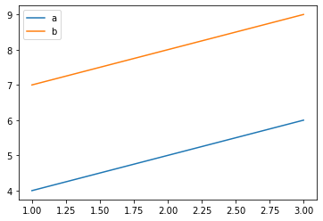
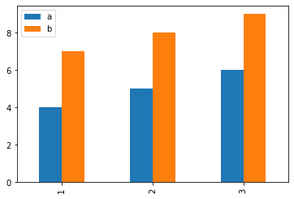
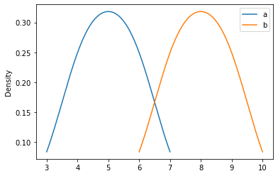

# Pandas basic
* https://pandas.pydata.org/
* https://pandas.pydata.org/Pandas_Cheat_Sheet.pdf
* [10 minutes to Pandas](https://pandas.pydata.org/docs/user_guide/10min.html)


```python
import pandas as pd
```

# DataFrame


```python
# 공식문서(도움말) 활용하기
# pd.DataFrame?
# pd.DataFrame(shift+tab+tab)

df = pd.DataFrame(
{"a" : [4 ,5, 6],
"b" : [7, 8, 9],
"c" : [10, 11, 12]},
index = [1, 2, 3])
df
```


<div>
<style scoped>
    .dataframe tbody tr th:only-of-type {
        vertical-align: middle;
    }

    .dataframe tbody tr th {
        vertical-align: top;
    }

    .dataframe thead th {
        text-align: right;
    }
</style>
<table border="1" class="dataframe">
  <thead>
    <tr style="text-align: right;">
      <th></th>
      <th>a</th>
      <th>b</th>
      <th>c</th>
    </tr>
  </thead>
  <tbody>
    <tr>
      <th>1</th>
      <td>4</td>
      <td>7</td>
      <td>10</td>
    </tr>
    <tr>
      <th>2</th>
      <td>5</td>
      <td>8</td>
      <td>11</td>
    </tr>
    <tr>
      <th>3</th>
      <td>6</td>
      <td>9</td>
      <td>12</td>
    </tr>
  </tbody>
</table>
</div>


# Series


```python
df["a"]
```


    1    4
    2    5
    3    6
    Name: a, dtype: int64


```python
# dataframe
df[["a"]]
```


<div>
<style scoped>
    .dataframe tbody tr th:only-of-type {
        vertical-align: middle;
    }

    .dataframe tbody tr th {
        vertical-align: top;
    }

    .dataframe thead th {
        text-align: right;
    }
</style>
<table border="1" class="dataframe">
  <thead>
    <tr style="text-align: right;">
      <th></th>
      <th>a</th>
    </tr>
  </thead>
  <tbody>
    <tr>
      <th>1</th>
      <td>4</td>
    </tr>
    <tr>
      <th>2</th>
      <td>5</td>
    </tr>
    <tr>
      <th>3</th>
      <td>6</td>
    </tr>
  </tbody>
</table>
</div>


# Subset


```python
# Rows 기준 예시
df[df["a"] > 4]
```


<div>
<style scoped>
    .dataframe tbody tr th:only-of-type {
        vertical-align: middle;
    }

    .dataframe tbody tr th {
        vertical-align: top;
    }

    .dataframe thead th {
        text-align: right;
    }
</style>
<table border="1" class="dataframe">
  <thead>
    <tr style="text-align: right;">
      <th></th>
      <th>a</th>
      <th>b</th>
      <th>c</th>
    </tr>
  </thead>
  <tbody>
    <tr>
      <th>2</th>
      <td>5</td>
      <td>8</td>
      <td>11</td>
    </tr>
    <tr>
      <th>3</th>
      <td>6</td>
      <td>9</td>
      <td>12</td>
    </tr>
  </tbody>
</table>
</div>


```python
# Columns 기준 예시
# 한 개의 Column만 Series 형식으로 가지고 올 때
df["a"]
```


    1    4
    2    5
    3    6
    Name: a, dtype: int64


```python
# Columns 기준 예시
# 두 개 이상의 Columns를 DataFrame 형식으로 가지고 올 때
df[["a" , "b"]]
```


<div>
<style scoped>
    .dataframe tbody tr th:only-of-type {
        vertical-align: middle;
    }

    .dataframe tbody tr th {
        vertical-align: top;
    }

    .dataframe thead th {
        text-align: right;
    }
</style>
<table border="1" class="dataframe">
  <thead>
    <tr style="text-align: right;">
      <th></th>
      <th>a</th>
      <th>b</th>
    </tr>
  </thead>
  <tbody>
    <tr>
      <th>1</th>
      <td>4</td>
      <td>7</td>
    </tr>
    <tr>
      <th>2</th>
      <td>5</td>
      <td>8</td>
    </tr>
    <tr>
      <th>3</th>
      <td>6</td>
      <td>9</td>
    </tr>
  </tbody>
</table>
</div>


# Summerize Data


```python
# Categorical한 값의 빈도수를 구하는 방법입니다.
df["a"].value_counts()
```


    6    1
    5    1
    4    1
    Name: a, dtype: int64


```python
len(df)
```


    3


# Reshaping

## sort_values, drop


```python
# "a"컬럼을 기준으로 정렬하기
df["a"].sort_values()
```


    1    4
    2    5
    3    6
    Name: a, dtype: int64


```python
# DataFrame 전체에서 "a"값을 기준으로 정렬하기
df.sort_values("a")
```


<div>
<style scoped>
    .dataframe tbody tr th:only-of-type {
        vertical-align: middle;
    }

    .dataframe tbody tr th {
        vertical-align: top;
    }

    .dataframe thead th {
        text-align: right;
    }
</style>
<table border="1" class="dataframe">
  <thead>
    <tr style="text-align: right;">
      <th></th>
      <th>a</th>
      <th>b</th>
      <th>c</th>
    </tr>
  </thead>
  <tbody>
    <tr>
      <th>1</th>
      <td>4</td>
      <td>7</td>
      <td>10</td>
    </tr>
    <tr>
      <th>2</th>
      <td>5</td>
      <td>8</td>
      <td>11</td>
    </tr>
    <tr>
      <th>3</th>
      <td>6</td>
      <td>9</td>
      <td>12</td>
    </tr>
  </tbody>
</table>
</div>


```python
# 역순으로 정렬하기
df.sort_values("a", ascending = False)
```


<div>
<style scoped>
    .dataframe tbody tr th:only-of-type {
        vertical-align: middle;
    }

    .dataframe tbody tr th {
        vertical-align: top;
    }

    .dataframe thead th {
        text-align: right;
    }
</style>
<table border="1" class="dataframe">
  <thead>
    <tr style="text-align: right;">
      <th></th>
      <th>a</th>
      <th>b</th>
      <th>c</th>
    </tr>
  </thead>
  <tbody>
    <tr>
      <th>3</th>
      <td>6</td>
      <td>9</td>
      <td>12</td>
    </tr>
    <tr>
      <th>2</th>
      <td>5</td>
      <td>8</td>
      <td>11</td>
    </tr>
    <tr>
      <th>1</th>
      <td>4</td>
      <td>7</td>
      <td>10</td>
    </tr>
  </tbody>
</table>
</div>


```python
# DataFrame에서 특정 Column(예제에서는 "c"Column)drop 하기
'''변경사항이 반영된 df를 출력하려면 다시 df에 할당해주어야 한다.'''
df = df.drop(["c"], axis = 1)
df
```


<div>
<style scoped>
    .dataframe tbody tr th:only-of-type {
        vertical-align: middle;
    }

    .dataframe tbody tr th {
        vertical-align: top;
    }

    .dataframe thead th {
        text-align: right;
    }
</style>
<table border="1" class="dataframe">
  <thead>
    <tr style="text-align: right;">
      <th></th>
      <th>a</th>
      <th>b</th>
    </tr>
  </thead>
  <tbody>
    <tr>
      <th>1</th>
      <td>4</td>
      <td>7</td>
    </tr>
    <tr>
      <th>2</th>
      <td>5</td>
      <td>8</td>
    </tr>
    <tr>
      <th>3</th>
      <td>6</td>
      <td>9</td>
    </tr>
  </tbody>
</table>
</div>


# Group Data

## Groupby, pivot_table


```python
# "a" 컬럼값을 Groupby하여 "b"의 컬럼값 평균값, 합계, 갯수 구하기 
df.groupby(["a"])["b"].agg(["mean", "sum", "count"])
```


<div>
<style scoped>
    .dataframe tbody tr th:only-of-type {
        vertical-align: middle;
    }

    .dataframe tbody tr th {
        vertical-align: top;
    }

    .dataframe thead th {
        text-align: right;
    }
</style>
<table border="1" class="dataframe">
  <thead>
    <tr style="text-align: right;">
      <th></th>
      <th>mean</th>
      <th>sum</th>
      <th>count</th>
    </tr>
    <tr>
      <th>a</th>
      <th></th>
      <th></th>
      <th></th>
    </tr>
  </thead>
  <tbody>
    <tr>
      <th>4</th>
      <td>7</td>
      <td>7</td>
      <td>1</td>
    </tr>
    <tr>
      <th>5</th>
      <td>8</td>
      <td>8</td>
      <td>1</td>
    </tr>
    <tr>
      <th>6</th>
      <td>9</td>
      <td>9</td>
      <td>1</td>
    </tr>
  </tbody>
</table>
</div>


```python
# df의 모든 값을 요약해보기
df.groupby(["a"])["b"].describe()
```


<div>
<style scoped>
    .dataframe tbody tr th:only-of-type {
        vertical-align: middle;
    }

    .dataframe tbody tr th {
        vertical-align: top;
    }

    .dataframe thead th {
        text-align: right;
    }
</style>
<table border="1" class="dataframe">
  <thead>
    <tr style="text-align: right;">
      <th></th>
      <th>count</th>
      <th>mean</th>
      <th>std</th>
      <th>min</th>
      <th>25%</th>
      <th>50%</th>
      <th>75%</th>
      <th>max</th>
    </tr>
    <tr>
      <th>a</th>
      <th></th>
      <th></th>
      <th></th>
      <th></th>
      <th></th>
      <th></th>
      <th></th>
      <th></th>
    </tr>
  </thead>
  <tbody>
    <tr>
      <th>4</th>
      <td>1.0</td>
      <td>7.0</td>
      <td>NaN</td>
      <td>7.0</td>
      <td>7.0</td>
      <td>7.0</td>
      <td>7.0</td>
      <td>7.0</td>
    </tr>
    <tr>
      <th>5</th>
      <td>1.0</td>
      <td>8.0</td>
      <td>NaN</td>
      <td>8.0</td>
      <td>8.0</td>
      <td>8.0</td>
      <td>8.0</td>
      <td>8.0</td>
    </tr>
    <tr>
      <th>6</th>
      <td>1.0</td>
      <td>9.0</td>
      <td>NaN</td>
      <td>9.0</td>
      <td>9.0</td>
      <td>9.0</td>
      <td>9.0</td>
      <td>9.0</td>
    </tr>
  </tbody>
</table>
</div>


```python
# pivot_table로 평균값 구하기
pd.pivot_table(df, index = "a")
```


<div>
<style scoped>
    .dataframe tbody tr th:only-of-type {
        vertical-align: middle;
    }

    .dataframe tbody tr th {
        vertical-align: top;
    }

    .dataframe thead th {
        text-align: right;
    }
</style>
<table border="1" class="dataframe">
  <thead>
    <tr style="text-align: right;">
      <th></th>
      <th>b</th>
    </tr>
    <tr>
      <th>a</th>
      <th></th>
    </tr>
  </thead>
  <tbody>
    <tr>
      <th>4</th>
      <td>7</td>
    </tr>
    <tr>
      <th>5</th>
      <td>8</td>
    </tr>
    <tr>
      <th>6</th>
      <td>9</td>
    </tr>
  </tbody>
</table>
</div>


# Plotting


```python
# 데이터를 가지고 다양한 시각화를 해보실 수 있습니다.
# 꺾은선 그래프 그리기
df.plot()
```


    <AxesSubplot:>


    

    


```python
# 막대그래프 그리기
df.plot.bar()
```


    <AxesSubplot:>


    

    


```python
# 밀도함수 그리기
df.plot.density()
```


    <AxesSubplot:ylabel='Density'>


    

    


```python

```
