# 공공데이터 국민의료정보 분석해보기
* https://www.data.go.kr/tcs/eds/selectCoreDataListView.do
* 국가중점데이터 중 하나인 국민의료정보를 살펴봅니다.
* 처음으로 파일데이터에서 `건강보험심사평가원_전국 병의원 및 약국 현황_20210630`를 다운로드 받아봅니다.

## 필요한 라이브러리 불러오기
* https://pandas.pydata.org/
* https://numpy.org/
* https://seaborn.pydata.org/


```python
# numpy는 고성능의 수치계산, 행렬이나 대규모 다차원 배열을 쉽게 처리하기 위한 라이브러리
# seaborn은 데이터 시각화를 위한 라이브러리
# matplotlib도 데이터 시각화를 위한 라이브러리
import pandas as pd
import numpy as np
import seaborn as sns
import matplotlib.pyplot as plt
```

## 시각화를 위한 폰트 설정


```python
# Window의 한글폰트 설정
plt.rc( 'font' , family= 'Malgun Gothic' )
# 그래프가 노트북 안에 보이게 하기 위해 
%matplotlib inline
```


```python
from IPython.display import set_matplotlib_formats
# 폰트가 선명하게 보이기 위해
set_matplotlib_formats('retina')
```

## 데이터 로드하기
- 판다스에서 데이터를 로드할 때는 read_csv를 사용합니다.
- 데이터를 로드해서 df라는 변수에 담습니다.
- 그리고 shape 을 통해 데이터의 갯수를 찍습니다. 결과는 (행,열) 순으로 출력됩니다.
- data 폴더에 받은 자료를 불러오기 위해서 ~/data를 입력하고 tab키를 누릅니다.
- 윈도우에서 엑셀로 파일을 열고 저장을 하면 cp949방식으로 저장을 하기 때문에 인코딩까지 해줍니다.
- mixed type이 있는 경우 low_memory = False를 지정해줍니다.


```python
# read_csv로 불러온 파일을 df라는 변수에 담습니다.
df = pd.read_csv("C:/Users/dayun/data/1. 병원정보서비스 2021.6.csv", encoding = 'cp949')
df.shape
```


    (74364, 29)


## 데이터 미리보기
- head, tail을 통해 데이터를 미리 볼 수 있습니다.
- ()안에서 Shift + Tab 키를 누르시면 docstring을 볼 수 있습니다.


```python
# head로 데이터를 미리보기 합니다.
# ()안에서 Shift + Tab 키를 눌러보면 기본값이 5로 설정되어 있음을 알 수 있다.
df.head(3)
```


<div>
<style scoped>
    .dataframe tbody tr th:only-of-type {
        vertical-align: middle;
    }

    .dataframe tbody tr th {
        vertical-align: top;
    }

    .dataframe thead th {
        text-align: right;
    }
</style>
<table border="1" class="dataframe">
  <thead>
    <tr style="text-align: right;">
      <th></th>
      <th>암호화YKIHO코드</th>
      <th>요양기관명</th>
      <th>종별코드</th>
      <th>종별코드명</th>
      <th>시도코드</th>
      <th>시도코드명</th>
      <th>시군구코드</th>
      <th>시군구코드명</th>
      <th>읍면동</th>
      <th>우편번호</th>
      <th>...</th>
      <th>치과일반의 인원수</th>
      <th>치과인턴 인원수</th>
      <th>치과레지던트 인원수</th>
      <th>치과전문의 인원수</th>
      <th>한방일반의 인원수</th>
      <th>한방인턴 인원수</th>
      <th>한방레지던트 인원수</th>
      <th>한방전문의 인원수</th>
      <th>x좌표</th>
      <th>y좌표</th>
    </tr>
  </thead>
  <tbody>
    <tr>
      <th>0</th>
      <td>JDQ4MTYyMiM1MSMkMSMkMCMkODkkMzgxMzUxIzExIyQxIy...</td>
      <td>가톨릭대학교인천성모병원</td>
      <td>1</td>
      <td>상급종합</td>
      <td>220000</td>
      <td>인천</td>
      <td>220003</td>
      <td>인천부평구</td>
      <td>NaN</td>
      <td>21431</td>
      <td>...</td>
      <td>1</td>
      <td>0</td>
      <td>0</td>
      <td>2</td>
      <td>0</td>
      <td>0</td>
      <td>0</td>
      <td>0</td>
      <td>126.724899</td>
      <td>37.484831</td>
    </tr>
    <tr>
      <th>1</th>
      <td>JDQ4MTYyMiM1MSMkMSMkNCMkODkkMzgxMzUxIzExIyQxIy...</td>
      <td>강릉아산병원</td>
      <td>1</td>
      <td>상급종합</td>
      <td>320000</td>
      <td>강원</td>
      <td>320100</td>
      <td>강릉시</td>
      <td>NaN</td>
      <td>25440</td>
      <td>...</td>
      <td>0</td>
      <td>0</td>
      <td>0</td>
      <td>2</td>
      <td>0</td>
      <td>0</td>
      <td>0</td>
      <td>0</td>
      <td>128.857841</td>
      <td>37.818433</td>
    </tr>
    <tr>
      <th>2</th>
      <td>JDQ4MTg4MSM1MSMkMSMkMCMkODkkMzgxMzUxIzExIyQxIy...</td>
      <td>강북삼성병원</td>
      <td>1</td>
      <td>상급종합</td>
      <td>110000</td>
      <td>서울</td>
      <td>110016</td>
      <td>종로구</td>
      <td>NaN</td>
      <td>3181</td>
      <td>...</td>
      <td>3</td>
      <td>0</td>
      <td>0</td>
      <td>4</td>
      <td>0</td>
      <td>0</td>
      <td>0</td>
      <td>0</td>
      <td>126.967750</td>
      <td>37.568408</td>
    </tr>
  </tbody>
</table>
<p>3 rows × 29 columns</p>
</div>


```python
# tail로 마지막 부분에 있는 데이터를 불러옵니다.
df.tail(3)
```


<div>
<style scoped>
    .dataframe tbody tr th:only-of-type {
        vertical-align: middle;
    }

    .dataframe tbody tr th {
        vertical-align: top;
    }

    .dataframe thead th {
        text-align: right;
    }
</style>
<table border="1" class="dataframe">
  <thead>
    <tr style="text-align: right;">
      <th></th>
      <th>암호화YKIHO코드</th>
      <th>요양기관명</th>
      <th>종별코드</th>
      <th>종별코드명</th>
      <th>시도코드</th>
      <th>시도코드명</th>
      <th>시군구코드</th>
      <th>시군구코드명</th>
      <th>읍면동</th>
      <th>우편번호</th>
      <th>...</th>
      <th>치과일반의 인원수</th>
      <th>치과인턴 인원수</th>
      <th>치과레지던트 인원수</th>
      <th>치과전문의 인원수</th>
      <th>한방일반의 인원수</th>
      <th>한방인턴 인원수</th>
      <th>한방레지던트 인원수</th>
      <th>한방전문의 인원수</th>
      <th>x좌표</th>
      <th>y좌표</th>
    </tr>
  </thead>
  <tbody>
    <tr>
      <th>74361</th>
      <td>JDQ4MTg4MSM1MSMkMSMkNCMkMTMkNDgxMzUxIzUxIyQxIy...</td>
      <td>힘찬마디한의원</td>
      <td>93</td>
      <td>한의원</td>
      <td>110000</td>
      <td>서울</td>
      <td>110002</td>
      <td>강동구</td>
      <td>천호동</td>
      <td>5329</td>
      <td>...</td>
      <td>0</td>
      <td>0</td>
      <td>0</td>
      <td>0</td>
      <td>1</td>
      <td>0</td>
      <td>0</td>
      <td>0</td>
      <td>127.126386</td>
      <td>37.538123</td>
    </tr>
    <tr>
      <th>74362</th>
      <td>JDQ4MTg4MSM1MSMkMSMkNCMkMTMkMzgxNzAyIzUxIyQxIy...</td>
      <td>힘찬세상경희한의원</td>
      <td>93</td>
      <td>한의원</td>
      <td>110000</td>
      <td>서울</td>
      <td>110014</td>
      <td>용산구</td>
      <td>한강로2가</td>
      <td>4376</td>
      <td>...</td>
      <td>0</td>
      <td>0</td>
      <td>0</td>
      <td>0</td>
      <td>0</td>
      <td>0</td>
      <td>0</td>
      <td>1</td>
      <td>126.968167</td>
      <td>37.530005</td>
    </tr>
    <tr>
      <th>74363</th>
      <td>JDQ4MTg4MSM1MSMkMiMkOCMkMDAkMzgxMzUxIzExIyQyIy...</td>
      <td>읻다의원</td>
      <td>31</td>
      <td>의원</td>
      <td>110000</td>
      <td>서울</td>
      <td>110001</td>
      <td>강남구</td>
      <td>NaN</td>
      <td>6012</td>
      <td>...</td>
      <td>0</td>
      <td>0</td>
      <td>0</td>
      <td>0</td>
      <td>0</td>
      <td>0</td>
      <td>0</td>
      <td>0</td>
      <td>NaN</td>
      <td>NaN</td>
    </tr>
  </tbody>
</table>
<p>3 rows × 29 columns</p>
</div>


```python
# sample로 미리보기를 합니다.
df.sample()
```


<div>
<style scoped>
    .dataframe tbody tr th:only-of-type {
        vertical-align: middle;
    }

    .dataframe tbody tr th {
        vertical-align: top;
    }

    .dataframe thead th {
        text-align: right;
    }
</style>
<table border="1" class="dataframe">
  <thead>
    <tr style="text-align: right;">
      <th></th>
      <th>암호화YKIHO코드</th>
      <th>요양기관명</th>
      <th>종별코드</th>
      <th>종별코드명</th>
      <th>시도코드</th>
      <th>시도코드명</th>
      <th>시군구코드</th>
      <th>시군구코드명</th>
      <th>읍면동</th>
      <th>우편번호</th>
      <th>...</th>
      <th>치과일반의 인원수</th>
      <th>치과인턴 인원수</th>
      <th>치과레지던트 인원수</th>
      <th>치과전문의 인원수</th>
      <th>한방일반의 인원수</th>
      <th>한방인턴 인원수</th>
      <th>한방레지던트 인원수</th>
      <th>한방전문의 인원수</th>
      <th>x좌표</th>
      <th>y좌표</th>
    </tr>
  </thead>
  <tbody>
    <tr>
      <th>23052</th>
      <td>JDQ4MTYyMiM1MSMkMiMkMCMkMDAkNDgxOTYxIzExIyQxIy...</td>
      <td>연세메디의원</td>
      <td>31</td>
      <td>의원</td>
      <td>310000</td>
      <td>경기</td>
      <td>310702</td>
      <td>안양동안구</td>
      <td>NaN</td>
      <td>13940</td>
      <td>...</td>
      <td>0</td>
      <td>0</td>
      <td>0</td>
      <td>0</td>
      <td>0</td>
      <td>0</td>
      <td>0</td>
      <td>0</td>
      <td>126.956873</td>
      <td>37.403669</td>
    </tr>
  </tbody>
</table>
<p>1 rows × 29 columns</p>
</div>


## 데이터 요약하기

### 요약정보


```python
# info로 데이터의 요약을 봅니다.
df.info()
```

    <class 'pandas.core.frame.DataFrame'>
    RangeIndex: 74364 entries, 0 to 74363
    Data columns (total 29 columns):
     #   Column      Non-Null Count  Dtype  
    ---  ------      --------------  -----  
     0   암호화YKIHO코드  74364 non-null  object 
     1   요양기관명       74364 non-null  object 
     2   종별코드        74364 non-null  int64  
     3   종별코드명       74364 non-null  object 
     4   시도코드        74364 non-null  int64  
     5   시도코드명       74364 non-null  object 
     6   시군구코드       74364 non-null  int64  
     7   시군구코드명      74364 non-null  object 
     8   읍면동         31281 non-null  object 
     9   우편번호        74364 non-null  int64  
     10  주소          74364 non-null  object 
     11  전화번호        74055 non-null  object 
     12  병원URL       9099 non-null   object 
     13  개설일자        74348 non-null  object 
     14  총의사수        74364 non-null  int64  
     15  의과일반의 인원수   74364 non-null  int64  
     16  의과인턴 인원수    74364 non-null  int64  
     17  의과레지던트 인원수  74364 non-null  int64  
     18  의과전문의 인원수   74364 non-null  int64  
     19  치과일반의 인원수   74364 non-null  int64  
     20  치과인턴 인원수    74364 non-null  int64  
     21  치과레지던트 인원수  74364 non-null  int64  
     22  치과전문의 인원수   74364 non-null  int64  
     23  한방일반의 인원수   74364 non-null  int64  
     24  한방인턴 인원수    74364 non-null  int64  
     25  한방레지던트 인원수  74364 non-null  int64  
     26  한방전문의 인원수   74364 non-null  int64  
     27  x좌표         70914 non-null  float64
     28  y좌표         70914 non-null  float64
    dtypes: float64(2), int64(17), object(10)
    memory usage: 16.5+ MB
    

### 컬럼명 보기


```python
# 컬럼명만 출력해 봅니다.
df.columns
```


    Index(['암호화YKIHO코드', '요양기관명', '종별코드', '종별코드명', '시도코드', '시도코드명', '시군구코드',
           '시군구코드명', '읍면동', '우편번호', '주소', '전화번호', '병원URL', '개설일자', '총의사수',
           '의과일반의 인원수', '의과인턴 인원수', '의과레지던트 인원수', '의과전문의 인원수', '치과일반의 인원수',
           '치과인턴 인원수', '치과레지던트 인원수', '치과전문의 인원수', '한방일반의 인원수', '한방인턴 인원수',
           '한방레지던트 인원수', '한방전문의 인원수', 'x좌표', 'y좌표'],
          dtype='object')


### 데이터 타입


```python
# 데이터 타입만 출력합니다.
df.dtypes
```


    암호화YKIHO코드     object
    요양기관명          object
    종별코드            int64
    종별코드명          object
    시도코드            int64
    시도코드명          object
    시군구코드           int64
    시군구코드명         object
    읍면동            object
    우편번호            int64
    주소             object
    전화번호           object
    병원URL          object
    개설일자           object
    총의사수            int64
    의과일반의 인원수       int64
    의과인턴 인원수        int64
    의과레지던트 인원수      int64
    의과전문의 인원수       int64
    치과일반의 인원수       int64
    치과인턴 인원수        int64
    치과레지던트 인원수      int64
    치과전문의 인원수       int64
    한방일반의 인원수       int64
    한방인턴 인원수        int64
    한방레지던트 인원수      int64
    한방전문의 인원수       int64
    x좌표           float64
    y좌표           float64
    dtype: object


## 결측치


```python
True == 1
```


    True


```python
# 결측치를 확인할 때는 df.isnull()로 T/F 값을 확인한다. 
null_count = df.isnull().sum()
null_count
```


    암호화YKIHO코드        0
    요양기관명             0
    종별코드              0
    종별코드명             0
    시도코드              0
    시도코드명             0
    시군구코드             0
    시군구코드명            0
    읍면동           43083
    우편번호              0
    주소                0
    전화번호            309
    병원URL         65265
    개설일자             16
    총의사수              0
    의과일반의 인원수         0
    의과인턴 인원수          0
    의과레지던트 인원수        0
    의과전문의 인원수         0
    치과일반의 인원수         0
    치과인턴 인원수          0
    치과레지던트 인원수        0
    치과전문의 인원수         0
    한방일반의 인원수         0
    한방인턴 인원수          0
    한방레지던트 인원수        0
    한방전문의 인원수         0
    x좌표            3450
    y좌표            3450
    dtype: int64


```python
# 위에서 구한 결측치(null_count)를 .plot.bar를 통해 막대그래프로 표현합니다.
# .plot.barh를 사용하면 bar 그래프의 x,y축을 바꿔서 그려준다.
# figsize = (a,b)를 괄호 안에 넣어서 y축의 글자간격을 조절할 수 있다.

null_count.plot.barh(figsize = (5,7))
```


    <AxesSubplot:>


    
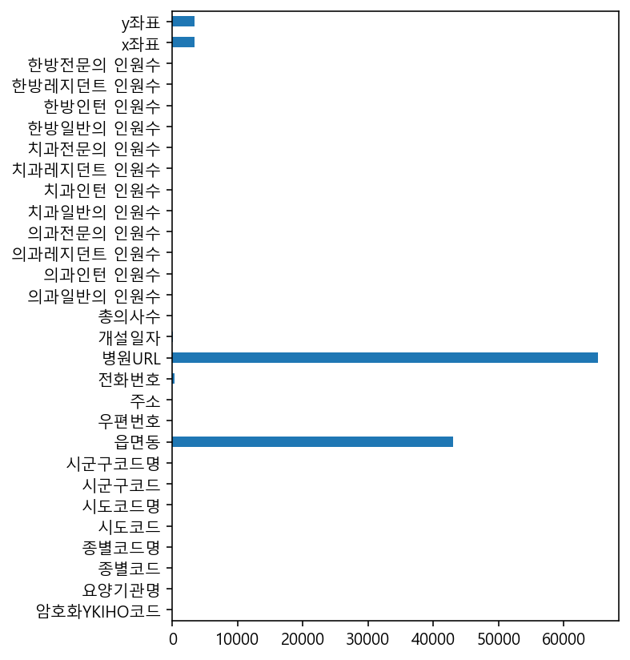
    


```python
# 위에서 계산한 결측치 수를 reset_index를 통해 데이터프레임으로 만들어 줍니다.
# df_null_count 변수에 결과를 담아서 head로 미리보기를 합니다.

df_null_count = null_count.reset_index()
df_null_count.head()
```


<div>
<style scoped>
    .dataframe tbody tr th:only-of-type {
        vertical-align: middle;
    }

    .dataframe tbody tr th {
        vertical-align: top;
    }

    .dataframe thead th {
        text-align: right;
    }
</style>
<table border="1" class="dataframe">
  <thead>
    <tr style="text-align: right;">
      <th></th>
      <th>index</th>
      <th>0</th>
    </tr>
  </thead>
  <tbody>
    <tr>
      <th>0</th>
      <td>암호화YKIHO코드</td>
      <td>0</td>
    </tr>
    <tr>
      <th>1</th>
      <td>요양기관명</td>
      <td>0</td>
    </tr>
    <tr>
      <th>2</th>
      <td>종별코드</td>
      <td>0</td>
    </tr>
    <tr>
      <th>3</th>
      <td>종별코드명</td>
      <td>0</td>
    </tr>
    <tr>
      <th>4</th>
      <td>시도코드</td>
      <td>0</td>
    </tr>
  </tbody>
</table>
</div>


## 컬럼명 변경하기


```python
# df_null_count 변수에 담겨있는 컬럼의 이름을 "컬럼명", "결측치수"로 변경해 줍니다.

df_null_count.columns = ["컬럼명", "결측치수"]
df_null_count.head()
```


<div>
<style scoped>
    .dataframe tbody tr th:only-of-type {
        vertical-align: middle;
    }

    .dataframe tbody tr th {
        vertical-align: top;
    }

    .dataframe thead th {
        text-align: right;
    }
</style>
<table border="1" class="dataframe">
  <thead>
    <tr style="text-align: right;">
      <th></th>
      <th>컬럼명</th>
      <th>결측치수</th>
    </tr>
  </thead>
  <tbody>
    <tr>
      <th>0</th>
      <td>암호화YKIHO코드</td>
      <td>0</td>
    </tr>
    <tr>
      <th>1</th>
      <td>요양기관명</td>
      <td>0</td>
    </tr>
    <tr>
      <th>2</th>
      <td>종별코드</td>
      <td>0</td>
    </tr>
    <tr>
      <th>3</th>
      <td>종별코드명</td>
      <td>0</td>
    </tr>
    <tr>
      <th>4</th>
      <td>시도코드</td>
      <td>0</td>
    </tr>
  </tbody>
</table>
</div>


## 정렬하기


```python
# df_null_count 데이터프레임에 있는 결측치수 컬럼을 sort_values를 통해 정렬해서 
# 결측치가 많은 순으로 상위 10개만 출력합니다.

df_null_count_top = df_null_count.sort_values(by = "결측치수", ascending=False).head(10)
df_null_count_top
```


<div>
<style scoped>
    .dataframe tbody tr th:only-of-type {
        vertical-align: middle;
    }

    .dataframe tbody tr th {
        vertical-align: top;
    }

    .dataframe thead th {
        text-align: right;
    }
</style>
<table border="1" class="dataframe">
  <thead>
    <tr style="text-align: right;">
      <th></th>
      <th>컬럼명</th>
      <th>결측치수</th>
    </tr>
  </thead>
  <tbody>
    <tr>
      <th>12</th>
      <td>병원URL</td>
      <td>65265</td>
    </tr>
    <tr>
      <th>8</th>
      <td>읍면동</td>
      <td>43083</td>
    </tr>
    <tr>
      <th>28</th>
      <td>y좌표</td>
      <td>3450</td>
    </tr>
    <tr>
      <th>27</th>
      <td>x좌표</td>
      <td>3450</td>
    </tr>
    <tr>
      <th>11</th>
      <td>전화번호</td>
      <td>309</td>
    </tr>
    <tr>
      <th>13</th>
      <td>개설일자</td>
      <td>16</td>
    </tr>
    <tr>
      <th>17</th>
      <td>의과레지던트 인원수</td>
      <td>0</td>
    </tr>
    <tr>
      <th>26</th>
      <td>한방전문의 인원수</td>
      <td>0</td>
    </tr>
    <tr>
      <th>25</th>
      <td>한방레지던트 인원수</td>
      <td>0</td>
    </tr>
    <tr>
      <th>24</th>
      <td>한방인턴 인원수</td>
      <td>0</td>
    </tr>
  </tbody>
</table>
</div>


## 특정 컬럼만 불러오기


```python
# 병원URL 컬럼을 불러옵니다.
# NaN == Not a Number의 약자로 결측치를 의미합니다.

df["병원URL"].head()
```


    0    http://www.cmcism.or.kr/
    1       http://www.gnah.co.kr
    2      http://www.kbsmc.co.kr
    3        http://www.kuh.ac.kr
    4      http://knumc.knu.ac.kr
    Name: 병원URL, dtype: object


```python
# "컬럼명" 이라는 컬럼의 값만 가져와서 drop_columns 라는 변수에 담습니다.
# .tolist는 리스트 형태로 변경해준다.

drop_columns = df_null_count_top["컬럼명"].tolist()
drop_columns
```


    ['병원URL',
     '읍면동',
     'y좌표',
     'x좌표',
     '전화번호',
     '개설일자',
     '의과레지던트 인원수',
     '한방전문의 인원수',
     '한방레지던트 인원수',
     '한방인턴 인원수']


```python
# drop_columns 변수로 해당 컬럼 정보만 데이터프레임에서 가져옵니다.

df[drop_columns].head()
```


<div>
<style scoped>
    .dataframe tbody tr th:only-of-type {
        vertical-align: middle;
    }

    .dataframe tbody tr th {
        vertical-align: top;
    }

    .dataframe thead th {
        text-align: right;
    }
</style>
<table border="1" class="dataframe">
  <thead>
    <tr style="text-align: right;">
      <th></th>
      <th>병원URL</th>
      <th>읍면동</th>
      <th>y좌표</th>
      <th>x좌표</th>
      <th>전화번호</th>
      <th>개설일자</th>
      <th>의과레지던트 인원수</th>
      <th>한방전문의 인원수</th>
      <th>한방레지던트 인원수</th>
      <th>한방인턴 인원수</th>
    </tr>
  </thead>
  <tbody>
    <tr>
      <th>0</th>
      <td>http://www.cmcism.or.kr/</td>
      <td>NaN</td>
      <td>37.484831</td>
      <td>126.724899</td>
      <td>032-1544-9004</td>
      <td>1981-08-06</td>
      <td>68</td>
      <td>0</td>
      <td>0</td>
      <td>0</td>
    </tr>
    <tr>
      <th>1</th>
      <td>http://www.gnah.co.kr</td>
      <td>NaN</td>
      <td>37.818433</td>
      <td>128.857841</td>
      <td>033-610-3114</td>
      <td>1996-07-30</td>
      <td>41</td>
      <td>0</td>
      <td>0</td>
      <td>0</td>
    </tr>
    <tr>
      <th>2</th>
      <td>http://www.kbsmc.co.kr</td>
      <td>NaN</td>
      <td>37.568408</td>
      <td>126.967750</td>
      <td>02-2001-2001</td>
      <td>1979-03-24</td>
      <td>134</td>
      <td>0</td>
      <td>0</td>
      <td>0</td>
    </tr>
    <tr>
      <th>3</th>
      <td>http://www.kuh.ac.kr</td>
      <td>NaN</td>
      <td>37.540376</td>
      <td>127.071828</td>
      <td>1588-1533</td>
      <td>1982-11-16</td>
      <td>155</td>
      <td>0</td>
      <td>0</td>
      <td>0</td>
    </tr>
    <tr>
      <th>4</th>
      <td>http://knumc.knu.ac.kr</td>
      <td>NaN</td>
      <td>35.866774</td>
      <td>128.604125</td>
      <td>053-200-5114</td>
      <td>1910-09-07</td>
      <td>195</td>
      <td>0</td>
      <td>0</td>
      <td>0</td>
    </tr>
  </tbody>
</table>
</div>


## 제거하기


```python
# 이후에 있을 데이터 분석에 경도 = x좌표, 위도 = y좌표를 이용하기 위해서
# 이 분석의 경우 결측치가 있는 컬럼 중 '병원URL' 과 '읍면동'컬럼만 삭제한다.

df = df.drop(columns = ['병원URL','읍면동'] )
```


```python
# 제거 결과를 info로 확인합니다.
# 이전에는 컬럼 수가 29개였지만 2개의 컬럼을 삭제하고 27개가 된 것을 확인할 수 있다.

df.info()
```

    <class 'pandas.core.frame.DataFrame'>
    RangeIndex: 74364 entries, 0 to 74363
    Data columns (total 27 columns):
     #   Column      Non-Null Count  Dtype  
    ---  ------      --------------  -----  
     0   암호화YKIHO코드  74364 non-null  object 
     1   요양기관명       74364 non-null  object 
     2   종별코드        74364 non-null  int64  
     3   종별코드명       74364 non-null  object 
     4   시도코드        74364 non-null  int64  
     5   시도코드명       74364 non-null  object 
     6   시군구코드       74364 non-null  int64  
     7   시군구코드명      74364 non-null  object 
     8   우편번호        74364 non-null  int64  
     9   주소          74364 non-null  object 
     10  전화번호        74055 non-null  object 
     11  개설일자        74348 non-null  object 
     12  총의사수        74364 non-null  int64  
     13  의과일반의 인원수   74364 non-null  int64  
     14  의과인턴 인원수    74364 non-null  int64  
     15  의과레지던트 인원수  74364 non-null  int64  
     16  의과전문의 인원수   74364 non-null  int64  
     17  치과일반의 인원수   74364 non-null  int64  
     18  치과인턴 인원수    74364 non-null  int64  
     19  치과레지던트 인원수  74364 non-null  int64  
     20  치과전문의 인원수   74364 non-null  int64  
     21  한방일반의 인원수   74364 non-null  int64  
     22  한방인턴 인원수    74364 non-null  int64  
     23  한방레지던트 인원수  74364 non-null  int64  
     24  한방전문의 인원수   74364 non-null  int64  
     25  x좌표         70914 non-null  float64
     26  y좌표         70914 non-null  float64
    dtypes: float64(2), int64(17), object(8)
    memory usage: 15.3+ MB
    

## 기초 통계값 보기 

### 기초 통계 수치


```python
# 평균값
# 위도 = y좌표, 경도 = x좌표를 의미한다.

df["y좌표"].mean()
```


    36.63462346855301


```python
# 중앙값

df["y좌표"].median()
```


    37.2463231


```python
# 최대값

df["y좌표"].max()
```


    38.5389924


```python
# 최솟값

df["y좌표"].min()
```


    33.1165291


```python
# 갯수

df["y좌표"].count()
```


    70914


### 기초통계값 요약하기 - describe
- describe 를 사용하면 데이터를 요약해 볼 수 있습니다. 기본적으로 수치형 데이터를 요약해서 보여줍니다. 데이터의 갯수, 평균, 표준편차, 최솟값, 1사분위수(25%), 2사분위수=중앙값(50%), 3사분위수(75%), 최댓값을 볼 수 있습니다.


```python
# y좌표 = 위도를 describe로 요약해봅니다.

df["y좌표"].describe()
```


    count    70914.000000
    mean        36.634623
    std          1.049799
    min         33.116529
    25%         35.814819
    50%         37.246323
    75%         37.515765
    max         38.538992
    Name: y좌표, dtype: float64


```python
# 2개의 컬럼을 describe로 요약합니다.
# 2개 이상의 컬럼을 가져올 때는 리스트 형태의 자료구조로 가져와야한다.

df[["y좌표","x좌표"]].describe()
```


<div>
<style scoped>
    .dataframe tbody tr th:only-of-type {
        vertical-align: middle;
    }

    .dataframe tbody tr th {
        vertical-align: top;
    }

    .dataframe thead th {
        text-align: right;
    }
</style>
<table border="1" class="dataframe">
  <thead>
    <tr style="text-align: right;">
      <th></th>
      <th>y좌표</th>
      <th>x좌표</th>
    </tr>
  </thead>
  <tbody>
    <tr>
      <th>count</th>
      <td>70914.000000</td>
      <td>70914.000000</td>
    </tr>
    <tr>
      <th>mean</th>
      <td>36.634623</td>
      <td>127.485896</td>
    </tr>
    <tr>
      <th>std</th>
      <td>1.049799</td>
      <td>0.839266</td>
    </tr>
    <tr>
      <th>min</th>
      <td>33.116529</td>
      <td>124.653081</td>
    </tr>
    <tr>
      <th>25%</th>
      <td>35.814819</td>
      <td>126.917622</td>
    </tr>
    <tr>
      <th>50%</th>
      <td>37.246323</td>
      <td>127.087415</td>
    </tr>
    <tr>
      <th>75%</th>
      <td>37.515765</td>
      <td>128.107597</td>
    </tr>
    <tr>
      <th>max</th>
      <td>38.538992</td>
      <td>130.908451</td>
    </tr>
  </tbody>
</table>
</div>


```python
# describe로 문자열 데이터타입의 요약을 봅니다.
# include = number를 사용할 경우 수치형데이터만, object를 사용할 경우 문자열데이터만 추출한다.
# top은 가장 많이 등장하는 값, freq는 빈도수를 의미한다. 

df.describe(include = "object")
```


<div>
<style scoped>
    .dataframe tbody tr th:only-of-type {
        vertical-align: middle;
    }

    .dataframe tbody tr th {
        vertical-align: top;
    }

    .dataframe thead th {
        text-align: right;
    }
</style>
<table border="1" class="dataframe">
  <thead>
    <tr style="text-align: right;">
      <th></th>
      <th>암호화YKIHO코드</th>
      <th>요양기관명</th>
      <th>종별코드명</th>
      <th>시도코드명</th>
      <th>시군구코드명</th>
      <th>주소</th>
      <th>전화번호</th>
      <th>개설일자</th>
    </tr>
  </thead>
  <tbody>
    <tr>
      <th>count</th>
      <td>74364</td>
      <td>74364</td>
      <td>74364</td>
      <td>74364</td>
      <td>74364</td>
      <td>74364</td>
      <td>74055</td>
      <td>74348</td>
    </tr>
    <tr>
      <th>unique</th>
      <td>74364</td>
      <td>50056</td>
      <td>15</td>
      <td>17</td>
      <td>250</td>
      <td>70927</td>
      <td>73689</td>
      <td>11673</td>
    </tr>
    <tr>
      <th>top</th>
      <td>JDQ4MTg4MSM1MSMkMiMkNCMkMDAkNTgxOTYxIzUxIyQxIy...</td>
      <td>경희한의원</td>
      <td>의원</td>
      <td>서울</td>
      <td>강남구</td>
      <td>경상남도 창원시 성산구 동산로 124 (상남동, 성원그랜드쇼핑)</td>
      <td>1544-0377</td>
      <td>1988-01-01</td>
    </tr>
    <tr>
      <th>freq</th>
      <td>1</td>
      <td>118</td>
      <td>33597</td>
      <td>18183</td>
      <td>2741</td>
      <td>16</td>
      <td>12</td>
      <td>219</td>
    </tr>
  </tbody>
</table>
</div>


### 중복제거한 값 보기
- unique 로 중복을 제거한 값을 보고 nunique 로 갯수를 세어봅니다.


```python
# 종별코드명

df["종별코드명"].unique()
```


    array(['상급종합', '종합병원', '병원', '요양병원', '정신병원', '의원', '치과병원', '치과의원', '조산원',
           '보건소', '보건지소', '보건진료소', '보건의료원', '한방병원', '한의원'], dtype=object)


```python
df["종별코드명"].nunique()
```


    15


```python
# 시도코드명

df["시도코드명"].unique()
```


    array(['인천', '강원', '서울', '대구', '경남', '경기', '충남', '부산', '전북', '광주', '대전',
           '충북', '울산', '전남', '경북', '세종시', '제주'], dtype=object)


```python
df["시도코드명"].nunique()
```


    17


```python
# 시군구코드명

df["시군구코드명"].unique()
```


    array(['인천부평구', '강릉시', '종로구', '광진구', '대구중구', '진주시', '동대문구', '대구달서구',
           '구로구', '안산단원구', '천안동남구', '대구남구', '부산서구', '성남분당구', '강남구', '부천시',
           '수원영통구', '양산시', '원주시', '익산시', '인천남동구', '양천구', '부산진구', '인천중구',
           '송파구', '광주동구', '전주덕진구', '동작구', '대전중구', '청주서원구', '대구북구', '성북구',
           '울산동구', '서초구', '창원마산회원구', '서대문구', '안양동안구', '성동구', '화순군', '인천연수구',
           '용인처인구', '대구수성구', '광주광산구', '인천서구', '수원팔달구', '영등포구', '은평구', '의정부시',
           '용인기흥구', '강동구', '춘천시', '삼척시', '영월군', '속초시', '김해시', '충주시', '수원장안구',
           '안성시', '이천시', '파주시', '포천시', '창원마산합포구', '김천시', '안동시', '포항북구', '광명시',
           '광양시', '광주남구', '광주북구', '광주서구', '구미시', '부산북구', '고양일산동구', '중구',
           '대전대덕구', '순천시', '창원성산구', '태백시', '안산상록구', '나주시', '남양주시', '노원구',
           '중랑구', '당진시', '대구서구', '대구동구', '부산동래구', '대전동구', '대전서구', '경주시',
           '부산기장군', '목포시', '강서구', '부산연제구', '부산남구', '부안군', '인천강화군', '부산수영구',
           '상주시', '통영시', '서산시', '울산울주군', '성남수정구', '성남중원구', '세종시', '용산구',
           '아산시', '포항남구', '관악구', '여수시', '창원진해구', '영광군', '영천시', '부산영도구', '영주시',
           '오산시', '울산북구', '군포시', '평택시', '거제시', '진천군', '경산시', '시흥시', '울산중구',
           '동해시', '수원권선구', '논산시', '인천동구', '천안서북구', '예산군', '군산시', '장흥군', '화성시',
           '울산남구', '부산해운대구', '인천미추홀구', '청주상당구', '제천시', '제주시', '옥천군', '부산금정구',
           '무안군', '문경시', '고양덕양구', '고창군', '강북구', '전주완산구', '고흥군', '대전유성구',
           '김포시', '부산사상구', '부산동구', '청주흥덕구', '도봉구', '해남군', '안양만안구', '고양일산서구',
           '인천계양구', '보령시', '정읍시', '창원의창구', '부산중구', '남원시', '서귀포시', '광주시',
           '청주청원구', '공주시', '홍성군', '구리시', '홍천군', '금천구', '김제시', '음성군', '부산강서구',
           '부산사하구', '고성군', '거창군', '계룡시', '의성군', '구례군', '양주시', '함평군', '양평군',
           '정선군', '하남시', '밀양시', '가평군', '담양군', '동두천시', '용인수지구', '양구군', '봉화군',
           '사천시', '합천군', '영암군', '금산군', '하동군', '마포구', '여주시', '함안군', '의왕시',
           '보성군', '대구달성군', '영덕군', '예천군', '완도군', '울진군', '의령군', '괴산군', '진안군',
           '서천군', '증평군', '보은군', '남해군', '임실군', '완주군', '영동군', '청도군', '진도군',
           '곡성군', '영양군', '신안군', '성주군', '고령군', '칠곡군', '창녕군', '장성군', '인제군',
           '인천옹진군', '강진군', '철원군', '태안군', '부여군', '함양군', '횡성군', '순창군', '단양군',
           '산청군', '울릉군', '청양군', '인천남구', '연천군', '평창군', '청송군', '화천군', '과천시',
           '무주군', '군위군', '장수군', '양양군'], dtype=object)


```python
df["시군구코드명"].nunique()
```


    250


```python
# nunique 대신 len을 사용할 수도 있습니다.

len(df["시군구코드명"].unique())
```


    250


### 그룹화된 요약값 보기 - value_counts
- value_counts 를 사용하면 카테고리 형태의 데이터 갯수를 세어볼 수 있습니다.


```python
# value_counts 를 사용하면 카테고리 형태의 데이터 갯수를 세어볼 수 있습니다.
# 시도코드명을 세어봅니다.

city = df["시도코드명"].value_counts()
city
```


    서울     18183
    경기     16233
    부산      5349
    경남      4171
    대구      3912
    인천      3496
    경북      3393
    전북      2900
    충남      2745
    전남      2622
    대전      2304
    광주      2215
    충북      2153
    강원      1907
    울산      1408
    제주       971
    세종시      402
    Name: 시도코드명, dtype: int64


```python
# normalize=True 옵션을 사용하면 비율을 구할 수 있습니다.

city_normalize = df["시도코드명"].value_counts(normalize = True)
city_normalize
```


    서울     0.244513
    경기     0.218291
    부산     0.071930
    경남     0.056089
    대구     0.052606
    인천     0.047012
    경북     0.045627
    전북     0.038997
    충남     0.036913
    전남     0.035259
    대전     0.030983
    광주     0.029786
    충북     0.028952
    강원     0.025644
    울산     0.018934
    제주     0.013057
    세종시    0.005406
    Name: 시도코드명, dtype: float64


```python
# Pandas에서는 plot 기능을 내장하고 있습니다.
# 위에서 분석한 시도코드명 수를 막대그래프로 표현해봅니다.

city.plot.barh()
```


    <AxesSubplot:>


    
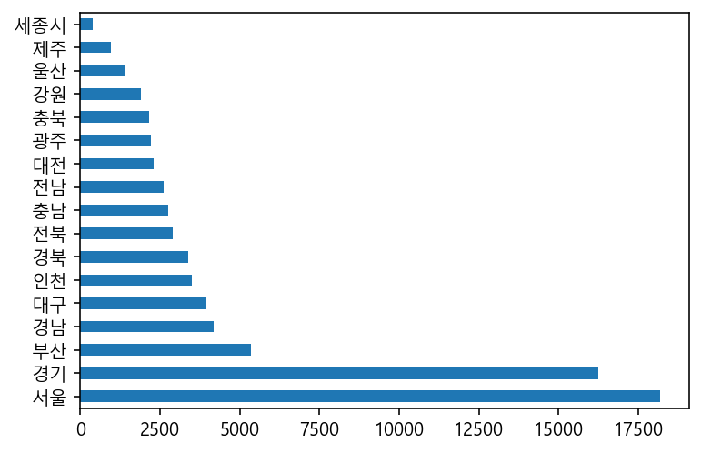
    


```python
# Pandas의 plot.pie()를 사용해서 파이그래프를 그려봅니다.

city_normalize.plot.pie(figsize = (10,10))
```


    <AxesSubplot:ylabel='시도코드명'>


    
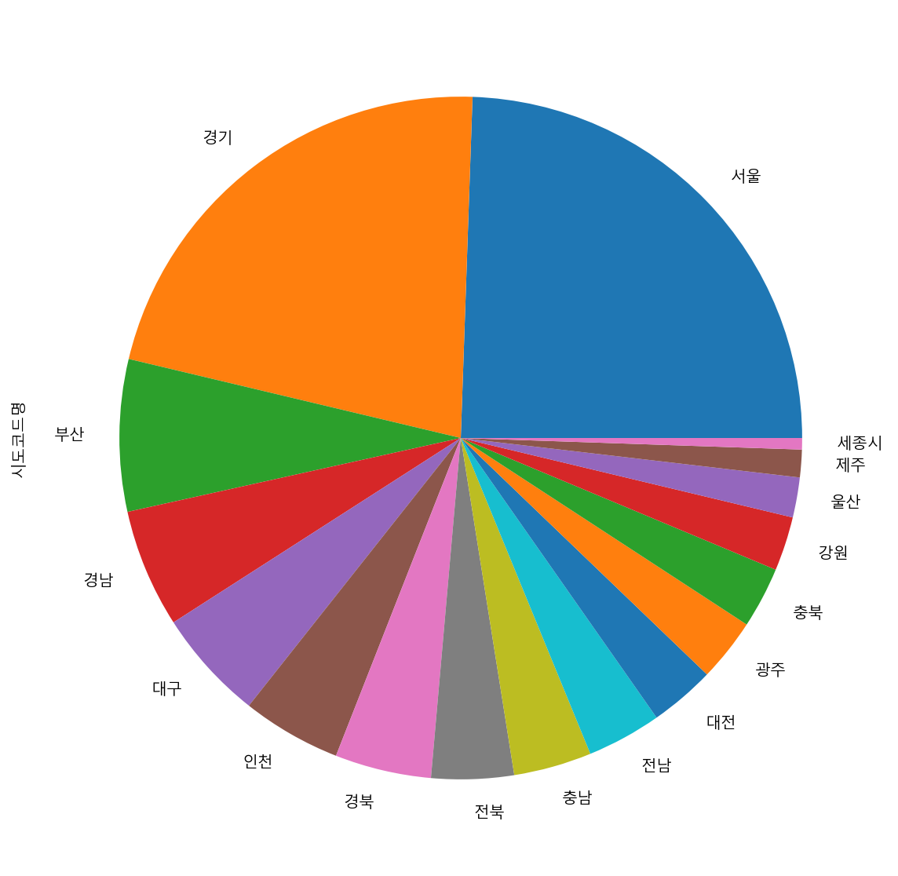
    


```python
# seaborn의 countplot으로 그려봅니다.

sns.countplot(data = df, y = "시도코드명")
```


    <AxesSubplot:xlabel='count', ylabel='시도코드명'>


    
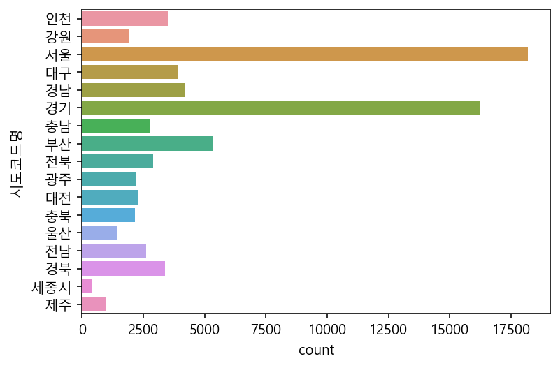
    


```python
# 종별코드명으로 갯수를 세어봅니다.

c = df["종별코드명"].value_counts()
c
```


    의원       33597
    치과의원     18490
    한의원      14618
    보건진료소     1905
    요양병원      1474
    병원        1413
    보건지소      1319
    한방병원       443
    종합병원       319
    보건소        243
    치과병원       237
    정신병원       229
    상급종합        45
    조산원         17
    보건의료원       15
    Name: 종별코드명, dtype: int64


```python
# 시군구코드명으로 갯수를 세어봅니다.

df["시군구코드명"].value_counts()
```


    강남구      2741
    서초구      1279
    송파구      1215
    부천시      1110
    성남분당구     965
             ... 
    양구군        25
    양양군        24
    영양군        21
    울릉군         9
    인천남구        1
    Name: 시군구코드명, Length: 250, dtype: int64


```python
# normalize=True 를 사용해 비율을 구해봅니다.

n = df["종별코드명"].value_counts(normalize = True)
n
```


    의원       0.451791
    치과의원     0.248642
    한의원      0.196574
    보건진료소    0.025617
    요양병원     0.019821
    병원       0.019001
    보건지소     0.017737
    한방병원     0.005957
    종합병원     0.004290
    보건소      0.003268
    치과병원     0.003187
    정신병원     0.003079
    상급종합     0.000605
    조산원      0.000229
    보건의료원    0.000202
    Name: 종별코드명, dtype: float64


```python
# Pandas의 plot.barh()를 사용해서 막대그래프를 그려봅니다.
# grid = True를 통해서 격자를 추가합니다.

c.plot.barh(grid = True)
```


    <AxesSubplot:>


    
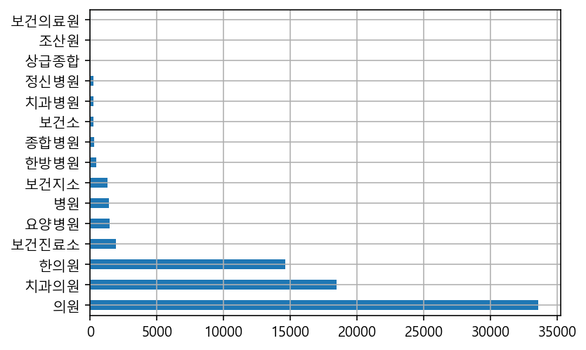
    


```python
# Pandas의 plot.pie()를 사용해서 파이그래프를 그려봅니다.

c.plot.pie(figsize = (11,5))
```


    <AxesSubplot:ylabel='종별코드명'>


    
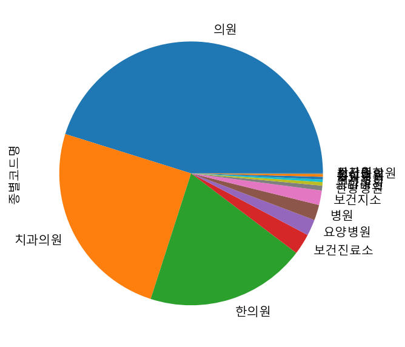
    


## 데이터 색인하기
- 특정 데이터만 모아서 따로 봅니다.


```python
# "종별코드명"이 "치과의원"인 데이터만 가져와서
# df_medical 이라는 변수에 담아봅니다.
# 그리고 head()를 통해 미리보기를 합니다.
# copy 후에 df_medical의 값이 바뀌더라도 원본 df에는 영향이 없다.

df_medical = df[df["종별코드명"] == "치과의원"].copy()
df_medical.head(1)
```


<div>
<style scoped>
    .dataframe tbody tr th:only-of-type {
        vertical-align: middle;
    }

    .dataframe tbody tr th {
        vertical-align: top;
    }

    .dataframe thead th {
        text-align: right;
    }
</style>
<table border="1" class="dataframe">
  <thead>
    <tr style="text-align: right;">
      <th></th>
      <th>암호화YKIHO코드</th>
      <th>요양기관명</th>
      <th>종별코드</th>
      <th>종별코드명</th>
      <th>시도코드</th>
      <th>시도코드명</th>
      <th>시군구코드</th>
      <th>시군구코드명</th>
      <th>우편번호</th>
      <th>주소</th>
      <th>...</th>
      <th>치과일반의 인원수</th>
      <th>치과인턴 인원수</th>
      <th>치과레지던트 인원수</th>
      <th>치과전문의 인원수</th>
      <th>한방일반의 인원수</th>
      <th>한방인턴 인원수</th>
      <th>한방레지던트 인원수</th>
      <th>한방전문의 인원수</th>
      <th>x좌표</th>
      <th>y좌표</th>
    </tr>
  </thead>
  <tbody>
    <tr>
      <th>37313</th>
      <td>JDQ4MTg4MSM1MSMkMSMkMCMkNzIkNTgxMzUxIzExIyQxIy...</td>
      <td>(사)누가선교회 누가플러스치과의원</td>
      <td>51</td>
      <td>치과의원</td>
      <td>110000</td>
      <td>서울</td>
      <td>110013</td>
      <td>영등포구</td>
      <td>7213</td>
      <td>서울특별시 영등포구 양평로 67 2층 (당산동5가, 한강포스빌)</td>
      <td>...</td>
      <td>1</td>
      <td>0</td>
      <td>0</td>
      <td>0</td>
      <td>0</td>
      <td>0</td>
      <td>0</td>
      <td>0</td>
      <td>126.899314</td>
      <td>37.534927</td>
    </tr>
  </tbody>
</table>
<p>1 rows × 27 columns</p>
</div>


```python
# "시도코드명"에서 "서울"만 가져옵니다.
# df.loc를 사용하면 행,열을 함께 가져올 수 있습니다.
# 이 기능을 통해 "시군구코드명"만 가져옵니다.
# 그리고 가져온 결과를 value_counts를 통해 시군구코드의 갯수를 세어봅니다. 

s = df["시도코드명"] == "서울"
df.loc[s, "시군구코드명"].value_counts()
```


    강남구     2741
    서초구     1279
    송파구     1215
    강서구      880
    강동구      844
    영등포구     794
    마포구      761
    노원구      747
    관악구      706
    은평구      686
    양천구      649
    동작구      601
    동대문구     597
    구로구      574
    중구       572
    광진구      558
    성북구      539
    중랑구      539
    종로구      496
    강북구      468
    성동구      457
    서대문구     437
    도봉구      370
    금천구      354
    용산구      319
    Name: 시군구코드명, dtype: int64


```python
# 위와 똑같은 기능을 수행하는 코드입니다. 아래와 같이 한 줄에 표현할 수도 있습니다.
#df.loc[df["시도코드명"] == "서울", "시군구코드명"].value_counts()
```


```python
# 강남구만 따로 모아봅니다. 

df_gangnam = df[df["시군구코드명"] == "강남구"]
df_gangnam.shape
```


    (2741, 27)


```python
# 요양기관명을 그룹화해서 갯수를 세어봅니다.
# value_counts를 사용해서 상위 10개를 출력합니다.
# 메소드체이닝을 사용합니다.

df["요양기관명"].value_counts().head(10)
```


    경희한의원      118
    서울치과의원      98
    연세치과의원      85
    우리치과의원      80
    이사랑치과의원     73
    현대치과의원      68
    우리한의원       66
    굿모닝치과의원     65
    유디치과의원      61
    이편한치과의원     61
    Name: 요양기관명, dtype: int64


```python
# 강남구만 df_gangnam 변수에 담겨져 있습니다.
# df_gangnam 변수에서 요양기관명으로 갯수를 세어봅니다.
# 가장 많은 요양기관명 상위 10개를 출력합니다.

df_gangnam["요양기관명"].value_counts().head(10)
```


    미고성형외과의원      2
    정치과의원         2
    바른나무치과의원      2
    신소애여성의원       1
    제이유피부과의원      1
    세민성형외과의원      1
    조성형외과의원       1
    다움산부인과의원      1
    더니버스성형외과의원    1
    밀라노의원         1
    Name: 요양기관명, dtype: int64


### 여러 조건으로 색인하기


```python
# "종별코드명"이 "치과의원"인 것과
# "시도코드명"이 "서울"인 것만 가져옵니다.
# Pandas에서 and 조건을 입력하기 위해서는 & 연산자를 사용하여야 하고, 연산자 우선순위 표시를 위해 ()로 묶어주어야 한다.
# and == & , or == \ 
# print 구문을 통해서 중간에 있는 코드도 출력할 수 있다.

df_seoul_dental = df[(df["종별코드명"] == "치과의원") & (df["시도코드명"] == "서울")]
print(df_seoul_dental.shape)
df_seoul_dental.head(1)
```

    (4906, 27)
    


<div>
<style scoped>
    .dataframe tbody tr th:only-of-type {
        vertical-align: middle;
    }

    .dataframe tbody tr th {
        vertical-align: top;
    }

    .dataframe thead th {
        text-align: right;
    }
</style>
<table border="1" class="dataframe">
  <thead>
    <tr style="text-align: right;">
      <th></th>
      <th>암호화YKIHO코드</th>
      <th>요양기관명</th>
      <th>종별코드</th>
      <th>종별코드명</th>
      <th>시도코드</th>
      <th>시도코드명</th>
      <th>시군구코드</th>
      <th>시군구코드명</th>
      <th>우편번호</th>
      <th>주소</th>
      <th>...</th>
      <th>치과일반의 인원수</th>
      <th>치과인턴 인원수</th>
      <th>치과레지던트 인원수</th>
      <th>치과전문의 인원수</th>
      <th>한방일반의 인원수</th>
      <th>한방인턴 인원수</th>
      <th>한방레지던트 인원수</th>
      <th>한방전문의 인원수</th>
      <th>x좌표</th>
      <th>y좌표</th>
    </tr>
  </thead>
  <tbody>
    <tr>
      <th>37313</th>
      <td>JDQ4MTg4MSM1MSMkMSMkMCMkNzIkNTgxMzUxIzExIyQxIy...</td>
      <td>(사)누가선교회 누가플러스치과의원</td>
      <td>51</td>
      <td>치과의원</td>
      <td>110000</td>
      <td>서울</td>
      <td>110013</td>
      <td>영등포구</td>
      <td>7213</td>
      <td>서울특별시 영등포구 양평로 67 2층 (당산동5가, 한강포스빌)</td>
      <td>...</td>
      <td>1</td>
      <td>0</td>
      <td>0</td>
      <td>0</td>
      <td>0</td>
      <td>0</td>
      <td>0</td>
      <td>0</td>
      <td>126.899314</td>
      <td>37.534927</td>
    </tr>
  </tbody>
</table>
<p>1 rows × 27 columns</p>
</div>


### 구별로 보기


```python
# 위에서 색인한 데이터로 "시군구코드명"으로 그룹화 해서 갯수를 세어봅니다.
# 구별로 치과의원이 몇개가 있는지 확인해봅니다. 

c = df_seoul_dental["시군구코드명"].value_counts()
c.head()
```


    강남구     551
    송파구     329
    서초구     314
    영등포구    242
    강동구     232
    Name: 시군구코드명, dtype: int64


```python
# normalize=True 를 사용해 비율을 구해봅니다.

n = df_seoul_dental["시군구코드명"].value_counts(normalize=True)
n.head()
```


    강남구     0.112311
    송파구     0.067061
    서초구     0.064003
    영등포구    0.049327
    강동구     0.047289
    Name: 시군구코드명, dtype: float64


```python
# 위에서 구한 결과를 Pandas의 plot.bar()를 활용해 막대그래프로 그립니다.
# rot를 통해 x축의 글씨 기울기를 조절합니다.

c.plot.bar(figsize = (10,5), rot = 60)
```


    <AxesSubplot:>


    
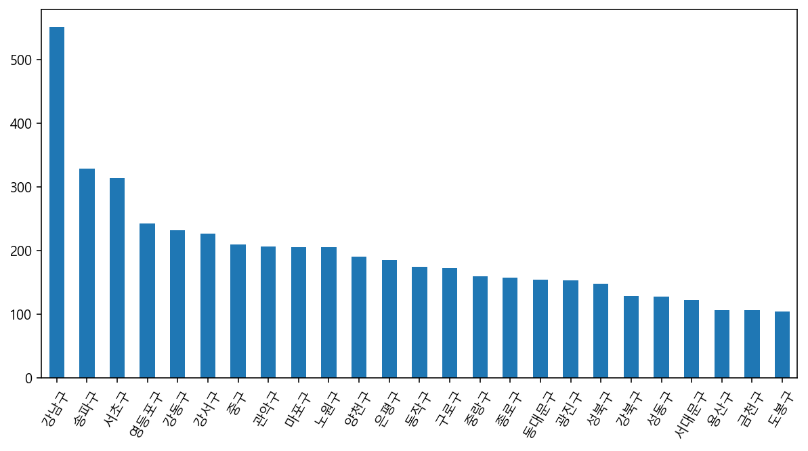
    


```python
# "종별코드명"이 "종합병원"인 것과
# "시도코드명"이 "서울"인 것만 가져옵니다.
# 결과를 df_seoul_hospital에 할당해서 재사용합니다.

df_seoul_hospital = df[(df["종별코드명"] == "종합병원") & (df["시도코드명"] == "서울")].copy()
df_seoul_hospital
```


<div>
<style scoped>
    .dataframe tbody tr th:only-of-type {
        vertical-align: middle;
    }

    .dataframe tbody tr th {
        vertical-align: top;
    }

    .dataframe thead th {
        text-align: right;
    }
</style>
<table border="1" class="dataframe">
  <thead>
    <tr style="text-align: right;">
      <th></th>
      <th>암호화YKIHO코드</th>
      <th>요양기관명</th>
      <th>종별코드</th>
      <th>종별코드명</th>
      <th>시도코드</th>
      <th>시도코드명</th>
      <th>시군구코드</th>
      <th>시군구코드명</th>
      <th>우편번호</th>
      <th>주소</th>
      <th>...</th>
      <th>치과일반의 인원수</th>
      <th>치과인턴 인원수</th>
      <th>치과레지던트 인원수</th>
      <th>치과전문의 인원수</th>
      <th>한방일반의 인원수</th>
      <th>한방인턴 인원수</th>
      <th>한방레지던트 인원수</th>
      <th>한방전문의 인원수</th>
      <th>x좌표</th>
      <th>y좌표</th>
    </tr>
  </thead>
  <tbody>
    <tr>
      <th>51</th>
      <td>JDQ4MTg4MSM1MSMkMSMkMCMkODkkMzgxMzUxIzExIyQxIy...</td>
      <td>가톨릭대학교 여의도성모병원</td>
      <td>11</td>
      <td>종합병원</td>
      <td>110000</td>
      <td>서울</td>
      <td>110013</td>
      <td>영등포구</td>
      <td>7345</td>
      <td>서울특별시 영등포구 63로 10 여의도성모병원 (여의도동)</td>
      <td>...</td>
      <td>0</td>
      <td>0</td>
      <td>0</td>
      <td>3</td>
      <td>0</td>
      <td>0</td>
      <td>0</td>
      <td>0</td>
      <td>126.936752</td>
      <td>37.518325</td>
    </tr>
    <tr>
      <th>52</th>
      <td>JDQ4MTg4MSM1MSMkMSMkMCMkODkkMzgxMzUxIzExIyQxIy...</td>
      <td>가톨릭대학교 은평성모병원</td>
      <td>11</td>
      <td>종합병원</td>
      <td>110000</td>
      <td>서울</td>
      <td>110015</td>
      <td>은평구</td>
      <td>3312</td>
      <td>서울특별시 은평구 통일로 1021 (진관동)</td>
      <td>...</td>
      <td>0</td>
      <td>0</td>
      <td>0</td>
      <td>3</td>
      <td>0</td>
      <td>0</td>
      <td>0</td>
      <td>0</td>
      <td>126.916191</td>
      <td>37.633494</td>
    </tr>
    <tr>
      <th>56</th>
      <td>JDQ4MTg4MSM1MSMkMSMkMCMkODkkMzgxMzUxIzExIyQxIy...</td>
      <td>강동경희대학교의대병원</td>
      <td>11</td>
      <td>종합병원</td>
      <td>110000</td>
      <td>서울</td>
      <td>110002</td>
      <td>강동구</td>
      <td>5278</td>
      <td>서울특별시 강동구 동남로 892 (상일동)</td>
      <td>...</td>
      <td>0</td>
      <td>0</td>
      <td>0</td>
      <td>1</td>
      <td>0</td>
      <td>0</td>
      <td>0</td>
      <td>0</td>
      <td>127.157379</td>
      <td>37.553448</td>
    </tr>
    <tr>
      <th>76</th>
      <td>JDQ4MTg4MSM1MSMkMSMkMCMkODkkMzgxMzUxIzExIyQxIy...</td>
      <td>경찰병원</td>
      <td>11</td>
      <td>종합병원</td>
      <td>110000</td>
      <td>서울</td>
      <td>110018</td>
      <td>송파구</td>
      <td>5715</td>
      <td>서울특별시 송파구 송이로 123 국립경찰병원 (가락동)</td>
      <td>...</td>
      <td>1</td>
      <td>0</td>
      <td>0</td>
      <td>2</td>
      <td>0</td>
      <td>0</td>
      <td>0</td>
      <td>0</td>
      <td>127.123509</td>
      <td>37.496384</td>
    </tr>
    <tr>
      <th>91</th>
      <td>JDQ4MTg4MSM1MSMkMSMkMCMkODkkMzgxMzUxIzExIyQyIy...</td>
      <td>구로성심병원</td>
      <td>11</td>
      <td>종합병원</td>
      <td>110000</td>
      <td>서울</td>
      <td>110005</td>
      <td>구로구</td>
      <td>8223</td>
      <td>서울특별시 구로구 경인로 427 구로성심병원 (고척동)</td>
      <td>...</td>
      <td>0</td>
      <td>0</td>
      <td>0</td>
      <td>0</td>
      <td>0</td>
      <td>0</td>
      <td>0</td>
      <td>0</td>
      <td>126.866416</td>
      <td>37.499672</td>
    </tr>
    <tr>
      <th>96</th>
      <td>JDQ4MTg4MSM1MSMkMSMkMCMkODkkMzgxMzUxIzExIyQyIy...</td>
      <td>국립중앙의료원</td>
      <td>11</td>
      <td>종합병원</td>
      <td>110000</td>
      <td>서울</td>
      <td>110017</td>
      <td>중구</td>
      <td>4564</td>
      <td>서울특별시 중구 을지로 245 (을지로6가)</td>
      <td>...</td>
      <td>0</td>
      <td>0</td>
      <td>0</td>
      <td>4</td>
      <td>0</td>
      <td>0</td>
      <td>0</td>
      <td>4</td>
      <td>127.005671</td>
      <td>37.567214</td>
    </tr>
    <tr>
      <th>108</th>
      <td>JDQ4MTg4MSM1MSMkMSMkMCMkODkkMzgxMzUxIzExIyQxIy...</td>
      <td>노원을지대학교병원</td>
      <td>11</td>
      <td>종합병원</td>
      <td>110000</td>
      <td>서울</td>
      <td>110022</td>
      <td>노원구</td>
      <td>1830</td>
      <td>서울특별시 노원구 한글비석로 68 을지병원 (하계동)</td>
      <td>...</td>
      <td>1</td>
      <td>0</td>
      <td>0</td>
      <td>2</td>
      <td>0</td>
      <td>0</td>
      <td>0</td>
      <td>0</td>
      <td>127.069935</td>
      <td>37.636479</td>
    </tr>
    <tr>
      <th>109</th>
      <td>JDQ4MTg4MSM1MSMkMSMkMCMkODkkMzgxMzUxIzExIyQxIy...</td>
      <td>녹색병원</td>
      <td>11</td>
      <td>종합병원</td>
      <td>110000</td>
      <td>서울</td>
      <td>110019</td>
      <td>중랑구</td>
      <td>2221</td>
      <td>서울특별시 중랑구 사가정로49길 53 (면목동)</td>
      <td>...</td>
      <td>0</td>
      <td>0</td>
      <td>0</td>
      <td>0</td>
      <td>0</td>
      <td>0</td>
      <td>0</td>
      <td>0</td>
      <td>127.086074</td>
      <td>37.583573</td>
    </tr>
    <tr>
      <th>115</th>
      <td>JDQ4MTg4MSM1MSMkMSMkMCMkODkkMzgxMzUxIzExIyQxIy...</td>
      <td>대림성모병원</td>
      <td>11</td>
      <td>종합병원</td>
      <td>110000</td>
      <td>서울</td>
      <td>110013</td>
      <td>영등포구</td>
      <td>7442</td>
      <td>서울특별시 영등포구 시흥대로 657 (대림동, 대림성모병원)</td>
      <td>...</td>
      <td>1</td>
      <td>0</td>
      <td>0</td>
      <td>0</td>
      <td>0</td>
      <td>0</td>
      <td>0</td>
      <td>0</td>
      <td>126.907221</td>
      <td>37.490698</td>
    </tr>
    <tr>
      <th>129</th>
      <td>JDQ4MTg4MSM1MSMkMSMkMCMkODkkMzgxMzUxIzExIyQxIy...</td>
      <td>명지성모병원</td>
      <td>11</td>
      <td>종합병원</td>
      <td>110000</td>
      <td>서울</td>
      <td>110013</td>
      <td>영등포구</td>
      <td>7417</td>
      <td>서울특별시 영등포구 도림로 156 명지성모병원 (대림동)</td>
      <td>...</td>
      <td>0</td>
      <td>0</td>
      <td>0</td>
      <td>0</td>
      <td>0</td>
      <td>0</td>
      <td>0</td>
      <td>0</td>
      <td>126.899278</td>
      <td>37.493883</td>
    </tr>
    <tr>
      <th>134</th>
      <td>JDQ4MTg4MSM1MSMkMSMkMCMkODkkMzgxMzUxIzExIyQxIy...</td>
      <td>미즈메디병원</td>
      <td>11</td>
      <td>종합병원</td>
      <td>110000</td>
      <td>서울</td>
      <td>110003</td>
      <td>강서구</td>
      <td>7639</td>
      <td>서울특별시 강서구 강서로 295 (내발산동)</td>
      <td>...</td>
      <td>0</td>
      <td>0</td>
      <td>0</td>
      <td>0</td>
      <td>0</td>
      <td>0</td>
      <td>0</td>
      <td>0</td>
      <td>126.835936</td>
      <td>37.552218</td>
    </tr>
    <tr>
      <th>136</th>
      <td>JDQ4MTg4MSM1MSMkMSMkMCMkODkkMzgxMzUxIzExIyQyIy...</td>
      <td>부민병원</td>
      <td>11</td>
      <td>종합병원</td>
      <td>110000</td>
      <td>서울</td>
      <td>110003</td>
      <td>강서구</td>
      <td>7590</td>
      <td>서울특별시 강서구 공항대로 389 부민병원 (등촌동)</td>
      <td>...</td>
      <td>0</td>
      <td>0</td>
      <td>0</td>
      <td>0</td>
      <td>0</td>
      <td>0</td>
      <td>0</td>
      <td>0</td>
      <td>126.850927</td>
      <td>37.556866</td>
    </tr>
    <tr>
      <th>149</th>
      <td>JDQ4MTg4MSM1MSMkMSMkMCMkODkkMzgxMzUxIzExIyQxIy...</td>
      <td>삼육서울병원</td>
      <td>11</td>
      <td>종합병원</td>
      <td>110000</td>
      <td>서울</td>
      <td>110007</td>
      <td>동대문구</td>
      <td>2500</td>
      <td>서울특별시 동대문구 망우로 82 (휘경동)</td>
      <td>...</td>
      <td>1</td>
      <td>0</td>
      <td>0</td>
      <td>0</td>
      <td>0</td>
      <td>0</td>
      <td>0</td>
      <td>0</td>
      <td>127.065307</td>
      <td>37.587991</td>
    </tr>
    <tr>
      <th>158</th>
      <td>JDQ4MTg4MSM1MSMkMSMkMCMkODkkMzgxMzUxIzExIyQxIy...</td>
      <td>서울성심병원</td>
      <td>11</td>
      <td>종합병원</td>
      <td>110000</td>
      <td>서울</td>
      <td>110007</td>
      <td>동대문구</td>
      <td>2488</td>
      <td>서울특별시 동대문구 왕산로 259 서울성심병원 (청량리동)</td>
      <td>...</td>
      <td>1</td>
      <td>0</td>
      <td>0</td>
      <td>0</td>
      <td>0</td>
      <td>0</td>
      <td>0</td>
      <td>0</td>
      <td>127.049730</td>
      <td>37.584308</td>
    </tr>
    <tr>
      <th>159</th>
      <td>JDQ4MTg4MSM1MSMkMSMkMCMkODkkMzgxMzUxIzExIyQxIy...</td>
      <td>서울적십자병원</td>
      <td>11</td>
      <td>종합병원</td>
      <td>110000</td>
      <td>서울</td>
      <td>110016</td>
      <td>종로구</td>
      <td>3181</td>
      <td>서울특별시 종로구 새문안로 9 적십자병원 (평동)</td>
      <td>...</td>
      <td>2</td>
      <td>0</td>
      <td>0</td>
      <td>1</td>
      <td>0</td>
      <td>0</td>
      <td>0</td>
      <td>0</td>
      <td>126.966997</td>
      <td>37.567180</td>
    </tr>
    <tr>
      <th>160</th>
      <td>JDQ4MTg4MSM1MSMkMSMkMCMkODkkMzgxMzUxIzExIyQxIy...</td>
      <td>서울특별시 동부병원</td>
      <td>11</td>
      <td>종합병원</td>
      <td>110000</td>
      <td>서울</td>
      <td>110007</td>
      <td>동대문구</td>
      <td>2584</td>
      <td>서울특별시 동대문구 무학로 124 (용두동)</td>
      <td>...</td>
      <td>2</td>
      <td>0</td>
      <td>0</td>
      <td>0</td>
      <td>0</td>
      <td>0</td>
      <td>0</td>
      <td>0</td>
      <td>127.031341</td>
      <td>37.575368</td>
    </tr>
    <tr>
      <th>161</th>
      <td>JDQ4MTg4MSM1MSMkMSMkMCMkODkkMzgxMzUxIzExIyQxIy...</td>
      <td>서울특별시보라매병원</td>
      <td>11</td>
      <td>종합병원</td>
      <td>110000</td>
      <td>서울</td>
      <td>110008</td>
      <td>동작구</td>
      <td>7061</td>
      <td>서울특별시 동작구 보라매로5길 20 (신대방동)</td>
      <td>...</td>
      <td>0</td>
      <td>1</td>
      <td>3</td>
      <td>6</td>
      <td>0</td>
      <td>0</td>
      <td>0</td>
      <td>0</td>
      <td>126.923906</td>
      <td>37.493441</td>
    </tr>
    <tr>
      <th>162</th>
      <td>JDQ4MTg4MSM1MSMkMSMkMCMkODkkMzgxMzUxIzExIyQyIy...</td>
      <td>서울특별시서남병원</td>
      <td>11</td>
      <td>종합병원</td>
      <td>110000</td>
      <td>서울</td>
      <td>110020</td>
      <td>양천구</td>
      <td>8049</td>
      <td>서울특별시 양천구 신정이펜1로 20 (신정동)</td>
      <td>...</td>
      <td>1</td>
      <td>0</td>
      <td>0</td>
      <td>0</td>
      <td>0</td>
      <td>0</td>
      <td>0</td>
      <td>0</td>
      <td>126.833153</td>
      <td>37.512020</td>
    </tr>
    <tr>
      <th>163</th>
      <td>JDQ4MTg4MSM1MSMkMSMkMCMkODkkMzgxMzUxIzExIyQyIy...</td>
      <td>서울특별시서울의료원</td>
      <td>11</td>
      <td>종합병원</td>
      <td>110000</td>
      <td>서울</td>
      <td>110019</td>
      <td>중랑구</td>
      <td>2053</td>
      <td>서울특별시 중랑구 신내로 156 (신내동)</td>
      <td>...</td>
      <td>1</td>
      <td>0</td>
      <td>0</td>
      <td>2</td>
      <td>1</td>
      <td>0</td>
      <td>0</td>
      <td>0</td>
      <td>127.097831</td>
      <td>37.613276</td>
    </tr>
    <tr>
      <th>168</th>
      <td>JDQ4MTg4MSM1MSMkMSMkMCMkODkkMzgxMzUxIzExIyQxIy...</td>
      <td>성심의료재단강동성심병원</td>
      <td>11</td>
      <td>종합병원</td>
      <td>110000</td>
      <td>서울</td>
      <td>110002</td>
      <td>강동구</td>
      <td>5355</td>
      <td>서울특별시 강동구 성안로 150 (길동)</td>
      <td>...</td>
      <td>0</td>
      <td>0</td>
      <td>0</td>
      <td>2</td>
      <td>0</td>
      <td>0</td>
      <td>0</td>
      <td>0</td>
      <td>127.135378</td>
      <td>37.535997</td>
    </tr>
    <tr>
      <th>169</th>
      <td>JDQ4MTg4MSM1MSMkMSMkMCMkODkkMzgxMzUxIzExIyQyIy...</td>
      <td>성애의료재단 성애병원</td>
      <td>11</td>
      <td>종합병원</td>
      <td>110000</td>
      <td>서울</td>
      <td>110013</td>
      <td>영등포구</td>
      <td>7354</td>
      <td>서울특별시 영등포구 여의대방로53길 22 (신길동, 성애병원)</td>
      <td>...</td>
      <td>2</td>
      <td>0</td>
      <td>0</td>
      <td>0</td>
      <td>0</td>
      <td>0</td>
      <td>0</td>
      <td>0</td>
      <td>126.922500</td>
      <td>37.512027</td>
    </tr>
    <tr>
      <th>170</th>
      <td>JDQ4MTg4MSM1MSMkMSMkMCMkODkkMzgxMzUxIzExIyQxIy...</td>
      <td>세란병원</td>
      <td>11</td>
      <td>종합병원</td>
      <td>110000</td>
      <td>서울</td>
      <td>110016</td>
      <td>종로구</td>
      <td>3030</td>
      <td>서울특별시 종로구 통일로 256 (무악동)</td>
      <td>...</td>
      <td>0</td>
      <td>0</td>
      <td>0</td>
      <td>0</td>
      <td>0</td>
      <td>0</td>
      <td>0</td>
      <td>0</td>
      <td>126.957461</td>
      <td>37.575184</td>
    </tr>
    <tr>
      <th>176</th>
      <td>JDQ4MTg4MSM1MSMkMSMkMCMkODkkMzgxMzUxIzExIyQxIy...</td>
      <td>순천향대학교 부속 서울병원</td>
      <td>11</td>
      <td>종합병원</td>
      <td>110000</td>
      <td>서울</td>
      <td>110014</td>
      <td>용산구</td>
      <td>4401</td>
      <td>서울특별시 용산구 대사관로 59 (한남동)</td>
      <td>...</td>
      <td>2</td>
      <td>0</td>
      <td>0</td>
      <td>5</td>
      <td>0</td>
      <td>0</td>
      <td>0</td>
      <td>0</td>
      <td>127.004258</td>
      <td>37.533804</td>
    </tr>
    <tr>
      <th>178</th>
      <td>JDQ4MTg4MSM1MSMkMSMkMCMkODkkMzgxMzUxIzExIyQxIy...</td>
      <td>씨엠병원</td>
      <td>11</td>
      <td>종합병원</td>
      <td>110000</td>
      <td>서울</td>
      <td>110013</td>
      <td>영등포구</td>
      <td>7301</td>
      <td>서울특별시 영등포구 영등포로36길 13 (영등포동4가, 충무병원),  문래로 187...</td>
      <td>...</td>
      <td>0</td>
      <td>0</td>
      <td>0</td>
      <td>0</td>
      <td>0</td>
      <td>0</td>
      <td>0</td>
      <td>0</td>
      <td>126.903876</td>
      <td>37.518809</td>
    </tr>
    <tr>
      <th>183</th>
      <td>JDQ4MTg4MSM1MSMkMSMkMCMkODkkMzgxMzUxIzExIyQxIy...</td>
      <td>에이치플러스 양지병원</td>
      <td>11</td>
      <td>종합병원</td>
      <td>110000</td>
      <td>서울</td>
      <td>110004</td>
      <td>관악구</td>
      <td>8779</td>
      <td>서울특별시 관악구 남부순환로 1636 양지병원 (신림동)</td>
      <td>...</td>
      <td>0</td>
      <td>0</td>
      <td>0</td>
      <td>0</td>
      <td>0</td>
      <td>0</td>
      <td>0</td>
      <td>0</td>
      <td>126.932569</td>
      <td>37.484154</td>
    </tr>
    <tr>
      <th>195</th>
      <td>JDQ4MTg4MSM1MSMkMSMkMCMkODkkMzgxMzUxIzExIyQyIy...</td>
      <td>우리들병원</td>
      <td>11</td>
      <td>종합병원</td>
      <td>110000</td>
      <td>서울</td>
      <td>110003</td>
      <td>강서구</td>
      <td>7505</td>
      <td>서울특별시 강서구 하늘길 70 (과해동)</td>
      <td>...</td>
      <td>0</td>
      <td>0</td>
      <td>0</td>
      <td>0</td>
      <td>0</td>
      <td>0</td>
      <td>0</td>
      <td>0</td>
      <td>126.796326</td>
      <td>37.562045</td>
    </tr>
    <tr>
      <th>241</th>
      <td>JDQ4MTg4MSM1MSMkMSMkMCMkODkkMzgxMzUxIzExIyQxIy...</td>
      <td>의료법인 청구성심병원</td>
      <td>11</td>
      <td>종합병원</td>
      <td>110000</td>
      <td>서울</td>
      <td>110015</td>
      <td>은평구</td>
      <td>3330</td>
      <td>서울특별시 은평구 통일로 873 (갈현동)</td>
      <td>...</td>
      <td>0</td>
      <td>0</td>
      <td>0</td>
      <td>0</td>
      <td>0</td>
      <td>0</td>
      <td>0</td>
      <td>0</td>
      <td>126.919701</td>
      <td>37.620861</td>
    </tr>
    <tr>
      <th>252</th>
      <td>JDQ4MTg4MSM1MSMkMSMkMCMkODkkMzgxMzUxIzExIyQxIy...</td>
      <td>의료법인동신의료재단 동신병원</td>
      <td>11</td>
      <td>종합병원</td>
      <td>110000</td>
      <td>서울</td>
      <td>110010</td>
      <td>서대문구</td>
      <td>3653</td>
      <td>서울특별시 서대문구 연희로 272 동신병원 본관동 (홍은동)</td>
      <td>...</td>
      <td>0</td>
      <td>0</td>
      <td>0</td>
      <td>0</td>
      <td>0</td>
      <td>0</td>
      <td>0</td>
      <td>0</td>
      <td>126.936425</td>
      <td>37.581332</td>
    </tr>
    <tr>
      <th>265</th>
      <td>JDQ4MTg4MSM1MSMkMSMkMCMkODkkMzgxMzUxIzExIyQxIy...</td>
      <td>의료법인성화의료재단  대한병원</td>
      <td>11</td>
      <td>종합병원</td>
      <td>110000</td>
      <td>서울</td>
      <td>110024</td>
      <td>강북구</td>
      <td>1081</td>
      <td>서울특별시 강북구 도봉로 301 (수유동, 대한병원)</td>
      <td>...</td>
      <td>0</td>
      <td>0</td>
      <td>0</td>
      <td>0</td>
      <td>0</td>
      <td>0</td>
      <td>0</td>
      <td>0</td>
      <td>127.022691</td>
      <td>37.635475</td>
    </tr>
    <tr>
      <th>279</th>
      <td>JDQ4MTg4MSM1MSMkMSMkMCMkODkkMzgxMzUxIzExIyQxIy...</td>
      <td>의료법인풍산의료재단동부제일병원</td>
      <td>11</td>
      <td>종합병원</td>
      <td>110000</td>
      <td>서울</td>
      <td>110019</td>
      <td>중랑구</td>
      <td>2063</td>
      <td>서울특별시 중랑구 망우로 511 (망우동, 동부제일병원)</td>
      <td>...</td>
      <td>0</td>
      <td>0</td>
      <td>0</td>
      <td>0</td>
      <td>0</td>
      <td>0</td>
      <td>0</td>
      <td>0</td>
      <td>127.109009</td>
      <td>37.600709</td>
    </tr>
    <tr>
      <th>283</th>
      <td>JDQ4MTg4MSM1MSMkMSMkMCMkODkkMzgxMzUxIzExIyQxIy...</td>
      <td>의료법인한전의료재단 한일병원</td>
      <td>11</td>
      <td>종합병원</td>
      <td>110000</td>
      <td>서울</td>
      <td>110006</td>
      <td>도봉구</td>
      <td>1450</td>
      <td>서울특별시 도봉구 우이천로 308 (쌍문동)</td>
      <td>...</td>
      <td>1</td>
      <td>0</td>
      <td>0</td>
      <td>2</td>
      <td>0</td>
      <td>0</td>
      <td>0</td>
      <td>0</td>
      <td>127.029123</td>
      <td>37.646140</td>
    </tr>
    <tr>
      <th>290</th>
      <td>JDQ4MTg4MSM1MSMkMSMkMCMkODkkMzgxMzUxIzExIyQyIy...</td>
      <td>이화여자대학교의과대학부속서울병원</td>
      <td>11</td>
      <td>종합병원</td>
      <td>110000</td>
      <td>서울</td>
      <td>110003</td>
      <td>강서구</td>
      <td>7804</td>
      <td>서울특별시 강서구 공항대로 260 이화여자대학교 제2부속병원 (마곡동)</td>
      <td>...</td>
      <td>1</td>
      <td>0</td>
      <td>1</td>
      <td>4</td>
      <td>0</td>
      <td>0</td>
      <td>0</td>
      <td>0</td>
      <td>126.836267</td>
      <td>37.557263</td>
    </tr>
    <tr>
      <th>293</th>
      <td>JDQ4MTg4MSM1MSMkMSMkMCMkODkkMzgxMzUxIzExIyQxIy...</td>
      <td>인제대학교 상계백병원</td>
      <td>11</td>
      <td>종합병원</td>
      <td>110000</td>
      <td>서울</td>
      <td>110022</td>
      <td>노원구</td>
      <td>1757</td>
      <td>서울특별시 노원구 동일로 1342 상계백병원 (상계동)</td>
      <td>...</td>
      <td>0</td>
      <td>0</td>
      <td>6</td>
      <td>3</td>
      <td>0</td>
      <td>0</td>
      <td>0</td>
      <td>0</td>
      <td>127.063123</td>
      <td>37.648528</td>
    </tr>
    <tr>
      <th>294</th>
      <td>JDQ4MTg4MSM1MSMkMSMkMCMkODkkMzgxMzUxIzExIyQxIy...</td>
      <td>인제대학교 서울백병원</td>
      <td>11</td>
      <td>종합병원</td>
      <td>110000</td>
      <td>서울</td>
      <td>110017</td>
      <td>중구</td>
      <td>4551</td>
      <td>서울특별시 중구 마른내로 9-9 (저동2가)</td>
      <td>...</td>
      <td>0</td>
      <td>0</td>
      <td>0</td>
      <td>0</td>
      <td>0</td>
      <td>0</td>
      <td>0</td>
      <td>0</td>
      <td>126.988672</td>
      <td>37.564827</td>
    </tr>
    <tr>
      <th>319</th>
      <td>JDQ4MTg4MSM1MSMkMSMkMCMkODkkMzgxMzUxIzExIyQxIy...</td>
      <td>차의과학대학교 강남차병원</td>
      <td>11</td>
      <td>종합병원</td>
      <td>110000</td>
      <td>서울</td>
      <td>110001</td>
      <td>강남구</td>
      <td>6135</td>
      <td>서울특별시 강남구 논현로 566 강남차병원(역삼동650-9, 606-4, 605외2...</td>
      <td>...</td>
      <td>0</td>
      <td>0</td>
      <td>0</td>
      <td>2</td>
      <td>0</td>
      <td>0</td>
      <td>0</td>
      <td>0</td>
      <td>127.035055</td>
      <td>37.506794</td>
    </tr>
    <tr>
      <th>344</th>
      <td>JDQ4MTg4MSM1MSMkMSMkMCMkODkkMzgxMzUxIzExIyQxIy...</td>
      <td>한국보훈복지의료공단 중앙보훈병원</td>
      <td>11</td>
      <td>종합병원</td>
      <td>110000</td>
      <td>서울</td>
      <td>110002</td>
      <td>강동구</td>
      <td>5368</td>
      <td>서울특별시 강동구 진황도로61길 53 (둔촌동)</td>
      <td>...</td>
      <td>0</td>
      <td>9</td>
      <td>28</td>
      <td>21</td>
      <td>0</td>
      <td>0</td>
      <td>0</td>
      <td>1</td>
      <td>127.148161</td>
      <td>37.530634</td>
    </tr>
    <tr>
      <th>345</th>
      <td>JDQ4MTg4MSM1MSMkMSMkMCMkODkkMzgxMzUxIzExIyQxIy...</td>
      <td>한국원자력의학원원자력병원</td>
      <td>11</td>
      <td>종합병원</td>
      <td>110000</td>
      <td>서울</td>
      <td>110022</td>
      <td>노원구</td>
      <td>1812</td>
      <td>서울특별시 노원구 노원로 75 한국원자력의학원 (공릉동)</td>
      <td>...</td>
      <td>1</td>
      <td>0</td>
      <td>0</td>
      <td>1</td>
      <td>0</td>
      <td>0</td>
      <td>0</td>
      <td>0</td>
      <td>127.082697</td>
      <td>37.628821</td>
    </tr>
    <tr>
      <th>346</th>
      <td>JDQ4MTg4MSM1MSMkMSMkMCMkODkkMzgxMzUxIzExIyQyIy...</td>
      <td>한림대학교 강남성심병원</td>
      <td>11</td>
      <td>종합병원</td>
      <td>110000</td>
      <td>서울</td>
      <td>110013</td>
      <td>영등포구</td>
      <td>7441</td>
      <td>서울특별시 영등포구 신길로 1 (대림동, 강남성심병원)</td>
      <td>...</td>
      <td>0</td>
      <td>0</td>
      <td>0</td>
      <td>6</td>
      <td>0</td>
      <td>0</td>
      <td>0</td>
      <td>0</td>
      <td>126.908653</td>
      <td>37.493726</td>
    </tr>
    <tr>
      <th>347</th>
      <td>JDQ4MTg4MSM1MSMkMSMkMCMkODkkMzgxMzUxIzExIyQxIy...</td>
      <td>한림대학교 한강성심병원</td>
      <td>11</td>
      <td>종합병원</td>
      <td>110000</td>
      <td>서울</td>
      <td>110013</td>
      <td>영등포구</td>
      <td>7247</td>
      <td>서울특별시 영등포구 버드나루로7길 12 (영등포동7가, 한강성심병원)</td>
      <td>...</td>
      <td>0</td>
      <td>0</td>
      <td>0</td>
      <td>0</td>
      <td>0</td>
      <td>0</td>
      <td>0</td>
      <td>0</td>
      <td>126.909681</td>
      <td>37.523170</td>
    </tr>
    <tr>
      <th>358</th>
      <td>JDQ4MTg4MSM1MSMkMSMkMCMkODkkMzgxMzUxIzExIyQxIy...</td>
      <td>혜민병원</td>
      <td>11</td>
      <td>종합병원</td>
      <td>110000</td>
      <td>서울</td>
      <td>110023</td>
      <td>광진구</td>
      <td>5056</td>
      <td>서울특별시 광진구 자양로 85 (자양동)</td>
      <td>...</td>
      <td>0</td>
      <td>0</td>
      <td>0</td>
      <td>0</td>
      <td>0</td>
      <td>0</td>
      <td>0</td>
      <td>0</td>
      <td>127.083625</td>
      <td>37.535408</td>
    </tr>
    <tr>
      <th>359</th>
      <td>JDQ4MTg4MSM1MSMkMSMkMCMkODkkMzgxMzUxIzExIyQxIy...</td>
      <td>홍익병원</td>
      <td>11</td>
      <td>종합병원</td>
      <td>110000</td>
      <td>서울</td>
      <td>110020</td>
      <td>양천구</td>
      <td>7937</td>
      <td>서울특별시 양천구 목동로 225 홍익병원본관 (신정동)</td>
      <td>...</td>
      <td>1</td>
      <td>0</td>
      <td>0</td>
      <td>2</td>
      <td>0</td>
      <td>0</td>
      <td>0</td>
      <td>0</td>
      <td>126.863655</td>
      <td>37.528484</td>
    </tr>
    <tr>
      <th>363</th>
      <td>JDQ4MTg4MSM1MSMkMSMkMCMkODkkMzgxMzUxIzExIyQxIy...</td>
      <td>희명병원</td>
      <td>11</td>
      <td>종합병원</td>
      <td>110000</td>
      <td>서울</td>
      <td>110025</td>
      <td>금천구</td>
      <td>8626</td>
      <td>서울특별시 금천구 시흥대로 244 (시흥동)</td>
      <td>...</td>
      <td>0</td>
      <td>0</td>
      <td>0</td>
      <td>0</td>
      <td>0</td>
      <td>0</td>
      <td>0</td>
      <td>0</td>
      <td>126.900584</td>
      <td>37.455687</td>
    </tr>
  </tbody>
</table>
<p>42 rows × 27 columns</p>
</div>


```python
# "시군구코드명" 으로 그룹화해서 구별로 종합병원의 수를 세어봅니다.
df_seoul_hospital["시군구코드명"].value_counts()
```


    영등포구    7
    강서구     4
    강동구     3
    중랑구     3
    노원구     3
    동대문구    3
    양천구     2
    중구      2
    종로구     2
    은평구     2
    강북구     1
    금천구     1
    관악구     1
    구로구     1
    도봉구     1
    동작구     1
    서대문구    1
    강남구     1
    광진구     1
    용산구     1
    송파구     1
    Name: 시군구코드명, dtype: int64


### 텍스트데이터 색인하기 
- 텍스트 데이터 전처리를 위한 과정
- 1) 요양기관명에서 특정 단어(ex.성모)가 들어가는 데이터만 가져오고 싶을 때 
- df_seoul_hospital[df_seoul_hospital["요양기관명"].str.contains(성모)]
- 2) 특정 단어간 들어간 행을 제거하고 싶다면
- drop_row = df_seoul_hospital[df_seoul_hospital["요양기관명"].str.contains(성모)]
- drop_row = drop_row.tolist()
- df_seoul_hospital.drop(drop_row, axis = 0)


```python
# 텍스트 데이터 전처리 후 분석하고자 하는 데이터의 "요양기관명"을 확인 

df_seoul_hospital["요양기관명"].unique()
```


    array(['가톨릭대학교 여의도성모병원', '가톨릭대학교 은평성모병원', '강동경희대학교의대병원', '경찰병원', '구로성심병원',
           '국립중앙의료원', '노원을지대학교병원', '녹색병원', '대림성모병원', '명지성모병원', '미즈메디병원',
           '부민병원', '삼육서울병원', '서울성심병원', '서울적십자병원', '서울특별시 동부병원', '서울특별시보라매병원',
           '서울특별시서남병원', '서울특별시서울의료원', '성심의료재단강동성심병원', '성애의료재단 성애병원', '세란병원',
           '순천향대학교 부속 서울병원', '씨엠병원', '에이치플러스 양지병원', '우리들병원', '의료법인 청구성심병원',
           '의료법인동신의료재단 동신병원', '의료법인성화의료재단  대한병원', '의료법인풍산의료재단동부제일병원',
           '의료법인한전의료재단 한일병원', '이화여자대학교의과대학부속서울병원', '인제대학교 상계백병원',
           '인제대학교 서울백병원', '차의과학대학교 강남차병원', '한국보훈복지의료공단 중앙보훈병원',
           '한국원자력의학원원자력병원', '한림대학교 강남성심병원', '한림대학교 한강성심병원', '혜민병원', '홍익병원',
           '희명병원'], dtype=object)


```python
df_seoul_hospital["시군구코드명"].value_counts().plot.bar()
```


    <AxesSubplot:>


    
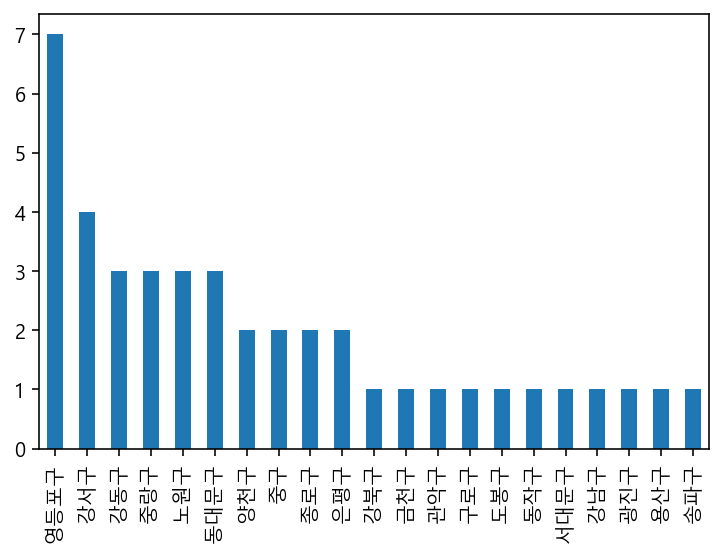
    


```python
# 시군구코드명에 따라 종합병원의 숫자를 countplot으로 그립니다.
# 그래프의 사이즈 조절
plt.figure(figsize = (15,4))
# 숫자가 많은 순서대로 정렬을 추가
sns.countplot(data = df_seoul_hospital, x = "시군구코드명" 
              , order = df_seoul_hospital["시군구코드명"].value_counts().index )
```


    <AxesSubplot:xlabel='시군구코드명', ylabel='count'>


    
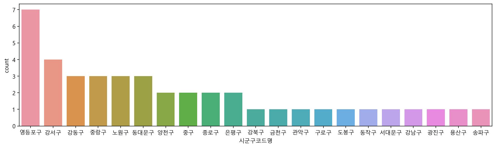
    


### 특정 지역만 보기 


```python
# 서울에 있는 데이터의 y좌표 = 위도와 x좌표 = 경도를 봅니다.
# 결과를 df_seoul이라는 데이터프레임에 저장합니다.
# 새로운 변수에 데이터프레임을 저장시 copy()를 사용합니다. 

df_seoul = df[df["시도코드명"] == "서울"].copy()
df_seoul.shape
```


    (18183, 27)


```python
df_seoul["시군구코드명"].value_counts().plot.bar(figsize = (10,4),rot = 30)
```


    <AxesSubplot:>


    
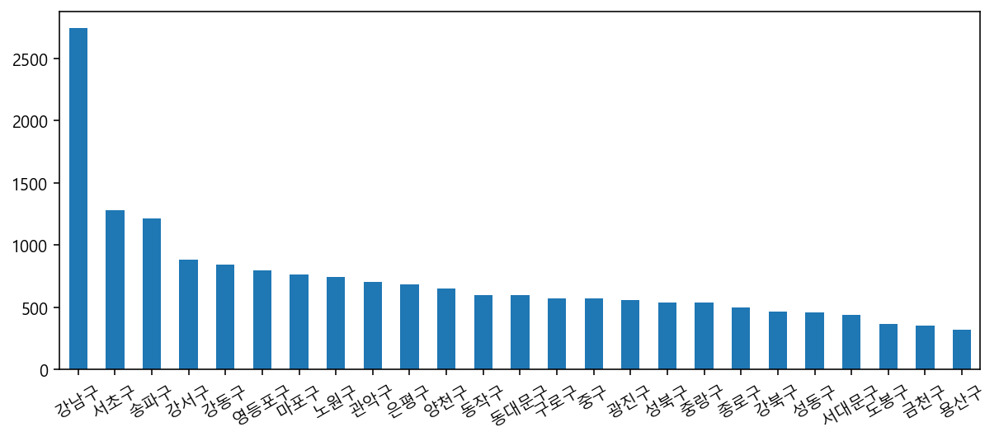
    


```python
# seaborn의 countplot을 사용해서 df_seoul 데이터프레임의 시군구코드명을 시각화 합니다.
plt.figure(figsize = (17,4))
sns.countplot(data = df_seoul, x = "시군구코드명")
```


    <AxesSubplot:xlabel='시군구코드명', ylabel='count'>


    
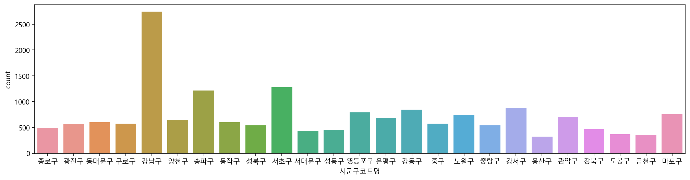
    


```python
# Pandas의 plot.scatter 를 통해 위도와 경도를 표시해 봅니다.

df_seoul[["x좌표", "y좌표", "시군구코드명"]].plot.scatter(x = "x좌표", y = "y좌표", figsize = (8,7), grid = True)
```


    <AxesSubplot:xlabel='x좌표', ylabel='y좌표'>


    
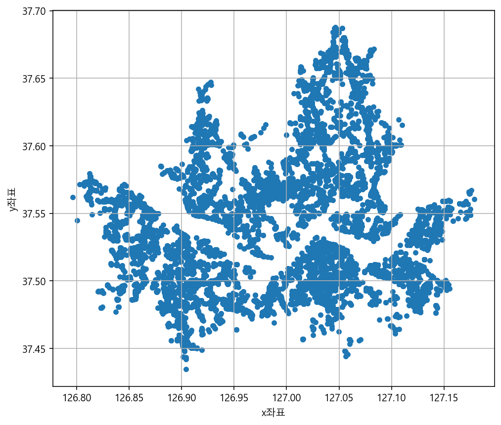
    


```python
# seaborn의 scatterplot 을 통해 구별 위도와 경도를 표시해 봅니다.
# hue에 컬럼명을 입력하여 해당 값마다 다른 색상을 표시할 수 있습니다.

plt.figure(figsize = (9,8))
sns.scatterplot(data = df_seoul, x = "x좌표", y = "y좌표", hue = "시군구코드명")
```


    <AxesSubplot:xlabel='x좌표', ylabel='y좌표'>


    
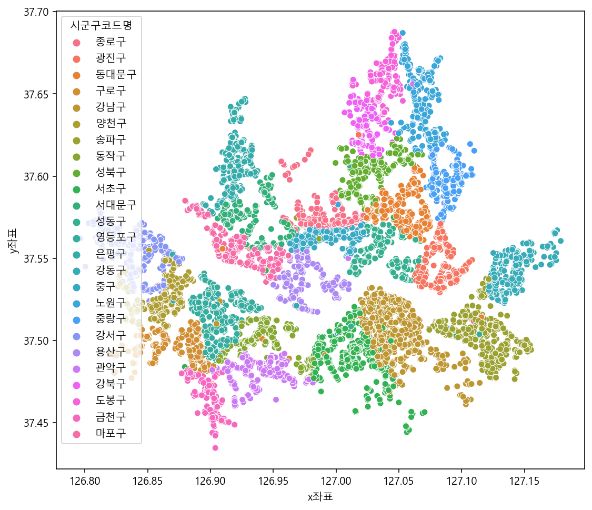
    


```python
# seaborn의 scatterplot 을 통해 "종별코드명" 위도와 경도를 표시해 봅니다.

plt.figure(figsize = (9,8))
sns.scatterplot(data = df_seoul, x = "x좌표", y = "y좌표", hue = "종별코드명")
```


    <AxesSubplot:xlabel='x좌표', ylabel='y좌표'>


    
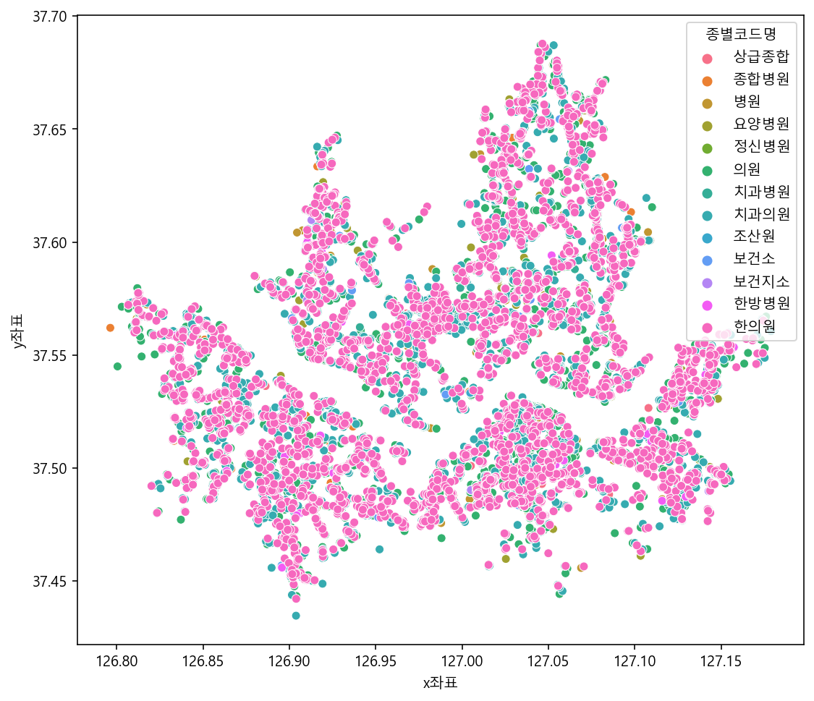
    


```python
# seaborn의 scatterplot 을 통해 전국 데이터(df)로 위도와 경도를 표시해 봅니다.

plt.figure(figsize = (16,12))
sns.scatterplot(data = df, x = "x좌표", y = "y좌표", hue = "시도코드명")
```


    <AxesSubplot:xlabel='x좌표', ylabel='y좌표'>


    
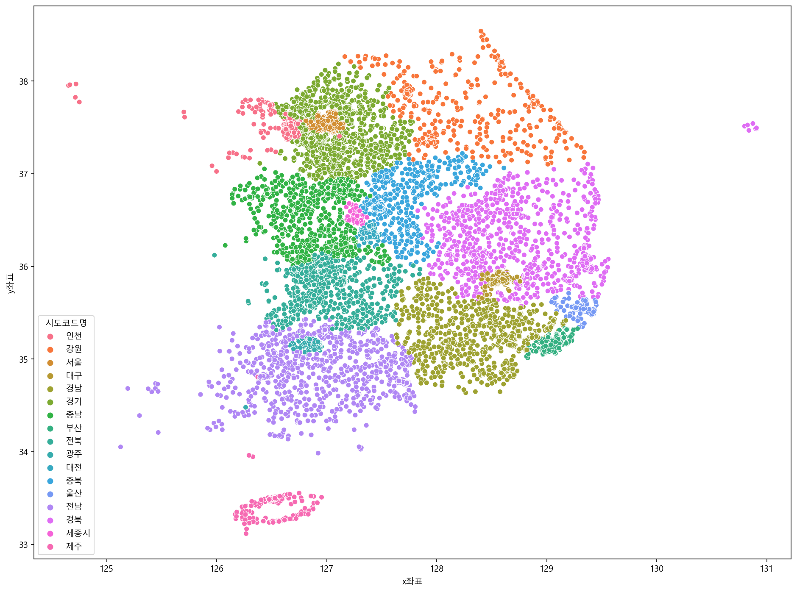
    


## Folium 으로 지도 활용하기
- Anaconda prompt 창을 열어 conda 명령어로 설치합니다.
- 프롬프트 창에 아래 명령어를 통해 Folium을 설치합니다.
- conda install -c conda-forge folium

### Folium 사용 예제
- http://nbviewer.jupyter.org/github/python-visualization/folium/tree/master/examples/


```python
# 아나콘다에서 folium 을 사용하기 위해서는 별도의 설치가 필요
# https://anaconda.org/conda-forge/folium
# conda install -c conda-forge folium 
# 지도 시각화를 위한 라이브러리
import folium
```


```python
# 지도의 중심을 지정하기 위해 위도와 경도의 평균을 구합니다.

df_seoul_hospital["y좌표"].mean()
df_seoul_hospital["x좌표"].mean()
```


    126.97888196666666


```python
map = folium.Map(location =[df_seoul_hospital["y좌표"].mean(), df_seoul_hospital["x좌표"].mean()], zoom_start = 12)

for n in df_seoul_hospital.index:
    name = df_seoul_hospital.loc[n, "요양기관명"]
    address = df_seoul_hospital.loc[n, "주소"]
    popup = f"{name}-{address}"
    location = df_seoul_hospital.loc[n, "y좌표"], df_seoul_hospital.loc[n, "x좌표"]
    folium.Marker(
        location = location,
        popup = popup,
        ).add_to(map)
map
```


<div style="width:100%;"><div style="position:relative;width:100%;height:0;padding-bottom:60%;"><span style="color:#565656">Make this Notebook Trusted to load map: File -> Trust Notebook</span><iframe src="about:blank" style="position:absolute;width:100%;height:100%;left:0;top:0;border:none !important;" data-html=%3C%21DOCTYPE%20html%3E%0A%3Chead%3E%20%20%20%20%0A%20%20%20%20%3Cmeta%20http-equiv%3D%22content-type%22%20content%3D%22text/html%3B%20charset%3DUTF-8%22%20/%3E%0A%20%20%20%20%0A%20%20%20%20%20%20%20%20%3Cscript%3E%0A%20%20%20%20%20%20%20%20%20%20%20%20L_NO_TOUCH%20%3D%20false%3B%0A%20%20%20%20%20%20%20%20%20%20%20%20L_DISABLE_3D%20%3D%20false%3B%0A%20%20%20%20%20%20%20%20%3C/script%3E%0A%20%20%20%20%0A%20%20%20%20%3Cstyle%3Ehtml%2C%20body%20%7Bwidth%3A%20100%25%3Bheight%3A%20100%25%3Bmargin%3A%200%3Bpadding%3A%200%3B%7D%3C/style%3E%0A%20%20%20%20%3Cstyle%3E%23map%20%7Bposition%3Aabsolute%3Btop%3A0%3Bbottom%3A0%3Bright%3A0%3Bleft%3A0%3B%7D%3C/style%3E%0A%20%20%20%20%3Cscript%20src%3D%22https%3A//cdn.jsdelivr.net/npm/leaflet%401.6.0/dist/leaflet.js%22%3E%3C/script%3E%0A%20%20%20%20%3Cscript%20src%3D%22https%3A//code.jquery.com/jquery-1.12.4.min.js%22%3E%3C/script%3E%0A%20%20%20%20%3Cscript%20src%3D%22https%3A//maxcdn.bootstrapcdn.com/bootstrap/3.2.0/js/bootstrap.min.js%22%3E%3C/script%3E%0A%20%20%20%20%3Cscript%20src%3D%22https%3A//cdnjs.cloudflare.com/ajax/libs/Leaflet.awesome-markers/2.0.2/leaflet.awesome-markers.js%22%3E%3C/script%3E%0A%20%20%20%20%3Clink%20rel%3D%22stylesheet%22%20href%3D%22https%3A//cdn.jsdelivr.net/npm/leaflet%401.6.0/dist/leaflet.css%22/%3E%0A%20%20%20%20%3Clink%20rel%3D%22stylesheet%22%20href%3D%22https%3A//maxcdn.bootstrapcdn.com/bootstrap/3.2.0/css/bootstrap.min.css%22/%3E%0A%20%20%20%20%3Clink%20rel%3D%22stylesheet%22%20href%3D%22https%3A//maxcdn.bootstrapcdn.com/bootstrap/3.2.0/css/bootstrap-theme.min.css%22/%3E%0A%20%20%20%20%3Clink%20rel%3D%22stylesheet%22%20href%3D%22https%3A//maxcdn.bootstrapcdn.com/font-awesome/4.6.3/css/font-awesome.min.css%22/%3E%0A%20%20%20%20%3Clink%20rel%3D%22stylesheet%22%20href%3D%22https%3A//cdnjs.cloudflare.com/ajax/libs/Leaflet.awesome-markers/2.0.2/leaflet.awesome-markers.css%22/%3E%0A%20%20%20%20%3Clink%20rel%3D%22stylesheet%22%20href%3D%22https%3A//cdn.jsdelivr.net/gh/python-visualization/folium/folium/templates/leaflet.awesome.rotate.min.css%22/%3E%0A%20%20%20%20%0A%20%20%20%20%20%20%20%20%20%20%20%20%3Cmeta%20name%3D%22viewport%22%20content%3D%22width%3Ddevice-width%2C%0A%20%20%20%20%20%20%20%20%20%20%20%20%20%20%20%20initial-scale%3D1.0%2C%20maximum-scale%3D1.0%2C%20user-scalable%3Dno%22%20/%3E%0A%20%20%20%20%20%20%20%20%20%20%20%20%3Cstyle%3E%0A%20%20%20%20%20%20%20%20%20%20%20%20%20%20%20%20%23map_f0cf1e92ebd74bf39becc1bcf957379b%20%7B%0A%20%20%20%20%20%20%20%20%20%20%20%20%20%20%20%20%20%20%20%20position%3A%20relative%3B%0A%20%20%20%20%20%20%20%20%20%20%20%20%20%20%20%20%20%20%20%20width%3A%20100.0%25%3B%0A%20%20%20%20%20%20%20%20%20%20%20%20%20%20%20%20%20%20%20%20height%3A%20100.0%25%3B%0A%20%20%20%20%20%20%20%20%20%20%20%20%20%20%20%20%20%20%20%20left%3A%200.0%25%3B%0A%20%20%20%20%20%20%20%20%20%20%20%20%20%20%20%20%20%20%20%20top%3A%200.0%25%3B%0A%20%20%20%20%20%20%20%20%20%20%20%20%20%20%20%20%7D%0A%20%20%20%20%20%20%20%20%20%20%20%20%3C/style%3E%0A%20%20%20%20%20%20%20%20%0A%3C/head%3E%0A%3Cbody%3E%20%20%20%20%0A%20%20%20%20%0A%20%20%20%20%20%20%20%20%20%20%20%20%3Cdiv%20class%3D%22folium-map%22%20id%3D%22map_f0cf1e92ebd74bf39becc1bcf957379b%22%20%3E%3C/div%3E%0A%20%20%20%20%20%20%20%20%0A%3C/body%3E%0A%3Cscript%3E%20%20%20%20%0A%20%20%20%20%0A%20%20%20%20%20%20%20%20%20%20%20%20var%20map_f0cf1e92ebd74bf39becc1bcf957379b%20%3D%20L.map%28%0A%20%20%20%20%20%20%20%20%20%20%20%20%20%20%20%20%22map_f0cf1e92ebd74bf39becc1bcf957379b%22%2C%0A%20%20%20%20%20%20%20%20%20%20%20%20%20%20%20%20%7B%0A%20%20%20%20%20%20%20%20%20%20%20%20%20%20%20%20%20%20%20%20center%3A%20%5B37.55465997809525%2C%20126.97888196666666%5D%2C%0A%20%20%20%20%20%20%20%20%20%20%20%20%20%20%20%20%20%20%20%20crs%3A%20L.CRS.EPSG3857%2C%0A%20%20%20%20%20%20%20%20%20%20%20%20%20%20%20%20%20%20%20%20zoom%3A%2012%2C%0A%20%20%20%20%20%20%20%20%20%20%20%20%20%20%20%20%20%20%20%20zoomControl%3A%20true%2C%0A%20%20%20%20%20%20%20%20%20%20%20%20%20%20%20%20%20%20%20%20preferCanvas%3A%20false%2C%0A%20%20%20%20%20%20%20%20%20%20%20%20%20%20%20%20%7D%0A%20%20%20%20%20%20%20%20%20%20%20%20%29%3B%0A%0A%20%20%20%20%20%20%20%20%20%20%20%20%0A%0A%20%20%20%20%20%20%20%20%0A%20%20%20%20%0A%20%20%20%20%20%20%20%20%20%20%20%20var%20tile_layer_3d2e44855b9245ddb446ed504bff22d4%20%3D%20L.tileLayer%28%0A%20%20%20%20%20%20%20%20%20%20%20%20%20%20%20%20%22https%3A//%7Bs%7D.tile.openstreetmap.org/%7Bz%7D/%7Bx%7D/%7By%7D.png%22%2C%0A%20%20%20%20%20%20%20%20%20%20%20%20%20%20%20%20%7B%22attribution%22%3A%20%22Data%20by%20%5Cu0026copy%3B%20%5Cu003ca%20href%3D%5C%22http%3A//openstreetmap.org%5C%22%5Cu003eOpenStreetMap%5Cu003c/a%5Cu003e%2C%20under%20%5Cu003ca%20href%3D%5C%22http%3A//www.openstreetmap.org/copyright%5C%22%5Cu003eODbL%5Cu003c/a%5Cu003e.%22%2C%20%22detectRetina%22%3A%20false%2C%20%22maxNativeZoom%22%3A%2018%2C%20%22maxZoom%22%3A%2018%2C%20%22minZoom%22%3A%200%2C%20%22noWrap%22%3A%20false%2C%20%22opacity%22%3A%201%2C%20%22subdomains%22%3A%20%22abc%22%2C%20%22tms%22%3A%20false%7D%0A%20%20%20%20%20%20%20%20%20%20%20%20%29.addTo%28map_f0cf1e92ebd74bf39becc1bcf957379b%29%3B%0A%20%20%20%20%20%20%20%20%0A%20%20%20%20%0A%20%20%20%20%20%20%20%20%20%20%20%20var%20marker_699baf80722c4defb9ec735313bea91e%20%3D%20L.marker%28%0A%20%20%20%20%20%20%20%20%20%20%20%20%20%20%20%20%5B37.518325299999994%2C%20126.9367517%5D%2C%0A%20%20%20%20%20%20%20%20%20%20%20%20%20%20%20%20%7B%7D%0A%20%20%20%20%20%20%20%20%20%20%20%20%29.addTo%28map_f0cf1e92ebd74bf39becc1bcf957379b%29%3B%0A%20%20%20%20%20%20%20%20%0A%20%20%20%20%0A%20%20%20%20%20%20%20%20var%20popup_ae7d115c671042649be96cd99e8dfa67%20%3D%20L.popup%28%7B%22maxWidth%22%3A%20%22100%25%22%7D%29%3B%0A%0A%20%20%20%20%20%20%20%20%0A%20%20%20%20%20%20%20%20%20%20%20%20var%20html_f91c37501ae247b99a75d8d56cf286b7%20%3D%20%24%28%60%3Cdiv%20id%3D%22html_f91c37501ae247b99a75d8d56cf286b7%22%20style%3D%22width%3A%20100.0%25%3B%20height%3A%20100.0%25%3B%22%3E%EA%B0%80%ED%86%A8%EB%A6%AD%EB%8C%80%ED%95%99%EA%B5%90%20%EC%97%AC%EC%9D%98%EB%8F%84%EC%84%B1%EB%AA%A8%EB%B3%91%EC%9B%90-%EC%84%9C%EC%9A%B8%ED%8A%B9%EB%B3%84%EC%8B%9C%20%EC%98%81%EB%93%B1%ED%8F%AC%EA%B5%AC%2063%EB%A1%9C%2010%20%EC%97%AC%EC%9D%98%EB%8F%84%EC%84%B1%EB%AA%A8%EB%B3%91%EC%9B%90%20%28%EC%97%AC%EC%9D%98%EB%8F%84%EB%8F%99%29%3C/div%3E%60%29%5B0%5D%3B%0A%20%20%20%20%20%20%20%20%20%20%20%20popup_ae7d115c671042649be96cd99e8dfa67.setContent%28html_f91c37501ae247b99a75d8d56cf286b7%29%3B%0A%20%20%20%20%20%20%20%20%0A%0A%20%20%20%20%20%20%20%20marker_699baf80722c4defb9ec735313bea91e.bindPopup%28popup_ae7d115c671042649be96cd99e8dfa67%29%0A%20%20%20%20%20%20%20%20%3B%0A%0A%20%20%20%20%20%20%20%20%0A%20%20%20%20%0A%20%20%20%20%0A%20%20%20%20%20%20%20%20%20%20%20%20var%20marker_bb9c41daf496443bac7e613b73bbd8c8%20%3D%20L.marker%28%0A%20%20%20%20%20%20%20%20%20%20%20%20%20%20%20%20%5B37.6334945%2C%20126.9161912%5D%2C%0A%20%20%20%20%20%20%20%20%20%20%20%20%20%20%20%20%7B%7D%0A%20%20%20%20%20%20%20%20%20%20%20%20%29.addTo%28map_f0cf1e92ebd74bf39becc1bcf957379b%29%3B%0A%20%20%20%20%20%20%20%20%0A%20%20%20%20%0A%20%20%20%20%20%20%20%20var%20popup_28fcad3672ec4662b49c985676ad1826%20%3D%20L.popup%28%7B%22maxWidth%22%3A%20%22100%25%22%7D%29%3B%0A%0A%20%20%20%20%20%20%20%20%0A%20%20%20%20%20%20%20%20%20%20%20%20var%20html_e8e22070ff8648b297f7f24d581d85b5%20%3D%20%24%28%60%3Cdiv%20id%3D%22html_e8e22070ff8648b297f7f24d581d85b5%22%20style%3D%22width%3A%20100.0%25%3B%20height%3A%20100.0%25%3B%22%3E%EA%B0%80%ED%86%A8%EB%A6%AD%EB%8C%80%ED%95%99%EA%B5%90%20%EC%9D%80%ED%8F%89%EC%84%B1%EB%AA%A8%EB%B3%91%EC%9B%90-%EC%84%9C%EC%9A%B8%ED%8A%B9%EB%B3%84%EC%8B%9C%20%EC%9D%80%ED%8F%89%EA%B5%AC%20%ED%86%B5%EC%9D%BC%EB%A1%9C%201021%20%28%EC%A7%84%EA%B4%80%EB%8F%99%29%3C/div%3E%60%29%5B0%5D%3B%0A%20%20%20%20%20%20%20%20%20%20%20%20popup_28fcad3672ec4662b49c985676ad1826.setContent%28html_e8e22070ff8648b297f7f24d581d85b5%29%3B%0A%20%20%20%20%20%20%20%20%0A%0A%20%20%20%20%20%20%20%20marker_bb9c41daf496443bac7e613b73bbd8c8.bindPopup%28popup_28fcad3672ec4662b49c985676ad1826%29%0A%20%20%20%20%20%20%20%20%3B%0A%0A%20%20%20%20%20%20%20%20%0A%20%20%20%20%0A%20%20%20%20%0A%20%20%20%20%20%20%20%20%20%20%20%20var%20marker_e89c58355fc64a87a7609e90434e8edb%20%3D%20L.marker%28%0A%20%20%20%20%20%20%20%20%20%20%20%20%20%20%20%20%5B37.5534484%2C%20127.1573794%5D%2C%0A%20%20%20%20%20%20%20%20%20%20%20%20%20%20%20%20%7B%7D%0A%20%20%20%20%20%20%20%20%20%20%20%20%29.addTo%28map_f0cf1e92ebd74bf39becc1bcf957379b%29%3B%0A%20%20%20%20%20%20%20%20%0A%20%20%20%20%0A%20%20%20%20%20%20%20%20var%20popup_83ff9c087ae94b9191bafaf5be2586ca%20%3D%20L.popup%28%7B%22maxWidth%22%3A%20%22100%25%22%7D%29%3B%0A%0A%20%20%20%20%20%20%20%20%0A%20%20%20%20%20%20%20%20%20%20%20%20var%20html_6494e9aaa5c94377b033d07ded8dea19%20%3D%20%24%28%60%3Cdiv%20id%3D%22html_6494e9aaa5c94377b033d07ded8dea19%22%20style%3D%22width%3A%20100.0%25%3B%20height%3A%20100.0%25%3B%22%3E%EA%B0%95%EB%8F%99%EA%B2%BD%ED%9D%AC%EB%8C%80%ED%95%99%EA%B5%90%EC%9D%98%EB%8C%80%EB%B3%91%EC%9B%90-%EC%84%9C%EC%9A%B8%ED%8A%B9%EB%B3%84%EC%8B%9C%20%EA%B0%95%EB%8F%99%EA%B5%AC%20%EB%8F%99%EB%82%A8%EB%A1%9C%20892%20%28%EC%83%81%EC%9D%BC%EB%8F%99%29%3C/div%3E%60%29%5B0%5D%3B%0A%20%20%20%20%20%20%20%20%20%20%20%20popup_83ff9c087ae94b9191bafaf5be2586ca.setContent%28html_6494e9aaa5c94377b033d07ded8dea19%29%3B%0A%20%20%20%20%20%20%20%20%0A%0A%20%20%20%20%20%20%20%20marker_e89c58355fc64a87a7609e90434e8edb.bindPopup%28popup_83ff9c087ae94b9191bafaf5be2586ca%29%0A%20%20%20%20%20%20%20%20%3B%0A%0A%20%20%20%20%20%20%20%20%0A%20%20%20%20%0A%20%20%20%20%0A%20%20%20%20%20%20%20%20%20%20%20%20var%20marker_df064146521c41aab32248e2fb75bec1%20%3D%20L.marker%28%0A%20%20%20%20%20%20%20%20%20%20%20%20%20%20%20%20%5B37.4963836%2C%20127.12350900000001%5D%2C%0A%20%20%20%20%20%20%20%20%20%20%20%20%20%20%20%20%7B%7D%0A%20%20%20%20%20%20%20%20%20%20%20%20%29.addTo%28map_f0cf1e92ebd74bf39becc1bcf957379b%29%3B%0A%20%20%20%20%20%20%20%20%0A%20%20%20%20%0A%20%20%20%20%20%20%20%20var%20popup_53fd4768de8f4ac092e4e0f55b693603%20%3D%20L.popup%28%7B%22maxWidth%22%3A%20%22100%25%22%7D%29%3B%0A%0A%20%20%20%20%20%20%20%20%0A%20%20%20%20%20%20%20%20%20%20%20%20var%20html_e259a9cecc114eb1b8037fa576a96d54%20%3D%20%24%28%60%3Cdiv%20id%3D%22html_e259a9cecc114eb1b8037fa576a96d54%22%20style%3D%22width%3A%20100.0%25%3B%20height%3A%20100.0%25%3B%22%3E%EA%B2%BD%EC%B0%B0%EB%B3%91%EC%9B%90-%EC%84%9C%EC%9A%B8%ED%8A%B9%EB%B3%84%EC%8B%9C%20%EC%86%A1%ED%8C%8C%EA%B5%AC%20%EC%86%A1%EC%9D%B4%EB%A1%9C%20123%20%EA%B5%AD%EB%A6%BD%EA%B2%BD%EC%B0%B0%EB%B3%91%EC%9B%90%20%28%EA%B0%80%EB%9D%BD%EB%8F%99%29%3C/div%3E%60%29%5B0%5D%3B%0A%20%20%20%20%20%20%20%20%20%20%20%20popup_53fd4768de8f4ac092e4e0f55b693603.setContent%28html_e259a9cecc114eb1b8037fa576a96d54%29%3B%0A%20%20%20%20%20%20%20%20%0A%0A%20%20%20%20%20%20%20%20marker_df064146521c41aab32248e2fb75bec1.bindPopup%28popup_53fd4768de8f4ac092e4e0f55b693603%29%0A%20%20%20%20%20%20%20%20%3B%0A%0A%20%20%20%20%20%20%20%20%0A%20%20%20%20%0A%20%20%20%20%0A%20%20%20%20%20%20%20%20%20%20%20%20var%20marker_47335216aff24bfcb8307eb9a30728c5%20%3D%20L.marker%28%0A%20%20%20%20%20%20%20%20%20%20%20%20%20%20%20%20%5B37.499671500000005%2C%20126.86641589999999%5D%2C%0A%20%20%20%20%20%20%20%20%20%20%20%20%20%20%20%20%7B%7D%0A%20%20%20%20%20%20%20%20%20%20%20%20%29.addTo%28map_f0cf1e92ebd74bf39becc1bcf957379b%29%3B%0A%20%20%20%20%20%20%20%20%0A%20%20%20%20%0A%20%20%20%20%20%20%20%20var%20popup_9761d1b9e2d74855a7558a2421240968%20%3D%20L.popup%28%7B%22maxWidth%22%3A%20%22100%25%22%7D%29%3B%0A%0A%20%20%20%20%20%20%20%20%0A%20%20%20%20%20%20%20%20%20%20%20%20var%20html_6437b4fa4258474b9ac0a5a75b8c3774%20%3D%20%24%28%60%3Cdiv%20id%3D%22html_6437b4fa4258474b9ac0a5a75b8c3774%22%20style%3D%22width%3A%20100.0%25%3B%20height%3A%20100.0%25%3B%22%3E%EA%B5%AC%EB%A1%9C%EC%84%B1%EC%8B%AC%EB%B3%91%EC%9B%90-%EC%84%9C%EC%9A%B8%ED%8A%B9%EB%B3%84%EC%8B%9C%20%EA%B5%AC%EB%A1%9C%EA%B5%AC%20%EA%B2%BD%EC%9D%B8%EB%A1%9C%20427%20%EA%B5%AC%EB%A1%9C%EC%84%B1%EC%8B%AC%EB%B3%91%EC%9B%90%20%28%EA%B3%A0%EC%B2%99%EB%8F%99%29%3C/div%3E%60%29%5B0%5D%3B%0A%20%20%20%20%20%20%20%20%20%20%20%20popup_9761d1b9e2d74855a7558a2421240968.setContent%28html_6437b4fa4258474b9ac0a5a75b8c3774%29%3B%0A%20%20%20%20%20%20%20%20%0A%0A%20%20%20%20%20%20%20%20marker_47335216aff24bfcb8307eb9a30728c5.bindPopup%28popup_9761d1b9e2d74855a7558a2421240968%29%0A%20%20%20%20%20%20%20%20%3B%0A%0A%20%20%20%20%20%20%20%20%0A%20%20%20%20%0A%20%20%20%20%0A%20%20%20%20%20%20%20%20%20%20%20%20var%20marker_a3a3b7fd47884128a1a1db08488f271a%20%3D%20L.marker%28%0A%20%20%20%20%20%20%20%20%20%20%20%20%20%20%20%20%5B37.5672138%2C%20127.00567099999999%5D%2C%0A%20%20%20%20%20%20%20%20%20%20%20%20%20%20%20%20%7B%7D%0A%20%20%20%20%20%20%20%20%20%20%20%20%29.addTo%28map_f0cf1e92ebd74bf39becc1bcf957379b%29%3B%0A%20%20%20%20%20%20%20%20%0A%20%20%20%20%0A%20%20%20%20%20%20%20%20var%20popup_c8ee2e8ba0a44d198df5b16212a07a5f%20%3D%20L.popup%28%7B%22maxWidth%22%3A%20%22100%25%22%7D%29%3B%0A%0A%20%20%20%20%20%20%20%20%0A%20%20%20%20%20%20%20%20%20%20%20%20var%20html_235c9d1051b5474abd6d38bcd05a3661%20%3D%20%24%28%60%3Cdiv%20id%3D%22html_235c9d1051b5474abd6d38bcd05a3661%22%20style%3D%22width%3A%20100.0%25%3B%20height%3A%20100.0%25%3B%22%3E%EA%B5%AD%EB%A6%BD%EC%A4%91%EC%95%99%EC%9D%98%EB%A3%8C%EC%9B%90-%EC%84%9C%EC%9A%B8%ED%8A%B9%EB%B3%84%EC%8B%9C%20%EC%A4%91%EA%B5%AC%20%EC%9D%84%EC%A7%80%EB%A1%9C%20245%20%28%EC%9D%84%EC%A7%80%EB%A1%9C6%EA%B0%80%29%3C/div%3E%60%29%5B0%5D%3B%0A%20%20%20%20%20%20%20%20%20%20%20%20popup_c8ee2e8ba0a44d198df5b16212a07a5f.setContent%28html_235c9d1051b5474abd6d38bcd05a3661%29%3B%0A%20%20%20%20%20%20%20%20%0A%0A%20%20%20%20%20%20%20%20marker_a3a3b7fd47884128a1a1db08488f271a.bindPopup%28popup_c8ee2e8ba0a44d198df5b16212a07a5f%29%0A%20%20%20%20%20%20%20%20%3B%0A%0A%20%20%20%20%20%20%20%20%0A%20%20%20%20%0A%20%20%20%20%0A%20%20%20%20%20%20%20%20%20%20%20%20var%20marker_052752255cf34398be547fb583073992%20%3D%20L.marker%28%0A%20%20%20%20%20%20%20%20%20%20%20%20%20%20%20%20%5B37.6364794%2C%20127.0699355%5D%2C%0A%20%20%20%20%20%20%20%20%20%20%20%20%20%20%20%20%7B%7D%0A%20%20%20%20%20%20%20%20%20%20%20%20%29.addTo%28map_f0cf1e92ebd74bf39becc1bcf957379b%29%3B%0A%20%20%20%20%20%20%20%20%0A%20%20%20%20%0A%20%20%20%20%20%20%20%20var%20popup_5c9b95713d1a4a0484823901dde318b7%20%3D%20L.popup%28%7B%22maxWidth%22%3A%20%22100%25%22%7D%29%3B%0A%0A%20%20%20%20%20%20%20%20%0A%20%20%20%20%20%20%20%20%20%20%20%20var%20html_070a431613054276b3ca4d58c9e5a0c8%20%3D%20%24%28%60%3Cdiv%20id%3D%22html_070a431613054276b3ca4d58c9e5a0c8%22%20style%3D%22width%3A%20100.0%25%3B%20height%3A%20100.0%25%3B%22%3E%EB%85%B8%EC%9B%90%EC%9D%84%EC%A7%80%EB%8C%80%ED%95%99%EA%B5%90%EB%B3%91%EC%9B%90-%EC%84%9C%EC%9A%B8%ED%8A%B9%EB%B3%84%EC%8B%9C%20%EB%85%B8%EC%9B%90%EA%B5%AC%20%ED%95%9C%EA%B8%80%EB%B9%84%EC%84%9D%EB%A1%9C%2068%20%EC%9D%84%EC%A7%80%EB%B3%91%EC%9B%90%20%28%ED%95%98%EA%B3%84%EB%8F%99%29%3C/div%3E%60%29%5B0%5D%3B%0A%20%20%20%20%20%20%20%20%20%20%20%20popup_5c9b95713d1a4a0484823901dde318b7.setContent%28html_070a431613054276b3ca4d58c9e5a0c8%29%3B%0A%20%20%20%20%20%20%20%20%0A%0A%20%20%20%20%20%20%20%20marker_052752255cf34398be547fb583073992.bindPopup%28popup_5c9b95713d1a4a0484823901dde318b7%29%0A%20%20%20%20%20%20%20%20%3B%0A%0A%20%20%20%20%20%20%20%20%0A%20%20%20%20%0A%20%20%20%20%0A%20%20%20%20%20%20%20%20%20%20%20%20var%20marker_0e4ae6a604d840a5963777294a98206d%20%3D%20L.marker%28%0A%20%20%20%20%20%20%20%20%20%20%20%20%20%20%20%20%5B37.5835731%2C%20127.0860738%5D%2C%0A%20%20%20%20%20%20%20%20%20%20%20%20%20%20%20%20%7B%7D%0A%20%20%20%20%20%20%20%20%20%20%20%20%29.addTo%28map_f0cf1e92ebd74bf39becc1bcf957379b%29%3B%0A%20%20%20%20%20%20%20%20%0A%20%20%20%20%0A%20%20%20%20%20%20%20%20var%20popup_cff18015aeaa4dc99b8d560394d4642b%20%3D%20L.popup%28%7B%22maxWidth%22%3A%20%22100%25%22%7D%29%3B%0A%0A%20%20%20%20%20%20%20%20%0A%20%20%20%20%20%20%20%20%20%20%20%20var%20html_faa472701c9f4e20805863ff19bccbd0%20%3D%20%24%28%60%3Cdiv%20id%3D%22html_faa472701c9f4e20805863ff19bccbd0%22%20style%3D%22width%3A%20100.0%25%3B%20height%3A%20100.0%25%3B%22%3E%EB%85%B9%EC%83%89%EB%B3%91%EC%9B%90-%EC%84%9C%EC%9A%B8%ED%8A%B9%EB%B3%84%EC%8B%9C%20%EC%A4%91%EB%9E%91%EA%B5%AC%20%EC%82%AC%EA%B0%80%EC%A0%95%EB%A1%9C49%EA%B8%B8%2053%20%28%EB%A9%B4%EB%AA%A9%EB%8F%99%29%3C/div%3E%60%29%5B0%5D%3B%0A%20%20%20%20%20%20%20%20%20%20%20%20popup_cff18015aeaa4dc99b8d560394d4642b.setContent%28html_faa472701c9f4e20805863ff19bccbd0%29%3B%0A%20%20%20%20%20%20%20%20%0A%0A%20%20%20%20%20%20%20%20marker_0e4ae6a604d840a5963777294a98206d.bindPopup%28popup_cff18015aeaa4dc99b8d560394d4642b%29%0A%20%20%20%20%20%20%20%20%3B%0A%0A%20%20%20%20%20%20%20%20%0A%20%20%20%20%0A%20%20%20%20%0A%20%20%20%20%20%20%20%20%20%20%20%20var%20marker_126cb7c9bb2f461fa40a208804993c44%20%3D%20L.marker%28%0A%20%20%20%20%20%20%20%20%20%20%20%20%20%20%20%20%5B37.4906979%2C%20126.90722079999999%5D%2C%0A%20%20%20%20%20%20%20%20%20%20%20%20%20%20%20%20%7B%7D%0A%20%20%20%20%20%20%20%20%20%20%20%20%29.addTo%28map_f0cf1e92ebd74bf39becc1bcf957379b%29%3B%0A%20%20%20%20%20%20%20%20%0A%20%20%20%20%0A%20%20%20%20%20%20%20%20var%20popup_06814fdcdf6e4c6fbe8ddd1c3fe4cd39%20%3D%20L.popup%28%7B%22maxWidth%22%3A%20%22100%25%22%7D%29%3B%0A%0A%20%20%20%20%20%20%20%20%0A%20%20%20%20%20%20%20%20%20%20%20%20var%20html_c93c52bc2c37408087f9cc99284df2f2%20%3D%20%24%28%60%3Cdiv%20id%3D%22html_c93c52bc2c37408087f9cc99284df2f2%22%20style%3D%22width%3A%20100.0%25%3B%20height%3A%20100.0%25%3B%22%3E%EB%8C%80%EB%A6%BC%EC%84%B1%EB%AA%A8%EB%B3%91%EC%9B%90-%EC%84%9C%EC%9A%B8%ED%8A%B9%EB%B3%84%EC%8B%9C%20%EC%98%81%EB%93%B1%ED%8F%AC%EA%B5%AC%20%EC%8B%9C%ED%9D%A5%EB%8C%80%EB%A1%9C%20657%20%28%EB%8C%80%EB%A6%BC%EB%8F%99%2C%20%EB%8C%80%EB%A6%BC%EC%84%B1%EB%AA%A8%EB%B3%91%EC%9B%90%29%3C/div%3E%60%29%5B0%5D%3B%0A%20%20%20%20%20%20%20%20%20%20%20%20popup_06814fdcdf6e4c6fbe8ddd1c3fe4cd39.setContent%28html_c93c52bc2c37408087f9cc99284df2f2%29%3B%0A%20%20%20%20%20%20%20%20%0A%0A%20%20%20%20%20%20%20%20marker_126cb7c9bb2f461fa40a208804993c44.bindPopup%28popup_06814fdcdf6e4c6fbe8ddd1c3fe4cd39%29%0A%20%20%20%20%20%20%20%20%3B%0A%0A%20%20%20%20%20%20%20%20%0A%20%20%20%20%0A%20%20%20%20%0A%20%20%20%20%20%20%20%20%20%20%20%20var%20marker_896441cab2994877bce7f5d9415a832f%20%3D%20L.marker%28%0A%20%20%20%20%20%20%20%20%20%20%20%20%20%20%20%20%5B37.4938833%2C%20126.8992778%5D%2C%0A%20%20%20%20%20%20%20%20%20%20%20%20%20%20%20%20%7B%7D%0A%20%20%20%20%20%20%20%20%20%20%20%20%29.addTo%28map_f0cf1e92ebd74bf39becc1bcf957379b%29%3B%0A%20%20%20%20%20%20%20%20%0A%20%20%20%20%0A%20%20%20%20%20%20%20%20var%20popup_079adffb4a7c4490a7b5820c058f2ef8%20%3D%20L.popup%28%7B%22maxWidth%22%3A%20%22100%25%22%7D%29%3B%0A%0A%20%20%20%20%20%20%20%20%0A%20%20%20%20%20%20%20%20%20%20%20%20var%20html_d23c6e2cffe04dc4addc1a870a511822%20%3D%20%24%28%60%3Cdiv%20id%3D%22html_d23c6e2cffe04dc4addc1a870a511822%22%20style%3D%22width%3A%20100.0%25%3B%20height%3A%20100.0%25%3B%22%3E%EB%AA%85%EC%A7%80%EC%84%B1%EB%AA%A8%EB%B3%91%EC%9B%90-%EC%84%9C%EC%9A%B8%ED%8A%B9%EB%B3%84%EC%8B%9C%20%EC%98%81%EB%93%B1%ED%8F%AC%EA%B5%AC%20%EB%8F%84%EB%A6%BC%EB%A1%9C%20156%20%EB%AA%85%EC%A7%80%EC%84%B1%EB%AA%A8%EB%B3%91%EC%9B%90%20%28%EB%8C%80%EB%A6%BC%EB%8F%99%29%3C/div%3E%60%29%5B0%5D%3B%0A%20%20%20%20%20%20%20%20%20%20%20%20popup_079adffb4a7c4490a7b5820c058f2ef8.setContent%28html_d23c6e2cffe04dc4addc1a870a511822%29%3B%0A%20%20%20%20%20%20%20%20%0A%0A%20%20%20%20%20%20%20%20marker_896441cab2994877bce7f5d9415a832f.bindPopup%28popup_079adffb4a7c4490a7b5820c058f2ef8%29%0A%20%20%20%20%20%20%20%20%3B%0A%0A%20%20%20%20%20%20%20%20%0A%20%20%20%20%0A%20%20%20%20%0A%20%20%20%20%20%20%20%20%20%20%20%20var%20marker_ef62ab5194f64ccbba53d3ea242cd94b%20%3D%20L.marker%28%0A%20%20%20%20%20%20%20%20%20%20%20%20%20%20%20%20%5B37.552217799999994%2C%20126.83593570000001%5D%2C%0A%20%20%20%20%20%20%20%20%20%20%20%20%20%20%20%20%7B%7D%0A%20%20%20%20%20%20%20%20%20%20%20%20%29.addTo%28map_f0cf1e92ebd74bf39becc1bcf957379b%29%3B%0A%20%20%20%20%20%20%20%20%0A%20%20%20%20%0A%20%20%20%20%20%20%20%20var%20popup_ec542af05ebe4aa386db6edbe18df589%20%3D%20L.popup%28%7B%22maxWidth%22%3A%20%22100%25%22%7D%29%3B%0A%0A%20%20%20%20%20%20%20%20%0A%20%20%20%20%20%20%20%20%20%20%20%20var%20html_d8a8dfd9541842aead195147f4e6efa1%20%3D%20%24%28%60%3Cdiv%20id%3D%22html_d8a8dfd9541842aead195147f4e6efa1%22%20style%3D%22width%3A%20100.0%25%3B%20height%3A%20100.0%25%3B%22%3E%EB%AF%B8%EC%A6%88%EB%A9%94%EB%94%94%EB%B3%91%EC%9B%90-%EC%84%9C%EC%9A%B8%ED%8A%B9%EB%B3%84%EC%8B%9C%20%EA%B0%95%EC%84%9C%EA%B5%AC%20%EA%B0%95%EC%84%9C%EB%A1%9C%20295%20%28%EB%82%B4%EB%B0%9C%EC%82%B0%EB%8F%99%29%3C/div%3E%60%29%5B0%5D%3B%0A%20%20%20%20%20%20%20%20%20%20%20%20popup_ec542af05ebe4aa386db6edbe18df589.setContent%28html_d8a8dfd9541842aead195147f4e6efa1%29%3B%0A%20%20%20%20%20%20%20%20%0A%0A%20%20%20%20%20%20%20%20marker_ef62ab5194f64ccbba53d3ea242cd94b.bindPopup%28popup_ec542af05ebe4aa386db6edbe18df589%29%0A%20%20%20%20%20%20%20%20%3B%0A%0A%20%20%20%20%20%20%20%20%0A%20%20%20%20%0A%20%20%20%20%0A%20%20%20%20%20%20%20%20%20%20%20%20var%20marker_0f91f2f8ab3e4cc2b51e2d329c0cf505%20%3D%20L.marker%28%0A%20%20%20%20%20%20%20%20%20%20%20%20%20%20%20%20%5B37.556866%2C%20126.85092730000001%5D%2C%0A%20%20%20%20%20%20%20%20%20%20%20%20%20%20%20%20%7B%7D%0A%20%20%20%20%20%20%20%20%20%20%20%20%29.addTo%28map_f0cf1e92ebd74bf39becc1bcf957379b%29%3B%0A%20%20%20%20%20%20%20%20%0A%20%20%20%20%0A%20%20%20%20%20%20%20%20var%20popup_a38dd845b82c4449b4f5c41cb15e970c%20%3D%20L.popup%28%7B%22maxWidth%22%3A%20%22100%25%22%7D%29%3B%0A%0A%20%20%20%20%20%20%20%20%0A%20%20%20%20%20%20%20%20%20%20%20%20var%20html_0f6462718eea4ce79cca130066ea1d94%20%3D%20%24%28%60%3Cdiv%20id%3D%22html_0f6462718eea4ce79cca130066ea1d94%22%20style%3D%22width%3A%20100.0%25%3B%20height%3A%20100.0%25%3B%22%3E%EB%B6%80%EB%AF%BC%EB%B3%91%EC%9B%90-%EC%84%9C%EC%9A%B8%ED%8A%B9%EB%B3%84%EC%8B%9C%20%EA%B0%95%EC%84%9C%EA%B5%AC%20%EA%B3%B5%ED%95%AD%EB%8C%80%EB%A1%9C%20389%20%EB%B6%80%EB%AF%BC%EB%B3%91%EC%9B%90%20%28%EB%93%B1%EC%B4%8C%EB%8F%99%29%3C/div%3E%60%29%5B0%5D%3B%0A%20%20%20%20%20%20%20%20%20%20%20%20popup_a38dd845b82c4449b4f5c41cb15e970c.setContent%28html_0f6462718eea4ce79cca130066ea1d94%29%3B%0A%20%20%20%20%20%20%20%20%0A%0A%20%20%20%20%20%20%20%20marker_0f91f2f8ab3e4cc2b51e2d329c0cf505.bindPopup%28popup_a38dd845b82c4449b4f5c41cb15e970c%29%0A%20%20%20%20%20%20%20%20%3B%0A%0A%20%20%20%20%20%20%20%20%0A%20%20%20%20%0A%20%20%20%20%0A%20%20%20%20%20%20%20%20%20%20%20%20var%20marker_fefd7af2d04844f88a393ff88462a507%20%3D%20L.marker%28%0A%20%20%20%20%20%20%20%20%20%20%20%20%20%20%20%20%5B37.5879909%2C%20127.06530659999999%5D%2C%0A%20%20%20%20%20%20%20%20%20%20%20%20%20%20%20%20%7B%7D%0A%20%20%20%20%20%20%20%20%20%20%20%20%29.addTo%28map_f0cf1e92ebd74bf39becc1bcf957379b%29%3B%0A%20%20%20%20%20%20%20%20%0A%20%20%20%20%0A%20%20%20%20%20%20%20%20var%20popup_a1d0cf9ebd974430838166c147de3fc9%20%3D%20L.popup%28%7B%22maxWidth%22%3A%20%22100%25%22%7D%29%3B%0A%0A%20%20%20%20%20%20%20%20%0A%20%20%20%20%20%20%20%20%20%20%20%20var%20html_6b36757a42a64181914a0fc444569b07%20%3D%20%24%28%60%3Cdiv%20id%3D%22html_6b36757a42a64181914a0fc444569b07%22%20style%3D%22width%3A%20100.0%25%3B%20height%3A%20100.0%25%3B%22%3E%EC%82%BC%EC%9C%A1%EC%84%9C%EC%9A%B8%EB%B3%91%EC%9B%90-%EC%84%9C%EC%9A%B8%ED%8A%B9%EB%B3%84%EC%8B%9C%20%EB%8F%99%EB%8C%80%EB%AC%B8%EA%B5%AC%20%EB%A7%9D%EC%9A%B0%EB%A1%9C%2082%20%28%ED%9C%98%EA%B2%BD%EB%8F%99%29%3C/div%3E%60%29%5B0%5D%3B%0A%20%20%20%20%20%20%20%20%20%20%20%20popup_a1d0cf9ebd974430838166c147de3fc9.setContent%28html_6b36757a42a64181914a0fc444569b07%29%3B%0A%20%20%20%20%20%20%20%20%0A%0A%20%20%20%20%20%20%20%20marker_fefd7af2d04844f88a393ff88462a507.bindPopup%28popup_a1d0cf9ebd974430838166c147de3fc9%29%0A%20%20%20%20%20%20%20%20%3B%0A%0A%20%20%20%20%20%20%20%20%0A%20%20%20%20%0A%20%20%20%20%0A%20%20%20%20%20%20%20%20%20%20%20%20var%20marker_f64c4af834b94a1787edf433984bbd4d%20%3D%20L.marker%28%0A%20%20%20%20%20%20%20%20%20%20%20%20%20%20%20%20%5B37.5843076%2C%20127.04972959999999%5D%2C%0A%20%20%20%20%20%20%20%20%20%20%20%20%20%20%20%20%7B%7D%0A%20%20%20%20%20%20%20%20%20%20%20%20%29.addTo%28map_f0cf1e92ebd74bf39becc1bcf957379b%29%3B%0A%20%20%20%20%20%20%20%20%0A%20%20%20%20%0A%20%20%20%20%20%20%20%20var%20popup_bbee6f8f7ffd49538b705d7dd9592507%20%3D%20L.popup%28%7B%22maxWidth%22%3A%20%22100%25%22%7D%29%3B%0A%0A%20%20%20%20%20%20%20%20%0A%20%20%20%20%20%20%20%20%20%20%20%20var%20html_5f0b7a49f5ec47d7ac4bc60740d6a427%20%3D%20%24%28%60%3Cdiv%20id%3D%22html_5f0b7a49f5ec47d7ac4bc60740d6a427%22%20style%3D%22width%3A%20100.0%25%3B%20height%3A%20100.0%25%3B%22%3E%EC%84%9C%EC%9A%B8%EC%84%B1%EC%8B%AC%EB%B3%91%EC%9B%90-%EC%84%9C%EC%9A%B8%ED%8A%B9%EB%B3%84%EC%8B%9C%20%EB%8F%99%EB%8C%80%EB%AC%B8%EA%B5%AC%20%EC%99%95%EC%82%B0%EB%A1%9C%20259%20%EC%84%9C%EC%9A%B8%EC%84%B1%EC%8B%AC%EB%B3%91%EC%9B%90%20%28%EC%B2%AD%EB%9F%89%EB%A6%AC%EB%8F%99%29%3C/div%3E%60%29%5B0%5D%3B%0A%20%20%20%20%20%20%20%20%20%20%20%20popup_bbee6f8f7ffd49538b705d7dd9592507.setContent%28html_5f0b7a49f5ec47d7ac4bc60740d6a427%29%3B%0A%20%20%20%20%20%20%20%20%0A%0A%20%20%20%20%20%20%20%20marker_f64c4af834b94a1787edf433984bbd4d.bindPopup%28popup_bbee6f8f7ffd49538b705d7dd9592507%29%0A%20%20%20%20%20%20%20%20%3B%0A%0A%20%20%20%20%20%20%20%20%0A%20%20%20%20%0A%20%20%20%20%0A%20%20%20%20%20%20%20%20%20%20%20%20var%20marker_f3bd30ebf2ee4aa299f1fcaa2cf4d780%20%3D%20L.marker%28%0A%20%20%20%20%20%20%20%20%20%20%20%20%20%20%20%20%5B37.5671805%2C%20126.96699740000001%5D%2C%0A%20%20%20%20%20%20%20%20%20%20%20%20%20%20%20%20%7B%7D%0A%20%20%20%20%20%20%20%20%20%20%20%20%29.addTo%28map_f0cf1e92ebd74bf39becc1bcf957379b%29%3B%0A%20%20%20%20%20%20%20%20%0A%20%20%20%20%0A%20%20%20%20%20%20%20%20var%20popup_09073af861f141648240f9f2bad2481d%20%3D%20L.popup%28%7B%22maxWidth%22%3A%20%22100%25%22%7D%29%3B%0A%0A%20%20%20%20%20%20%20%20%0A%20%20%20%20%20%20%20%20%20%20%20%20var%20html_bc62177e321e4ace8298d59c4d43b75d%20%3D%20%24%28%60%3Cdiv%20id%3D%22html_bc62177e321e4ace8298d59c4d43b75d%22%20style%3D%22width%3A%20100.0%25%3B%20height%3A%20100.0%25%3B%22%3E%EC%84%9C%EC%9A%B8%EC%A0%81%EC%8B%AD%EC%9E%90%EB%B3%91%EC%9B%90-%EC%84%9C%EC%9A%B8%ED%8A%B9%EB%B3%84%EC%8B%9C%20%EC%A2%85%EB%A1%9C%EA%B5%AC%20%EC%83%88%EB%AC%B8%EC%95%88%EB%A1%9C%209%20%EC%A0%81%EC%8B%AD%EC%9E%90%EB%B3%91%EC%9B%90%20%28%ED%8F%89%EB%8F%99%29%3C/div%3E%60%29%5B0%5D%3B%0A%20%20%20%20%20%20%20%20%20%20%20%20popup_09073af861f141648240f9f2bad2481d.setContent%28html_bc62177e321e4ace8298d59c4d43b75d%29%3B%0A%20%20%20%20%20%20%20%20%0A%0A%20%20%20%20%20%20%20%20marker_f3bd30ebf2ee4aa299f1fcaa2cf4d780.bindPopup%28popup_09073af861f141648240f9f2bad2481d%29%0A%20%20%20%20%20%20%20%20%3B%0A%0A%20%20%20%20%20%20%20%20%0A%20%20%20%20%0A%20%20%20%20%0A%20%20%20%20%20%20%20%20%20%20%20%20var%20marker_fe29188ba6f34cba8de30161af12d29a%20%3D%20L.marker%28%0A%20%20%20%20%20%20%20%20%20%20%20%20%20%20%20%20%5B37.575368100000006%2C%20127.031341%5D%2C%0A%20%20%20%20%20%20%20%20%20%20%20%20%20%20%20%20%7B%7D%0A%20%20%20%20%20%20%20%20%20%20%20%20%29.addTo%28map_f0cf1e92ebd74bf39becc1bcf957379b%29%3B%0A%20%20%20%20%20%20%20%20%0A%20%20%20%20%0A%20%20%20%20%20%20%20%20var%20popup_e67718bfdf934f8bae431af138820bea%20%3D%20L.popup%28%7B%22maxWidth%22%3A%20%22100%25%22%7D%29%3B%0A%0A%20%20%20%20%20%20%20%20%0A%20%20%20%20%20%20%20%20%20%20%20%20var%20html_e7962428c43c4c0da17ab3e121df6387%20%3D%20%24%28%60%3Cdiv%20id%3D%22html_e7962428c43c4c0da17ab3e121df6387%22%20style%3D%22width%3A%20100.0%25%3B%20height%3A%20100.0%25%3B%22%3E%EC%84%9C%EC%9A%B8%ED%8A%B9%EB%B3%84%EC%8B%9C%20%EB%8F%99%EB%B6%80%EB%B3%91%EC%9B%90-%EC%84%9C%EC%9A%B8%ED%8A%B9%EB%B3%84%EC%8B%9C%20%EB%8F%99%EB%8C%80%EB%AC%B8%EA%B5%AC%20%EB%AC%B4%ED%95%99%EB%A1%9C%20124%20%28%EC%9A%A9%EB%91%90%EB%8F%99%29%3C/div%3E%60%29%5B0%5D%3B%0A%20%20%20%20%20%20%20%20%20%20%20%20popup_e67718bfdf934f8bae431af138820bea.setContent%28html_e7962428c43c4c0da17ab3e121df6387%29%3B%0A%20%20%20%20%20%20%20%20%0A%0A%20%20%20%20%20%20%20%20marker_fe29188ba6f34cba8de30161af12d29a.bindPopup%28popup_e67718bfdf934f8bae431af138820bea%29%0A%20%20%20%20%20%20%20%20%3B%0A%0A%20%20%20%20%20%20%20%20%0A%20%20%20%20%0A%20%20%20%20%0A%20%20%20%20%20%20%20%20%20%20%20%20var%20marker_d9f5296f4dfe494a95535061e96c3e57%20%3D%20L.marker%28%0A%20%20%20%20%20%20%20%20%20%20%20%20%20%20%20%20%5B37.4934414%2C%20126.9239058%5D%2C%0A%20%20%20%20%20%20%20%20%20%20%20%20%20%20%20%20%7B%7D%0A%20%20%20%20%20%20%20%20%20%20%20%20%29.addTo%28map_f0cf1e92ebd74bf39becc1bcf957379b%29%3B%0A%20%20%20%20%20%20%20%20%0A%20%20%20%20%0A%20%20%20%20%20%20%20%20var%20popup_e1177d62b47044718847ca1fb42fef8b%20%3D%20L.popup%28%7B%22maxWidth%22%3A%20%22100%25%22%7D%29%3B%0A%0A%20%20%20%20%20%20%20%20%0A%20%20%20%20%20%20%20%20%20%20%20%20var%20html_20bfa936e64d4736a1c10df505563872%20%3D%20%24%28%60%3Cdiv%20id%3D%22html_20bfa936e64d4736a1c10df505563872%22%20style%3D%22width%3A%20100.0%25%3B%20height%3A%20100.0%25%3B%22%3E%EC%84%9C%EC%9A%B8%ED%8A%B9%EB%B3%84%EC%8B%9C%EB%B3%B4%EB%9D%BC%EB%A7%A4%EB%B3%91%EC%9B%90-%EC%84%9C%EC%9A%B8%ED%8A%B9%EB%B3%84%EC%8B%9C%20%EB%8F%99%EC%9E%91%EA%B5%AC%20%EB%B3%B4%EB%9D%BC%EB%A7%A4%EB%A1%9C5%EA%B8%B8%2020%20%28%EC%8B%A0%EB%8C%80%EB%B0%A9%EB%8F%99%29%3C/div%3E%60%29%5B0%5D%3B%0A%20%20%20%20%20%20%20%20%20%20%20%20popup_e1177d62b47044718847ca1fb42fef8b.setContent%28html_20bfa936e64d4736a1c10df505563872%29%3B%0A%20%20%20%20%20%20%20%20%0A%0A%20%20%20%20%20%20%20%20marker_d9f5296f4dfe494a95535061e96c3e57.bindPopup%28popup_e1177d62b47044718847ca1fb42fef8b%29%0A%20%20%20%20%20%20%20%20%3B%0A%0A%20%20%20%20%20%20%20%20%0A%20%20%20%20%0A%20%20%20%20%0A%20%20%20%20%20%20%20%20%20%20%20%20var%20marker_4c4ef379346046eba6440db8df4d34bd%20%3D%20L.marker%28%0A%20%20%20%20%20%20%20%20%20%20%20%20%20%20%20%20%5B37.5120195%2C%20126.83315309999999%5D%2C%0A%20%20%20%20%20%20%20%20%20%20%20%20%20%20%20%20%7B%7D%0A%20%20%20%20%20%20%20%20%20%20%20%20%29.addTo%28map_f0cf1e92ebd74bf39becc1bcf957379b%29%3B%0A%20%20%20%20%20%20%20%20%0A%20%20%20%20%0A%20%20%20%20%20%20%20%20var%20popup_dc505e9b061c4c2fbd0eccb486065edc%20%3D%20L.popup%28%7B%22maxWidth%22%3A%20%22100%25%22%7D%29%3B%0A%0A%20%20%20%20%20%20%20%20%0A%20%20%20%20%20%20%20%20%20%20%20%20var%20html_42eae768f74a4d0885e6ba413546622f%20%3D%20%24%28%60%3Cdiv%20id%3D%22html_42eae768f74a4d0885e6ba413546622f%22%20style%3D%22width%3A%20100.0%25%3B%20height%3A%20100.0%25%3B%22%3E%EC%84%9C%EC%9A%B8%ED%8A%B9%EB%B3%84%EC%8B%9C%EC%84%9C%EB%82%A8%EB%B3%91%EC%9B%90-%EC%84%9C%EC%9A%B8%ED%8A%B9%EB%B3%84%EC%8B%9C%20%EC%96%91%EC%B2%9C%EA%B5%AC%20%EC%8B%A0%EC%A0%95%EC%9D%B4%ED%8E%9C1%EB%A1%9C%2020%20%28%EC%8B%A0%EC%A0%95%EB%8F%99%29%3C/div%3E%60%29%5B0%5D%3B%0A%20%20%20%20%20%20%20%20%20%20%20%20popup_dc505e9b061c4c2fbd0eccb486065edc.setContent%28html_42eae768f74a4d0885e6ba413546622f%29%3B%0A%20%20%20%20%20%20%20%20%0A%0A%20%20%20%20%20%20%20%20marker_4c4ef379346046eba6440db8df4d34bd.bindPopup%28popup_dc505e9b061c4c2fbd0eccb486065edc%29%0A%20%20%20%20%20%20%20%20%3B%0A%0A%20%20%20%20%20%20%20%20%0A%20%20%20%20%0A%20%20%20%20%0A%20%20%20%20%20%20%20%20%20%20%20%20var%20marker_23660d1535d444cbb18c4612c574a24a%20%3D%20L.marker%28%0A%20%20%20%20%20%20%20%20%20%20%20%20%20%20%20%20%5B37.6132762%2C%20127.09783090000002%5D%2C%0A%20%20%20%20%20%20%20%20%20%20%20%20%20%20%20%20%7B%7D%0A%20%20%20%20%20%20%20%20%20%20%20%20%29.addTo%28map_f0cf1e92ebd74bf39becc1bcf957379b%29%3B%0A%20%20%20%20%20%20%20%20%0A%20%20%20%20%0A%20%20%20%20%20%20%20%20var%20popup_b2b3055dc1cc4a5abcd5a08d1ef1d2b1%20%3D%20L.popup%28%7B%22maxWidth%22%3A%20%22100%25%22%7D%29%3B%0A%0A%20%20%20%20%20%20%20%20%0A%20%20%20%20%20%20%20%20%20%20%20%20var%20html_fa9e8a085bb2403da84b525c2411de2f%20%3D%20%24%28%60%3Cdiv%20id%3D%22html_fa9e8a085bb2403da84b525c2411de2f%22%20style%3D%22width%3A%20100.0%25%3B%20height%3A%20100.0%25%3B%22%3E%EC%84%9C%EC%9A%B8%ED%8A%B9%EB%B3%84%EC%8B%9C%EC%84%9C%EC%9A%B8%EC%9D%98%EB%A3%8C%EC%9B%90-%EC%84%9C%EC%9A%B8%ED%8A%B9%EB%B3%84%EC%8B%9C%20%EC%A4%91%EB%9E%91%EA%B5%AC%20%EC%8B%A0%EB%82%B4%EB%A1%9C%20156%20%28%EC%8B%A0%EB%82%B4%EB%8F%99%29%3C/div%3E%60%29%5B0%5D%3B%0A%20%20%20%20%20%20%20%20%20%20%20%20popup_b2b3055dc1cc4a5abcd5a08d1ef1d2b1.setContent%28html_fa9e8a085bb2403da84b525c2411de2f%29%3B%0A%20%20%20%20%20%20%20%20%0A%0A%20%20%20%20%20%20%20%20marker_23660d1535d444cbb18c4612c574a24a.bindPopup%28popup_b2b3055dc1cc4a5abcd5a08d1ef1d2b1%29%0A%20%20%20%20%20%20%20%20%3B%0A%0A%20%20%20%20%20%20%20%20%0A%20%20%20%20%0A%20%20%20%20%0A%20%20%20%20%20%20%20%20%20%20%20%20var%20marker_1e3e409b3f174a02b6dbcf8d193c5fb0%20%3D%20L.marker%28%0A%20%20%20%20%20%20%20%20%20%20%20%20%20%20%20%20%5B37.5359971%2C%20127.135378%5D%2C%0A%20%20%20%20%20%20%20%20%20%20%20%20%20%20%20%20%7B%7D%0A%20%20%20%20%20%20%20%20%20%20%20%20%29.addTo%28map_f0cf1e92ebd74bf39becc1bcf957379b%29%3B%0A%20%20%20%20%20%20%20%20%0A%20%20%20%20%0A%20%20%20%20%20%20%20%20var%20popup_ba53500c2de9400f8fa939f8a6ab786c%20%3D%20L.popup%28%7B%22maxWidth%22%3A%20%22100%25%22%7D%29%3B%0A%0A%20%20%20%20%20%20%20%20%0A%20%20%20%20%20%20%20%20%20%20%20%20var%20html_8b9aa0ff92054025a42c754bc099a10d%20%3D%20%24%28%60%3Cdiv%20id%3D%22html_8b9aa0ff92054025a42c754bc099a10d%22%20style%3D%22width%3A%20100.0%25%3B%20height%3A%20100.0%25%3B%22%3E%EC%84%B1%EC%8B%AC%EC%9D%98%EB%A3%8C%EC%9E%AC%EB%8B%A8%EA%B0%95%EB%8F%99%EC%84%B1%EC%8B%AC%EB%B3%91%EC%9B%90-%EC%84%9C%EC%9A%B8%ED%8A%B9%EB%B3%84%EC%8B%9C%20%EA%B0%95%EB%8F%99%EA%B5%AC%20%EC%84%B1%EC%95%88%EB%A1%9C%20150%20%28%EA%B8%B8%EB%8F%99%29%3C/div%3E%60%29%5B0%5D%3B%0A%20%20%20%20%20%20%20%20%20%20%20%20popup_ba53500c2de9400f8fa939f8a6ab786c.setContent%28html_8b9aa0ff92054025a42c754bc099a10d%29%3B%0A%20%20%20%20%20%20%20%20%0A%0A%20%20%20%20%20%20%20%20marker_1e3e409b3f174a02b6dbcf8d193c5fb0.bindPopup%28popup_ba53500c2de9400f8fa939f8a6ab786c%29%0A%20%20%20%20%20%20%20%20%3B%0A%0A%20%20%20%20%20%20%20%20%0A%20%20%20%20%0A%20%20%20%20%0A%20%20%20%20%20%20%20%20%20%20%20%20var%20marker_dc3091f6a18f4c6c93884d66d8f229ea%20%3D%20L.marker%28%0A%20%20%20%20%20%20%20%20%20%20%20%20%20%20%20%20%5B37.5120274%2C%20126.9225003%5D%2C%0A%20%20%20%20%20%20%20%20%20%20%20%20%20%20%20%20%7B%7D%0A%20%20%20%20%20%20%20%20%20%20%20%20%29.addTo%28map_f0cf1e92ebd74bf39becc1bcf957379b%29%3B%0A%20%20%20%20%20%20%20%20%0A%20%20%20%20%0A%20%20%20%20%20%20%20%20var%20popup_682aeca6b0334508a5569f70c9afc0cb%20%3D%20L.popup%28%7B%22maxWidth%22%3A%20%22100%25%22%7D%29%3B%0A%0A%20%20%20%20%20%20%20%20%0A%20%20%20%20%20%20%20%20%20%20%20%20var%20html_380ecbc7687542e09f77e99ced9594a2%20%3D%20%24%28%60%3Cdiv%20id%3D%22html_380ecbc7687542e09f77e99ced9594a2%22%20style%3D%22width%3A%20100.0%25%3B%20height%3A%20100.0%25%3B%22%3E%EC%84%B1%EC%95%A0%EC%9D%98%EB%A3%8C%EC%9E%AC%EB%8B%A8%20%EC%84%B1%EC%95%A0%EB%B3%91%EC%9B%90-%EC%84%9C%EC%9A%B8%ED%8A%B9%EB%B3%84%EC%8B%9C%20%EC%98%81%EB%93%B1%ED%8F%AC%EA%B5%AC%20%EC%97%AC%EC%9D%98%EB%8C%80%EB%B0%A9%EB%A1%9C53%EA%B8%B8%2022%20%28%EC%8B%A0%EA%B8%B8%EB%8F%99%2C%20%EC%84%B1%EC%95%A0%EB%B3%91%EC%9B%90%29%3C/div%3E%60%29%5B0%5D%3B%0A%20%20%20%20%20%20%20%20%20%20%20%20popup_682aeca6b0334508a5569f70c9afc0cb.setContent%28html_380ecbc7687542e09f77e99ced9594a2%29%3B%0A%20%20%20%20%20%20%20%20%0A%0A%20%20%20%20%20%20%20%20marker_dc3091f6a18f4c6c93884d66d8f229ea.bindPopup%28popup_682aeca6b0334508a5569f70c9afc0cb%29%0A%20%20%20%20%20%20%20%20%3B%0A%0A%20%20%20%20%20%20%20%20%0A%20%20%20%20%0A%20%20%20%20%0A%20%20%20%20%20%20%20%20%20%20%20%20var%20marker_4bdf0b9dfd58422ea521c9199917478b%20%3D%20L.marker%28%0A%20%20%20%20%20%20%20%20%20%20%20%20%20%20%20%20%5B37.5751835%2C%20126.95746070000001%5D%2C%0A%20%20%20%20%20%20%20%20%20%20%20%20%20%20%20%20%7B%7D%0A%20%20%20%20%20%20%20%20%20%20%20%20%29.addTo%28map_f0cf1e92ebd74bf39becc1bcf957379b%29%3B%0A%20%20%20%20%20%20%20%20%0A%20%20%20%20%0A%20%20%20%20%20%20%20%20var%20popup_62f9a555d92c40cca736f36449fcd36c%20%3D%20L.popup%28%7B%22maxWidth%22%3A%20%22100%25%22%7D%29%3B%0A%0A%20%20%20%20%20%20%20%20%0A%20%20%20%20%20%20%20%20%20%20%20%20var%20html_621de9c267e4461f8c934ffdf1947498%20%3D%20%24%28%60%3Cdiv%20id%3D%22html_621de9c267e4461f8c934ffdf1947498%22%20style%3D%22width%3A%20100.0%25%3B%20height%3A%20100.0%25%3B%22%3E%EC%84%B8%EB%9E%80%EB%B3%91%EC%9B%90-%EC%84%9C%EC%9A%B8%ED%8A%B9%EB%B3%84%EC%8B%9C%20%EC%A2%85%EB%A1%9C%EA%B5%AC%20%ED%86%B5%EC%9D%BC%EB%A1%9C%20256%20%28%EB%AC%B4%EC%95%85%EB%8F%99%29%3C/div%3E%60%29%5B0%5D%3B%0A%20%20%20%20%20%20%20%20%20%20%20%20popup_62f9a555d92c40cca736f36449fcd36c.setContent%28html_621de9c267e4461f8c934ffdf1947498%29%3B%0A%20%20%20%20%20%20%20%20%0A%0A%20%20%20%20%20%20%20%20marker_4bdf0b9dfd58422ea521c9199917478b.bindPopup%28popup_62f9a555d92c40cca736f36449fcd36c%29%0A%20%20%20%20%20%20%20%20%3B%0A%0A%20%20%20%20%20%20%20%20%0A%20%20%20%20%0A%20%20%20%20%0A%20%20%20%20%20%20%20%20%20%20%20%20var%20marker_09882564066d4819b532d271cc6ab068%20%3D%20L.marker%28%0A%20%20%20%20%20%20%20%20%20%20%20%20%20%20%20%20%5B37.533803999999996%2C%20127.00425790000001%5D%2C%0A%20%20%20%20%20%20%20%20%20%20%20%20%20%20%20%20%7B%7D%0A%20%20%20%20%20%20%20%20%20%20%20%20%29.addTo%28map_f0cf1e92ebd74bf39becc1bcf957379b%29%3B%0A%20%20%20%20%20%20%20%20%0A%20%20%20%20%0A%20%20%20%20%20%20%20%20var%20popup_9c741e280a904f338a65962238062866%20%3D%20L.popup%28%7B%22maxWidth%22%3A%20%22100%25%22%7D%29%3B%0A%0A%20%20%20%20%20%20%20%20%0A%20%20%20%20%20%20%20%20%20%20%20%20var%20html_7d0f521207614771b941f530b9123842%20%3D%20%24%28%60%3Cdiv%20id%3D%22html_7d0f521207614771b941f530b9123842%22%20style%3D%22width%3A%20100.0%25%3B%20height%3A%20100.0%25%3B%22%3E%EC%88%9C%EC%B2%9C%ED%96%A5%EB%8C%80%ED%95%99%EA%B5%90%20%EB%B6%80%EC%86%8D%20%EC%84%9C%EC%9A%B8%EB%B3%91%EC%9B%90-%EC%84%9C%EC%9A%B8%ED%8A%B9%EB%B3%84%EC%8B%9C%20%EC%9A%A9%EC%82%B0%EA%B5%AC%20%EB%8C%80%EC%82%AC%EA%B4%80%EB%A1%9C%2059%20%28%ED%95%9C%EB%82%A8%EB%8F%99%29%3C/div%3E%60%29%5B0%5D%3B%0A%20%20%20%20%20%20%20%20%20%20%20%20popup_9c741e280a904f338a65962238062866.setContent%28html_7d0f521207614771b941f530b9123842%29%3B%0A%20%20%20%20%20%20%20%20%0A%0A%20%20%20%20%20%20%20%20marker_09882564066d4819b532d271cc6ab068.bindPopup%28popup_9c741e280a904f338a65962238062866%29%0A%20%20%20%20%20%20%20%20%3B%0A%0A%20%20%20%20%20%20%20%20%0A%20%20%20%20%0A%20%20%20%20%0A%20%20%20%20%20%20%20%20%20%20%20%20var%20marker_c1b45bdc120041ddb7a135f7c611bbed%20%3D%20L.marker%28%0A%20%20%20%20%20%20%20%20%20%20%20%20%20%20%20%20%5B37.518809499999996%2C%20126.9038757%5D%2C%0A%20%20%20%20%20%20%20%20%20%20%20%20%20%20%20%20%7B%7D%0A%20%20%20%20%20%20%20%20%20%20%20%20%29.addTo%28map_f0cf1e92ebd74bf39becc1bcf957379b%29%3B%0A%20%20%20%20%20%20%20%20%0A%20%20%20%20%0A%20%20%20%20%20%20%20%20var%20popup_66e0ca23ee234f9fbf7923afbb7812c3%20%3D%20L.popup%28%7B%22maxWidth%22%3A%20%22100%25%22%7D%29%3B%0A%0A%20%20%20%20%20%20%20%20%0A%20%20%20%20%20%20%20%20%20%20%20%20var%20html_4c76e47450364b16a8c59dd88dfce6ad%20%3D%20%24%28%60%3Cdiv%20id%3D%22html_4c76e47450364b16a8c59dd88dfce6ad%22%20style%3D%22width%3A%20100.0%25%3B%20height%3A%20100.0%25%3B%22%3E%EC%94%A8%EC%97%A0%EB%B3%91%EC%9B%90-%EC%84%9C%EC%9A%B8%ED%8A%B9%EB%B3%84%EC%8B%9C%20%EC%98%81%EB%93%B1%ED%8F%AC%EA%B5%AC%20%EC%98%81%EB%93%B1%ED%8F%AC%EB%A1%9C36%EA%B8%B8%2013%20%28%EC%98%81%EB%93%B1%ED%8F%AC%EB%8F%994%EA%B0%80%2C%20%EC%B6%A9%EB%AC%B4%EB%B3%91%EC%9B%90%29%2C%20%20%EB%AC%B8%EB%9E%98%EB%A1%9C%20187%2C%202%EC%B8%B5%2C%203%EC%B8%B5%20%28%EC%98%81%EB%93%B1%ED%8F%AC%EB%8F%994%EA%B0%80%29%3C/div%3E%60%29%5B0%5D%3B%0A%20%20%20%20%20%20%20%20%20%20%20%20popup_66e0ca23ee234f9fbf7923afbb7812c3.setContent%28html_4c76e47450364b16a8c59dd88dfce6ad%29%3B%0A%20%20%20%20%20%20%20%20%0A%0A%20%20%20%20%20%20%20%20marker_c1b45bdc120041ddb7a135f7c611bbed.bindPopup%28popup_66e0ca23ee234f9fbf7923afbb7812c3%29%0A%20%20%20%20%20%20%20%20%3B%0A%0A%20%20%20%20%20%20%20%20%0A%20%20%20%20%0A%20%20%20%20%0A%20%20%20%20%20%20%20%20%20%20%20%20var%20marker_4456a62ca59a4a1d8bb1150814b8df9c%20%3D%20L.marker%28%0A%20%20%20%20%20%20%20%20%20%20%20%20%20%20%20%20%5B37.4841536%2C%20126.9325692%5D%2C%0A%20%20%20%20%20%20%20%20%20%20%20%20%20%20%20%20%7B%7D%0A%20%20%20%20%20%20%20%20%20%20%20%20%29.addTo%28map_f0cf1e92ebd74bf39becc1bcf957379b%29%3B%0A%20%20%20%20%20%20%20%20%0A%20%20%20%20%0A%20%20%20%20%20%20%20%20var%20popup_696f3eab367e46a7a395fd668586cfb6%20%3D%20L.popup%28%7B%22maxWidth%22%3A%20%22100%25%22%7D%29%3B%0A%0A%20%20%20%20%20%20%20%20%0A%20%20%20%20%20%20%20%20%20%20%20%20var%20html_8b9e7b60894c4b1695f28a8f6a98d1fc%20%3D%20%24%28%60%3Cdiv%20id%3D%22html_8b9e7b60894c4b1695f28a8f6a98d1fc%22%20style%3D%22width%3A%20100.0%25%3B%20height%3A%20100.0%25%3B%22%3E%EC%97%90%EC%9D%B4%EC%B9%98%ED%94%8C%EB%9F%AC%EC%8A%A4%20%EC%96%91%EC%A7%80%EB%B3%91%EC%9B%90-%EC%84%9C%EC%9A%B8%ED%8A%B9%EB%B3%84%EC%8B%9C%20%EA%B4%80%EC%95%85%EA%B5%AC%20%EB%82%A8%EB%B6%80%EC%88%9C%ED%99%98%EB%A1%9C%201636%20%EC%96%91%EC%A7%80%EB%B3%91%EC%9B%90%20%28%EC%8B%A0%EB%A6%BC%EB%8F%99%29%3C/div%3E%60%29%5B0%5D%3B%0A%20%20%20%20%20%20%20%20%20%20%20%20popup_696f3eab367e46a7a395fd668586cfb6.setContent%28html_8b9e7b60894c4b1695f28a8f6a98d1fc%29%3B%0A%20%20%20%20%20%20%20%20%0A%0A%20%20%20%20%20%20%20%20marker_4456a62ca59a4a1d8bb1150814b8df9c.bindPopup%28popup_696f3eab367e46a7a395fd668586cfb6%29%0A%20%20%20%20%20%20%20%20%3B%0A%0A%20%20%20%20%20%20%20%20%0A%20%20%20%20%0A%20%20%20%20%0A%20%20%20%20%20%20%20%20%20%20%20%20var%20marker_958e372d946f408b88c700fc64c48282%20%3D%20L.marker%28%0A%20%20%20%20%20%20%20%20%20%20%20%20%20%20%20%20%5B37.562045399999995%2C%20126.79632649999999%5D%2C%0A%20%20%20%20%20%20%20%20%20%20%20%20%20%20%20%20%7B%7D%0A%20%20%20%20%20%20%20%20%20%20%20%20%29.addTo%28map_f0cf1e92ebd74bf39becc1bcf957379b%29%3B%0A%20%20%20%20%20%20%20%20%0A%20%20%20%20%0A%20%20%20%20%20%20%20%20var%20popup_9fafe19a54fa4224b5b77d2d553b8ca5%20%3D%20L.popup%28%7B%22maxWidth%22%3A%20%22100%25%22%7D%29%3B%0A%0A%20%20%20%20%20%20%20%20%0A%20%20%20%20%20%20%20%20%20%20%20%20var%20html_81050ca9d5734ab0a9c3c76d5ee37cd3%20%3D%20%24%28%60%3Cdiv%20id%3D%22html_81050ca9d5734ab0a9c3c76d5ee37cd3%22%20style%3D%22width%3A%20100.0%25%3B%20height%3A%20100.0%25%3B%22%3E%EC%9A%B0%EB%A6%AC%EB%93%A4%EB%B3%91%EC%9B%90-%EC%84%9C%EC%9A%B8%ED%8A%B9%EB%B3%84%EC%8B%9C%20%EA%B0%95%EC%84%9C%EA%B5%AC%20%ED%95%98%EB%8A%98%EA%B8%B8%2070%20%28%EA%B3%BC%ED%95%B4%EB%8F%99%29%3C/div%3E%60%29%5B0%5D%3B%0A%20%20%20%20%20%20%20%20%20%20%20%20popup_9fafe19a54fa4224b5b77d2d553b8ca5.setContent%28html_81050ca9d5734ab0a9c3c76d5ee37cd3%29%3B%0A%20%20%20%20%20%20%20%20%0A%0A%20%20%20%20%20%20%20%20marker_958e372d946f408b88c700fc64c48282.bindPopup%28popup_9fafe19a54fa4224b5b77d2d553b8ca5%29%0A%20%20%20%20%20%20%20%20%3B%0A%0A%20%20%20%20%20%20%20%20%0A%20%20%20%20%0A%20%20%20%20%0A%20%20%20%20%20%20%20%20%20%20%20%20var%20marker_314ac0e93990463293039aede693796e%20%3D%20L.marker%28%0A%20%20%20%20%20%20%20%20%20%20%20%20%20%20%20%20%5B37.6208615%2C%20126.9197006%5D%2C%0A%20%20%20%20%20%20%20%20%20%20%20%20%20%20%20%20%7B%7D%0A%20%20%20%20%20%20%20%20%20%20%20%20%29.addTo%28map_f0cf1e92ebd74bf39becc1bcf957379b%29%3B%0A%20%20%20%20%20%20%20%20%0A%20%20%20%20%0A%20%20%20%20%20%20%20%20var%20popup_db66ea0dec4140b097c5535b69dd499e%20%3D%20L.popup%28%7B%22maxWidth%22%3A%20%22100%25%22%7D%29%3B%0A%0A%20%20%20%20%20%20%20%20%0A%20%20%20%20%20%20%20%20%20%20%20%20var%20html_121944b84b3f43438a43444db6cda102%20%3D%20%24%28%60%3Cdiv%20id%3D%22html_121944b84b3f43438a43444db6cda102%22%20style%3D%22width%3A%20100.0%25%3B%20height%3A%20100.0%25%3B%22%3E%EC%9D%98%EB%A3%8C%EB%B2%95%EC%9D%B8%20%EC%B2%AD%EA%B5%AC%EC%84%B1%EC%8B%AC%EB%B3%91%EC%9B%90-%EC%84%9C%EC%9A%B8%ED%8A%B9%EB%B3%84%EC%8B%9C%20%EC%9D%80%ED%8F%89%EA%B5%AC%20%ED%86%B5%EC%9D%BC%EB%A1%9C%20873%20%28%EA%B0%88%ED%98%84%EB%8F%99%29%3C/div%3E%60%29%5B0%5D%3B%0A%20%20%20%20%20%20%20%20%20%20%20%20popup_db66ea0dec4140b097c5535b69dd499e.setContent%28html_121944b84b3f43438a43444db6cda102%29%3B%0A%20%20%20%20%20%20%20%20%0A%0A%20%20%20%20%20%20%20%20marker_314ac0e93990463293039aede693796e.bindPopup%28popup_db66ea0dec4140b097c5535b69dd499e%29%0A%20%20%20%20%20%20%20%20%3B%0A%0A%20%20%20%20%20%20%20%20%0A%20%20%20%20%0A%20%20%20%20%0A%20%20%20%20%20%20%20%20%20%20%20%20var%20marker_8c8d2df0500d430ab5a8baf046b4c546%20%3D%20L.marker%28%0A%20%20%20%20%20%20%20%20%20%20%20%20%20%20%20%20%5B37.5813323%2C%20126.9364251%5D%2C%0A%20%20%20%20%20%20%20%20%20%20%20%20%20%20%20%20%7B%7D%0A%20%20%20%20%20%20%20%20%20%20%20%20%29.addTo%28map_f0cf1e92ebd74bf39becc1bcf957379b%29%3B%0A%20%20%20%20%20%20%20%20%0A%20%20%20%20%0A%20%20%20%20%20%20%20%20var%20popup_3a2f231314a640ee81d7a37830467376%20%3D%20L.popup%28%7B%22maxWidth%22%3A%20%22100%25%22%7D%29%3B%0A%0A%20%20%20%20%20%20%20%20%0A%20%20%20%20%20%20%20%20%20%20%20%20var%20html_0cca4742e82b46638ed67dec40c1cb58%20%3D%20%24%28%60%3Cdiv%20id%3D%22html_0cca4742e82b46638ed67dec40c1cb58%22%20style%3D%22width%3A%20100.0%25%3B%20height%3A%20100.0%25%3B%22%3E%EC%9D%98%EB%A3%8C%EB%B2%95%EC%9D%B8%EB%8F%99%EC%8B%A0%EC%9D%98%EB%A3%8C%EC%9E%AC%EB%8B%A8%20%EB%8F%99%EC%8B%A0%EB%B3%91%EC%9B%90-%EC%84%9C%EC%9A%B8%ED%8A%B9%EB%B3%84%EC%8B%9C%20%EC%84%9C%EB%8C%80%EB%AC%B8%EA%B5%AC%20%EC%97%B0%ED%9D%AC%EB%A1%9C%20272%20%EB%8F%99%EC%8B%A0%EB%B3%91%EC%9B%90%20%EB%B3%B8%EA%B4%80%EB%8F%99%20%28%ED%99%8D%EC%9D%80%EB%8F%99%29%3C/div%3E%60%29%5B0%5D%3B%0A%20%20%20%20%20%20%20%20%20%20%20%20popup_3a2f231314a640ee81d7a37830467376.setContent%28html_0cca4742e82b46638ed67dec40c1cb58%29%3B%0A%20%20%20%20%20%20%20%20%0A%0A%20%20%20%20%20%20%20%20marker_8c8d2df0500d430ab5a8baf046b4c546.bindPopup%28popup_3a2f231314a640ee81d7a37830467376%29%0A%20%20%20%20%20%20%20%20%3B%0A%0A%20%20%20%20%20%20%20%20%0A%20%20%20%20%0A%20%20%20%20%0A%20%20%20%20%20%20%20%20%20%20%20%20var%20marker_a77e4569222843b18b2e4a9f7f0636c1%20%3D%20L.marker%28%0A%20%20%20%20%20%20%20%20%20%20%20%20%20%20%20%20%5B37.6354747%2C%20127.02269140000001%5D%2C%0A%20%20%20%20%20%20%20%20%20%20%20%20%20%20%20%20%7B%7D%0A%20%20%20%20%20%20%20%20%20%20%20%20%29.addTo%28map_f0cf1e92ebd74bf39becc1bcf957379b%29%3B%0A%20%20%20%20%20%20%20%20%0A%20%20%20%20%0A%20%20%20%20%20%20%20%20var%20popup_45c904a202ef4474adafbac0349731fb%20%3D%20L.popup%28%7B%22maxWidth%22%3A%20%22100%25%22%7D%29%3B%0A%0A%20%20%20%20%20%20%20%20%0A%20%20%20%20%20%20%20%20%20%20%20%20var%20html_e48db4a89cc24843bbe2a1da395ea79f%20%3D%20%24%28%60%3Cdiv%20id%3D%22html_e48db4a89cc24843bbe2a1da395ea79f%22%20style%3D%22width%3A%20100.0%25%3B%20height%3A%20100.0%25%3B%22%3E%EC%9D%98%EB%A3%8C%EB%B2%95%EC%9D%B8%EC%84%B1%ED%99%94%EC%9D%98%EB%A3%8C%EC%9E%AC%EB%8B%A8%20%20%EB%8C%80%ED%95%9C%EB%B3%91%EC%9B%90-%EC%84%9C%EC%9A%B8%ED%8A%B9%EB%B3%84%EC%8B%9C%20%EA%B0%95%EB%B6%81%EA%B5%AC%20%EB%8F%84%EB%B4%89%EB%A1%9C%20301%20%28%EC%88%98%EC%9C%A0%EB%8F%99%2C%20%EB%8C%80%ED%95%9C%EB%B3%91%EC%9B%90%29%3C/div%3E%60%29%5B0%5D%3B%0A%20%20%20%20%20%20%20%20%20%20%20%20popup_45c904a202ef4474adafbac0349731fb.setContent%28html_e48db4a89cc24843bbe2a1da395ea79f%29%3B%0A%20%20%20%20%20%20%20%20%0A%0A%20%20%20%20%20%20%20%20marker_a77e4569222843b18b2e4a9f7f0636c1.bindPopup%28popup_45c904a202ef4474adafbac0349731fb%29%0A%20%20%20%20%20%20%20%20%3B%0A%0A%20%20%20%20%20%20%20%20%0A%20%20%20%20%0A%20%20%20%20%0A%20%20%20%20%20%20%20%20%20%20%20%20var%20marker_802503e2c455402db76268dcd046c1ed%20%3D%20L.marker%28%0A%20%20%20%20%20%20%20%20%20%20%20%20%20%20%20%20%5B37.6007085%2C%20127.1090094%5D%2C%0A%20%20%20%20%20%20%20%20%20%20%20%20%20%20%20%20%7B%7D%0A%20%20%20%20%20%20%20%20%20%20%20%20%29.addTo%28map_f0cf1e92ebd74bf39becc1bcf957379b%29%3B%0A%20%20%20%20%20%20%20%20%0A%20%20%20%20%0A%20%20%20%20%20%20%20%20var%20popup_7952f0bf9b2c481eb957b42105333c0a%20%3D%20L.popup%28%7B%22maxWidth%22%3A%20%22100%25%22%7D%29%3B%0A%0A%20%20%20%20%20%20%20%20%0A%20%20%20%20%20%20%20%20%20%20%20%20var%20html_a377ef84bfad4421a1e3edf5d10490e1%20%3D%20%24%28%60%3Cdiv%20id%3D%22html_a377ef84bfad4421a1e3edf5d10490e1%22%20style%3D%22width%3A%20100.0%25%3B%20height%3A%20100.0%25%3B%22%3E%EC%9D%98%EB%A3%8C%EB%B2%95%EC%9D%B8%ED%92%8D%EC%82%B0%EC%9D%98%EB%A3%8C%EC%9E%AC%EB%8B%A8%EB%8F%99%EB%B6%80%EC%A0%9C%EC%9D%BC%EB%B3%91%EC%9B%90-%EC%84%9C%EC%9A%B8%ED%8A%B9%EB%B3%84%EC%8B%9C%20%EC%A4%91%EB%9E%91%EA%B5%AC%20%EB%A7%9D%EC%9A%B0%EB%A1%9C%20511%20%28%EB%A7%9D%EC%9A%B0%EB%8F%99%2C%20%EB%8F%99%EB%B6%80%EC%A0%9C%EC%9D%BC%EB%B3%91%EC%9B%90%29%3C/div%3E%60%29%5B0%5D%3B%0A%20%20%20%20%20%20%20%20%20%20%20%20popup_7952f0bf9b2c481eb957b42105333c0a.setContent%28html_a377ef84bfad4421a1e3edf5d10490e1%29%3B%0A%20%20%20%20%20%20%20%20%0A%0A%20%20%20%20%20%20%20%20marker_802503e2c455402db76268dcd046c1ed.bindPopup%28popup_7952f0bf9b2c481eb957b42105333c0a%29%0A%20%20%20%20%20%20%20%20%3B%0A%0A%20%20%20%20%20%20%20%20%0A%20%20%20%20%0A%20%20%20%20%0A%20%20%20%20%20%20%20%20%20%20%20%20var%20marker_76375590c4be43fd8ea2cf9a3ab03284%20%3D%20L.marker%28%0A%20%20%20%20%20%20%20%20%20%20%20%20%20%20%20%20%5B37.646140100000004%2C%20127.02912279999998%5D%2C%0A%20%20%20%20%20%20%20%20%20%20%20%20%20%20%20%20%7B%7D%0A%20%20%20%20%20%20%20%20%20%20%20%20%29.addTo%28map_f0cf1e92ebd74bf39becc1bcf957379b%29%3B%0A%20%20%20%20%20%20%20%20%0A%20%20%20%20%0A%20%20%20%20%20%20%20%20var%20popup_c7660d35ca254f4798a4a2dc0ff2b272%20%3D%20L.popup%28%7B%22maxWidth%22%3A%20%22100%25%22%7D%29%3B%0A%0A%20%20%20%20%20%20%20%20%0A%20%20%20%20%20%20%20%20%20%20%20%20var%20html_c5d86d3c25eb4efeb27d83cfd57423ae%20%3D%20%24%28%60%3Cdiv%20id%3D%22html_c5d86d3c25eb4efeb27d83cfd57423ae%22%20style%3D%22width%3A%20100.0%25%3B%20height%3A%20100.0%25%3B%22%3E%EC%9D%98%EB%A3%8C%EB%B2%95%EC%9D%B8%ED%95%9C%EC%A0%84%EC%9D%98%EB%A3%8C%EC%9E%AC%EB%8B%A8%20%ED%95%9C%EC%9D%BC%EB%B3%91%EC%9B%90-%EC%84%9C%EC%9A%B8%ED%8A%B9%EB%B3%84%EC%8B%9C%20%EB%8F%84%EB%B4%89%EA%B5%AC%20%EC%9A%B0%EC%9D%B4%EC%B2%9C%EB%A1%9C%20308%20%28%EC%8C%8D%EB%AC%B8%EB%8F%99%29%3C/div%3E%60%29%5B0%5D%3B%0A%20%20%20%20%20%20%20%20%20%20%20%20popup_c7660d35ca254f4798a4a2dc0ff2b272.setContent%28html_c5d86d3c25eb4efeb27d83cfd57423ae%29%3B%0A%20%20%20%20%20%20%20%20%0A%0A%20%20%20%20%20%20%20%20marker_76375590c4be43fd8ea2cf9a3ab03284.bindPopup%28popup_c7660d35ca254f4798a4a2dc0ff2b272%29%0A%20%20%20%20%20%20%20%20%3B%0A%0A%20%20%20%20%20%20%20%20%0A%20%20%20%20%0A%20%20%20%20%0A%20%20%20%20%20%20%20%20%20%20%20%20var%20marker_dc59dc86288043db8dc817e14921b9e3%20%3D%20L.marker%28%0A%20%20%20%20%20%20%20%20%20%20%20%20%20%20%20%20%5B37.5572629%2C%20126.8362668%5D%2C%0A%20%20%20%20%20%20%20%20%20%20%20%20%20%20%20%20%7B%7D%0A%20%20%20%20%20%20%20%20%20%20%20%20%29.addTo%28map_f0cf1e92ebd74bf39becc1bcf957379b%29%3B%0A%20%20%20%20%20%20%20%20%0A%20%20%20%20%0A%20%20%20%20%20%20%20%20var%20popup_d8743297dd474feeb4d79e18540b5efb%20%3D%20L.popup%28%7B%22maxWidth%22%3A%20%22100%25%22%7D%29%3B%0A%0A%20%20%20%20%20%20%20%20%0A%20%20%20%20%20%20%20%20%20%20%20%20var%20html_67c93b630c2a449b8b3edb09ff231d3f%20%3D%20%24%28%60%3Cdiv%20id%3D%22html_67c93b630c2a449b8b3edb09ff231d3f%22%20style%3D%22width%3A%20100.0%25%3B%20height%3A%20100.0%25%3B%22%3E%EC%9D%B4%ED%99%94%EC%97%AC%EC%9E%90%EB%8C%80%ED%95%99%EA%B5%90%EC%9D%98%EA%B3%BC%EB%8C%80%ED%95%99%EB%B6%80%EC%86%8D%EC%84%9C%EC%9A%B8%EB%B3%91%EC%9B%90-%EC%84%9C%EC%9A%B8%ED%8A%B9%EB%B3%84%EC%8B%9C%20%EA%B0%95%EC%84%9C%EA%B5%AC%20%EA%B3%B5%ED%95%AD%EB%8C%80%EB%A1%9C%20260%20%EC%9D%B4%ED%99%94%EC%97%AC%EC%9E%90%EB%8C%80%ED%95%99%EA%B5%90%20%EC%A0%9C2%EB%B6%80%EC%86%8D%EB%B3%91%EC%9B%90%20%28%EB%A7%88%EA%B3%A1%EB%8F%99%29%3C/div%3E%60%29%5B0%5D%3B%0A%20%20%20%20%20%20%20%20%20%20%20%20popup_d8743297dd474feeb4d79e18540b5efb.setContent%28html_67c93b630c2a449b8b3edb09ff231d3f%29%3B%0A%20%20%20%20%20%20%20%20%0A%0A%20%20%20%20%20%20%20%20marker_dc59dc86288043db8dc817e14921b9e3.bindPopup%28popup_d8743297dd474feeb4d79e18540b5efb%29%0A%20%20%20%20%20%20%20%20%3B%0A%0A%20%20%20%20%20%20%20%20%0A%20%20%20%20%0A%20%20%20%20%0A%20%20%20%20%20%20%20%20%20%20%20%20var%20marker_60319cd336e14617b2e159243dec0e9b%20%3D%20L.marker%28%0A%20%20%20%20%20%20%20%20%20%20%20%20%20%20%20%20%5B37.6485282%2C%20127.0631233%5D%2C%0A%20%20%20%20%20%20%20%20%20%20%20%20%20%20%20%20%7B%7D%0A%20%20%20%20%20%20%20%20%20%20%20%20%29.addTo%28map_f0cf1e92ebd74bf39becc1bcf957379b%29%3B%0A%20%20%20%20%20%20%20%20%0A%20%20%20%20%0A%20%20%20%20%20%20%20%20var%20popup_dd8762af6b194ba48d6e7de3944ae749%20%3D%20L.popup%28%7B%22maxWidth%22%3A%20%22100%25%22%7D%29%3B%0A%0A%20%20%20%20%20%20%20%20%0A%20%20%20%20%20%20%20%20%20%20%20%20var%20html_2626b76de87547fea2b5e5fcf85626aa%20%3D%20%24%28%60%3Cdiv%20id%3D%22html_2626b76de87547fea2b5e5fcf85626aa%22%20style%3D%22width%3A%20100.0%25%3B%20height%3A%20100.0%25%3B%22%3E%EC%9D%B8%EC%A0%9C%EB%8C%80%ED%95%99%EA%B5%90%20%EC%83%81%EA%B3%84%EB%B0%B1%EB%B3%91%EC%9B%90-%EC%84%9C%EC%9A%B8%ED%8A%B9%EB%B3%84%EC%8B%9C%20%EB%85%B8%EC%9B%90%EA%B5%AC%20%EB%8F%99%EC%9D%BC%EB%A1%9C%201342%20%EC%83%81%EA%B3%84%EB%B0%B1%EB%B3%91%EC%9B%90%20%28%EC%83%81%EA%B3%84%EB%8F%99%29%3C/div%3E%60%29%5B0%5D%3B%0A%20%20%20%20%20%20%20%20%20%20%20%20popup_dd8762af6b194ba48d6e7de3944ae749.setContent%28html_2626b76de87547fea2b5e5fcf85626aa%29%3B%0A%20%20%20%20%20%20%20%20%0A%0A%20%20%20%20%20%20%20%20marker_60319cd336e14617b2e159243dec0e9b.bindPopup%28popup_dd8762af6b194ba48d6e7de3944ae749%29%0A%20%20%20%20%20%20%20%20%3B%0A%0A%20%20%20%20%20%20%20%20%0A%20%20%20%20%0A%20%20%20%20%0A%20%20%20%20%20%20%20%20%20%20%20%20var%20marker_d646c8c68d2243109c34be0569033adf%20%3D%20L.marker%28%0A%20%20%20%20%20%20%20%20%20%20%20%20%20%20%20%20%5B37.56482718%2C%20126.98867220000001%5D%2C%0A%20%20%20%20%20%20%20%20%20%20%20%20%20%20%20%20%7B%7D%0A%20%20%20%20%20%20%20%20%20%20%20%20%29.addTo%28map_f0cf1e92ebd74bf39becc1bcf957379b%29%3B%0A%20%20%20%20%20%20%20%20%0A%20%20%20%20%0A%20%20%20%20%20%20%20%20var%20popup_c82b13f8ed3d495b964165a35b7db4e3%20%3D%20L.popup%28%7B%22maxWidth%22%3A%20%22100%25%22%7D%29%3B%0A%0A%20%20%20%20%20%20%20%20%0A%20%20%20%20%20%20%20%20%20%20%20%20var%20html_bd0f7d61946c4abdac2861da24b25541%20%3D%20%24%28%60%3Cdiv%20id%3D%22html_bd0f7d61946c4abdac2861da24b25541%22%20style%3D%22width%3A%20100.0%25%3B%20height%3A%20100.0%25%3B%22%3E%EC%9D%B8%EC%A0%9C%EB%8C%80%ED%95%99%EA%B5%90%20%EC%84%9C%EC%9A%B8%EB%B0%B1%EB%B3%91%EC%9B%90-%EC%84%9C%EC%9A%B8%ED%8A%B9%EB%B3%84%EC%8B%9C%20%EC%A4%91%EA%B5%AC%20%EB%A7%88%EB%A5%B8%EB%82%B4%EB%A1%9C%209-9%20%28%EC%A0%80%EB%8F%992%EA%B0%80%29%3C/div%3E%60%29%5B0%5D%3B%0A%20%20%20%20%20%20%20%20%20%20%20%20popup_c82b13f8ed3d495b964165a35b7db4e3.setContent%28html_bd0f7d61946c4abdac2861da24b25541%29%3B%0A%20%20%20%20%20%20%20%20%0A%0A%20%20%20%20%20%20%20%20marker_d646c8c68d2243109c34be0569033adf.bindPopup%28popup_c82b13f8ed3d495b964165a35b7db4e3%29%0A%20%20%20%20%20%20%20%20%3B%0A%0A%20%20%20%20%20%20%20%20%0A%20%20%20%20%0A%20%20%20%20%0A%20%20%20%20%20%20%20%20%20%20%20%20var%20marker_668ba545668a4818aa962b2586d8f398%20%3D%20L.marker%28%0A%20%20%20%20%20%20%20%20%20%20%20%20%20%20%20%20%5B37.5067941%2C%20127.035055%5D%2C%0A%20%20%20%20%20%20%20%20%20%20%20%20%20%20%20%20%7B%7D%0A%20%20%20%20%20%20%20%20%20%20%20%20%29.addTo%28map_f0cf1e92ebd74bf39becc1bcf957379b%29%3B%0A%20%20%20%20%20%20%20%20%0A%20%20%20%20%0A%20%20%20%20%20%20%20%20var%20popup_86246046ebc541c6ac248466d1c00198%20%3D%20L.popup%28%7B%22maxWidth%22%3A%20%22100%25%22%7D%29%3B%0A%0A%20%20%20%20%20%20%20%20%0A%20%20%20%20%20%20%20%20%20%20%20%20var%20html_cd52a86a96d74d1bbe4a5b578a4e5d9e%20%3D%20%24%28%60%3Cdiv%20id%3D%22html_cd52a86a96d74d1bbe4a5b578a4e5d9e%22%20style%3D%22width%3A%20100.0%25%3B%20height%3A%20100.0%25%3B%22%3E%EC%B0%A8%EC%9D%98%EA%B3%BC%ED%95%99%EB%8C%80%ED%95%99%EA%B5%90%20%EA%B0%95%EB%82%A8%EC%B0%A8%EB%B3%91%EC%9B%90-%EC%84%9C%EC%9A%B8%ED%8A%B9%EB%B3%84%EC%8B%9C%20%EA%B0%95%EB%82%A8%EA%B5%AC%20%EB%85%BC%ED%98%84%EB%A1%9C%20566%20%EA%B0%95%EB%82%A8%EC%B0%A8%EB%B3%91%EC%9B%90%28%EC%97%AD%EC%82%BC%EB%8F%99650-9%2C%20606-4%2C%20605%EC%99%B82%ED%95%84%EC%A7%80%28%EC%A7%80%ED%95%987%EC%B8%B5~%EC%A7%80%ED%95%981%EC%B8%B5%2C%20%EC%A7%80%EC%83%812%EC%B8%B5~7%EC%B8%B5%29%29%20%28%EC%97%AD%EC%82%BC%EB%8F%99%29%3C/div%3E%60%29%5B0%5D%3B%0A%20%20%20%20%20%20%20%20%20%20%20%20popup_86246046ebc541c6ac248466d1c00198.setContent%28html_cd52a86a96d74d1bbe4a5b578a4e5d9e%29%3B%0A%20%20%20%20%20%20%20%20%0A%0A%20%20%20%20%20%20%20%20marker_668ba545668a4818aa962b2586d8f398.bindPopup%28popup_86246046ebc541c6ac248466d1c00198%29%0A%20%20%20%20%20%20%20%20%3B%0A%0A%20%20%20%20%20%20%20%20%0A%20%20%20%20%0A%20%20%20%20%0A%20%20%20%20%20%20%20%20%20%20%20%20var%20marker_3251ef34181b40f78c52ab5be0e712ee%20%3D%20L.marker%28%0A%20%20%20%20%20%20%20%20%20%20%20%20%20%20%20%20%5B37.530634%2C%20127.1481606%5D%2C%0A%20%20%20%20%20%20%20%20%20%20%20%20%20%20%20%20%7B%7D%0A%20%20%20%20%20%20%20%20%20%20%20%20%29.addTo%28map_f0cf1e92ebd74bf39becc1bcf957379b%29%3B%0A%20%20%20%20%20%20%20%20%0A%20%20%20%20%0A%20%20%20%20%20%20%20%20var%20popup_f05118824de04bfebe13c6ec95aa5de6%20%3D%20L.popup%28%7B%22maxWidth%22%3A%20%22100%25%22%7D%29%3B%0A%0A%20%20%20%20%20%20%20%20%0A%20%20%20%20%20%20%20%20%20%20%20%20var%20html_d5106a4ef59b42c0a50da61a924fcd1e%20%3D%20%24%28%60%3Cdiv%20id%3D%22html_d5106a4ef59b42c0a50da61a924fcd1e%22%20style%3D%22width%3A%20100.0%25%3B%20height%3A%20100.0%25%3B%22%3E%ED%95%9C%EA%B5%AD%EB%B3%B4%ED%9B%88%EB%B3%B5%EC%A7%80%EC%9D%98%EB%A3%8C%EA%B3%B5%EB%8B%A8%20%EC%A4%91%EC%95%99%EB%B3%B4%ED%9B%88%EB%B3%91%EC%9B%90-%EC%84%9C%EC%9A%B8%ED%8A%B9%EB%B3%84%EC%8B%9C%20%EA%B0%95%EB%8F%99%EA%B5%AC%20%EC%A7%84%ED%99%A9%EB%8F%84%EB%A1%9C61%EA%B8%B8%2053%20%28%EB%91%94%EC%B4%8C%EB%8F%99%29%3C/div%3E%60%29%5B0%5D%3B%0A%20%20%20%20%20%20%20%20%20%20%20%20popup_f05118824de04bfebe13c6ec95aa5de6.setContent%28html_d5106a4ef59b42c0a50da61a924fcd1e%29%3B%0A%20%20%20%20%20%20%20%20%0A%0A%20%20%20%20%20%20%20%20marker_3251ef34181b40f78c52ab5be0e712ee.bindPopup%28popup_f05118824de04bfebe13c6ec95aa5de6%29%0A%20%20%20%20%20%20%20%20%3B%0A%0A%20%20%20%20%20%20%20%20%0A%20%20%20%20%0A%20%20%20%20%0A%20%20%20%20%20%20%20%20%20%20%20%20var%20marker_9bb0e0ed68a847c394c91e882354c863%20%3D%20L.marker%28%0A%20%20%20%20%20%20%20%20%20%20%20%20%20%20%20%20%5B37.6288213%2C%20127.08269650000001%5D%2C%0A%20%20%20%20%20%20%20%20%20%20%20%20%20%20%20%20%7B%7D%0A%20%20%20%20%20%20%20%20%20%20%20%20%29.addTo%28map_f0cf1e92ebd74bf39becc1bcf957379b%29%3B%0A%20%20%20%20%20%20%20%20%0A%20%20%20%20%0A%20%20%20%20%20%20%20%20var%20popup_026fd698e5fb4d518dcfa8ebaf44aad3%20%3D%20L.popup%28%7B%22maxWidth%22%3A%20%22100%25%22%7D%29%3B%0A%0A%20%20%20%20%20%20%20%20%0A%20%20%20%20%20%20%20%20%20%20%20%20var%20html_890098df87884f2181cdcbd03d2a726c%20%3D%20%24%28%60%3Cdiv%20id%3D%22html_890098df87884f2181cdcbd03d2a726c%22%20style%3D%22width%3A%20100.0%25%3B%20height%3A%20100.0%25%3B%22%3E%ED%95%9C%EA%B5%AD%EC%9B%90%EC%9E%90%EB%A0%A5%EC%9D%98%ED%95%99%EC%9B%90%EC%9B%90%EC%9E%90%EB%A0%A5%EB%B3%91%EC%9B%90-%EC%84%9C%EC%9A%B8%ED%8A%B9%EB%B3%84%EC%8B%9C%20%EB%85%B8%EC%9B%90%EA%B5%AC%20%EB%85%B8%EC%9B%90%EB%A1%9C%2075%20%ED%95%9C%EA%B5%AD%EC%9B%90%EC%9E%90%EB%A0%A5%EC%9D%98%ED%95%99%EC%9B%90%20%28%EA%B3%B5%EB%A6%89%EB%8F%99%29%3C/div%3E%60%29%5B0%5D%3B%0A%20%20%20%20%20%20%20%20%20%20%20%20popup_026fd698e5fb4d518dcfa8ebaf44aad3.setContent%28html_890098df87884f2181cdcbd03d2a726c%29%3B%0A%20%20%20%20%20%20%20%20%0A%0A%20%20%20%20%20%20%20%20marker_9bb0e0ed68a847c394c91e882354c863.bindPopup%28popup_026fd698e5fb4d518dcfa8ebaf44aad3%29%0A%20%20%20%20%20%20%20%20%3B%0A%0A%20%20%20%20%20%20%20%20%0A%20%20%20%20%0A%20%20%20%20%0A%20%20%20%20%20%20%20%20%20%20%20%20var%20marker_5c09527c00a6428186d5d60197b50857%20%3D%20L.marker%28%0A%20%20%20%20%20%20%20%20%20%20%20%20%20%20%20%20%5B37.493726200000005%2C%20126.9086527%5D%2C%0A%20%20%20%20%20%20%20%20%20%20%20%20%20%20%20%20%7B%7D%0A%20%20%20%20%20%20%20%20%20%20%20%20%29.addTo%28map_f0cf1e92ebd74bf39becc1bcf957379b%29%3B%0A%20%20%20%20%20%20%20%20%0A%20%20%20%20%0A%20%20%20%20%20%20%20%20var%20popup_2cfdbe8ce3064495a2d0ecb6b9fb72f6%20%3D%20L.popup%28%7B%22maxWidth%22%3A%20%22100%25%22%7D%29%3B%0A%0A%20%20%20%20%20%20%20%20%0A%20%20%20%20%20%20%20%20%20%20%20%20var%20html_0ea28ef249b1492f85510ae56da3c00e%20%3D%20%24%28%60%3Cdiv%20id%3D%22html_0ea28ef249b1492f85510ae56da3c00e%22%20style%3D%22width%3A%20100.0%25%3B%20height%3A%20100.0%25%3B%22%3E%ED%95%9C%EB%A6%BC%EB%8C%80%ED%95%99%EA%B5%90%20%EA%B0%95%EB%82%A8%EC%84%B1%EC%8B%AC%EB%B3%91%EC%9B%90-%EC%84%9C%EC%9A%B8%ED%8A%B9%EB%B3%84%EC%8B%9C%20%EC%98%81%EB%93%B1%ED%8F%AC%EA%B5%AC%20%EC%8B%A0%EA%B8%B8%EB%A1%9C%201%20%28%EB%8C%80%EB%A6%BC%EB%8F%99%2C%20%EA%B0%95%EB%82%A8%EC%84%B1%EC%8B%AC%EB%B3%91%EC%9B%90%29%3C/div%3E%60%29%5B0%5D%3B%0A%20%20%20%20%20%20%20%20%20%20%20%20popup_2cfdbe8ce3064495a2d0ecb6b9fb72f6.setContent%28html_0ea28ef249b1492f85510ae56da3c00e%29%3B%0A%20%20%20%20%20%20%20%20%0A%0A%20%20%20%20%20%20%20%20marker_5c09527c00a6428186d5d60197b50857.bindPopup%28popup_2cfdbe8ce3064495a2d0ecb6b9fb72f6%29%0A%20%20%20%20%20%20%20%20%3B%0A%0A%20%20%20%20%20%20%20%20%0A%20%20%20%20%0A%20%20%20%20%0A%20%20%20%20%20%20%20%20%20%20%20%20var%20marker_ddffaf225a8b43bcafa3f3bc5db596fb%20%3D%20L.marker%28%0A%20%20%20%20%20%20%20%20%20%20%20%20%20%20%20%20%5B37.5231702%2C%20126.9096811%5D%2C%0A%20%20%20%20%20%20%20%20%20%20%20%20%20%20%20%20%7B%7D%0A%20%20%20%20%20%20%20%20%20%20%20%20%29.addTo%28map_f0cf1e92ebd74bf39becc1bcf957379b%29%3B%0A%20%20%20%20%20%20%20%20%0A%20%20%20%20%0A%20%20%20%20%20%20%20%20var%20popup_aacc3b262a254a7cad9ecfd8da5568c9%20%3D%20L.popup%28%7B%22maxWidth%22%3A%20%22100%25%22%7D%29%3B%0A%0A%20%20%20%20%20%20%20%20%0A%20%20%20%20%20%20%20%20%20%20%20%20var%20html_b0c9423bd83c4460a06081714da31798%20%3D%20%24%28%60%3Cdiv%20id%3D%22html_b0c9423bd83c4460a06081714da31798%22%20style%3D%22width%3A%20100.0%25%3B%20height%3A%20100.0%25%3B%22%3E%ED%95%9C%EB%A6%BC%EB%8C%80%ED%95%99%EA%B5%90%20%ED%95%9C%EA%B0%95%EC%84%B1%EC%8B%AC%EB%B3%91%EC%9B%90-%EC%84%9C%EC%9A%B8%ED%8A%B9%EB%B3%84%EC%8B%9C%20%EC%98%81%EB%93%B1%ED%8F%AC%EA%B5%AC%20%EB%B2%84%EB%93%9C%EB%82%98%EB%A3%A8%EB%A1%9C7%EA%B8%B8%2012%20%28%EC%98%81%EB%93%B1%ED%8F%AC%EB%8F%997%EA%B0%80%2C%20%ED%95%9C%EA%B0%95%EC%84%B1%EC%8B%AC%EB%B3%91%EC%9B%90%29%3C/div%3E%60%29%5B0%5D%3B%0A%20%20%20%20%20%20%20%20%20%20%20%20popup_aacc3b262a254a7cad9ecfd8da5568c9.setContent%28html_b0c9423bd83c4460a06081714da31798%29%3B%0A%20%20%20%20%20%20%20%20%0A%0A%20%20%20%20%20%20%20%20marker_ddffaf225a8b43bcafa3f3bc5db596fb.bindPopup%28popup_aacc3b262a254a7cad9ecfd8da5568c9%29%0A%20%20%20%20%20%20%20%20%3B%0A%0A%20%20%20%20%20%20%20%20%0A%20%20%20%20%0A%20%20%20%20%0A%20%20%20%20%20%20%20%20%20%20%20%20var%20marker_10c4d06a0a6b4bc69aacc08ec2abdadd%20%3D%20L.marker%28%0A%20%20%20%20%20%20%20%20%20%20%20%20%20%20%20%20%5B37.535407899999996%2C%20127.08362460000001%5D%2C%0A%20%20%20%20%20%20%20%20%20%20%20%20%20%20%20%20%7B%7D%0A%20%20%20%20%20%20%20%20%20%20%20%20%29.addTo%28map_f0cf1e92ebd74bf39becc1bcf957379b%29%3B%0A%20%20%20%20%20%20%20%20%0A%20%20%20%20%0A%20%20%20%20%20%20%20%20var%20popup_45afd337ce604bf6bc711d81688d802f%20%3D%20L.popup%28%7B%22maxWidth%22%3A%20%22100%25%22%7D%29%3B%0A%0A%20%20%20%20%20%20%20%20%0A%20%20%20%20%20%20%20%20%20%20%20%20var%20html_ee252d86c21b44f0bf63780bb23b676b%20%3D%20%24%28%60%3Cdiv%20id%3D%22html_ee252d86c21b44f0bf63780bb23b676b%22%20style%3D%22width%3A%20100.0%25%3B%20height%3A%20100.0%25%3B%22%3E%ED%98%9C%EB%AF%BC%EB%B3%91%EC%9B%90-%EC%84%9C%EC%9A%B8%ED%8A%B9%EB%B3%84%EC%8B%9C%20%EA%B4%91%EC%A7%84%EA%B5%AC%20%EC%9E%90%EC%96%91%EB%A1%9C%2085%20%28%EC%9E%90%EC%96%91%EB%8F%99%29%3C/div%3E%60%29%5B0%5D%3B%0A%20%20%20%20%20%20%20%20%20%20%20%20popup_45afd337ce604bf6bc711d81688d802f.setContent%28html_ee252d86c21b44f0bf63780bb23b676b%29%3B%0A%20%20%20%20%20%20%20%20%0A%0A%20%20%20%20%20%20%20%20marker_10c4d06a0a6b4bc69aacc08ec2abdadd.bindPopup%28popup_45afd337ce604bf6bc711d81688d802f%29%0A%20%20%20%20%20%20%20%20%3B%0A%0A%20%20%20%20%20%20%20%20%0A%20%20%20%20%0A%20%20%20%20%0A%20%20%20%20%20%20%20%20%20%20%20%20var%20marker_52f5f122a4e842408e9482f9d4948f1d%20%3D%20L.marker%28%0A%20%20%20%20%20%20%20%20%20%20%20%20%20%20%20%20%5B37.5284838%2C%20126.8636551%5D%2C%0A%20%20%20%20%20%20%20%20%20%20%20%20%20%20%20%20%7B%7D%0A%20%20%20%20%20%20%20%20%20%20%20%20%29.addTo%28map_f0cf1e92ebd74bf39becc1bcf957379b%29%3B%0A%20%20%20%20%20%20%20%20%0A%20%20%20%20%0A%20%20%20%20%20%20%20%20var%20popup_8b152969a3a943d9b5e5be16c9cada75%20%3D%20L.popup%28%7B%22maxWidth%22%3A%20%22100%25%22%7D%29%3B%0A%0A%20%20%20%20%20%20%20%20%0A%20%20%20%20%20%20%20%20%20%20%20%20var%20html_7395109b51b449b78b183f607af99d24%20%3D%20%24%28%60%3Cdiv%20id%3D%22html_7395109b51b449b78b183f607af99d24%22%20style%3D%22width%3A%20100.0%25%3B%20height%3A%20100.0%25%3B%22%3E%ED%99%8D%EC%9D%B5%EB%B3%91%EC%9B%90-%EC%84%9C%EC%9A%B8%ED%8A%B9%EB%B3%84%EC%8B%9C%20%EC%96%91%EC%B2%9C%EA%B5%AC%20%EB%AA%A9%EB%8F%99%EB%A1%9C%20225%20%ED%99%8D%EC%9D%B5%EB%B3%91%EC%9B%90%EB%B3%B8%EA%B4%80%20%28%EC%8B%A0%EC%A0%95%EB%8F%99%29%3C/div%3E%60%29%5B0%5D%3B%0A%20%20%20%20%20%20%20%20%20%20%20%20popup_8b152969a3a943d9b5e5be16c9cada75.setContent%28html_7395109b51b449b78b183f607af99d24%29%3B%0A%20%20%20%20%20%20%20%20%0A%0A%20%20%20%20%20%20%20%20marker_52f5f122a4e842408e9482f9d4948f1d.bindPopup%28popup_8b152969a3a943d9b5e5be16c9cada75%29%0A%20%20%20%20%20%20%20%20%3B%0A%0A%20%20%20%20%20%20%20%20%0A%20%20%20%20%0A%20%20%20%20%0A%20%20%20%20%20%20%20%20%20%20%20%20var%20marker_ed8464fc6cf34cbbaf1949c4afef7fd9%20%3D%20L.marker%28%0A%20%20%20%20%20%20%20%20%20%20%20%20%20%20%20%20%5B37.4556869%2C%20126.90058359999999%5D%2C%0A%20%20%20%20%20%20%20%20%20%20%20%20%20%20%20%20%7B%7D%0A%20%20%20%20%20%20%20%20%20%20%20%20%29.addTo%28map_f0cf1e92ebd74bf39becc1bcf957379b%29%3B%0A%20%20%20%20%20%20%20%20%0A%20%20%20%20%0A%20%20%20%20%20%20%20%20var%20popup_a59af96a57db4218b805bcb974fee94a%20%3D%20L.popup%28%7B%22maxWidth%22%3A%20%22100%25%22%7D%29%3B%0A%0A%20%20%20%20%20%20%20%20%0A%20%20%20%20%20%20%20%20%20%20%20%20var%20html_1289dbd6b5e1421f8c54d87184697307%20%3D%20%24%28%60%3Cdiv%20id%3D%22html_1289dbd6b5e1421f8c54d87184697307%22%20style%3D%22width%3A%20100.0%25%3B%20height%3A%20100.0%25%3B%22%3E%ED%9D%AC%EB%AA%85%EB%B3%91%EC%9B%90-%EC%84%9C%EC%9A%B8%ED%8A%B9%EB%B3%84%EC%8B%9C%20%EA%B8%88%EC%B2%9C%EA%B5%AC%20%EC%8B%9C%ED%9D%A5%EB%8C%80%EB%A1%9C%20244%20%28%EC%8B%9C%ED%9D%A5%EB%8F%99%29%3C/div%3E%60%29%5B0%5D%3B%0A%20%20%20%20%20%20%20%20%20%20%20%20popup_a59af96a57db4218b805bcb974fee94a.setContent%28html_1289dbd6b5e1421f8c54d87184697307%29%3B%0A%20%20%20%20%20%20%20%20%0A%0A%20%20%20%20%20%20%20%20marker_ed8464fc6cf34cbbaf1949c4afef7fd9.bindPopup%28popup_a59af96a57db4218b805bcb974fee94a%29%0A%20%20%20%20%20%20%20%20%3B%0A%0A%20%20%20%20%20%20%20%20%0A%20%20%20%20%0A%3C/script%3E onload="this.contentDocument.open();this.contentDocument.write(    decodeURIComponent(this.getAttribute('data-html')));this.contentDocument.close();" allowfullscreen webkitallowfullscreen mozallowfullscreen></iframe></div></div>


